# 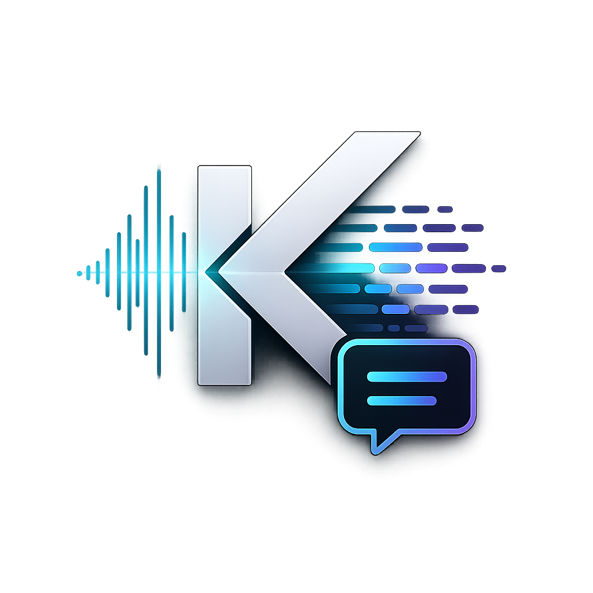 Kagevi Subtitles

**Live translated subtitles for streamers — local-first, privacy-first, OBS-ready.**

[](https://kiriuru.github.io/Kagevi-Subtitles/changelog.html)
[](#system-requirements)
[](./LICENSE)
[](https://kiriuru.github.io/Kagevi-Subtitles/changelog.html)
[](https://www.donationalerts.com/r/kiriuru)

<p align="center">
  <a href="https://kiriuru.github.io/Kagevi-Subtitles/">Website</a> ·
  <a href="./README.md">English</a> ·
  <a href="./README.ru.md">Русский</a> ·
  <a href="https://kiriuru.github.io/Kagevi-Subtitles/wiki.html">Wiki</a> ·
  <a href="./docs/TECHNICAL_ARCHITECTURE.en.md">Architecture</a> ·
  <a href="https://kiriuru.github.io/Kagevi-Subtitles/changelog.html">Changelog</a>
</p>

Kagevi Subtitles is a Windows desktop app that turns speech into real-time subtitles with optional translation. Recognition runs through **Google Chrome Web Speech** or optional offline **Local ASR** (Parakeet / ONNX). Everything stays on your machine — default bind `127.0.0.1:8765`, no cloud backend, no accounts.

First Kagevi Subtitles release: **`0.5.0`**. Current line: **`0.6.2`**.

<p align="center">
  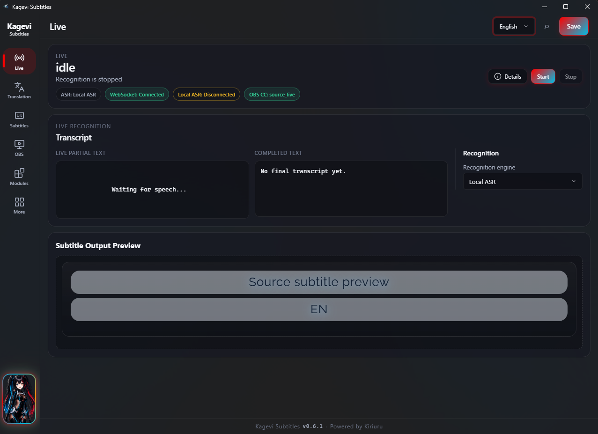
  <br>
  <em>Live — Start/Stop, recognition status, transcript, and subtitle preview</em>
</p>

## Table of contents

- [Features](#features)
- [Screenshots](#screenshots)
- [System requirements](#system-requirements)
- [Quick start](#quick-start)
- [Local URLs](#local-urls)
- [Data paths](#data-paths)
- [Troubleshooting](#troubleshooting)
- [Documentation](#documentation)
- [Contributing](#contributing)
- [License](#license)

## Features

| Area | What you get |
| --- | --- |
| **Speech** | Google Chrome Web Speech worker, or offline Local ASR (Parakeet / ONNX, CPU or CUDA) |
| **Translation** | 18 providers (incl. Baidu / Youdao / Tencent / Caiyun), up to **4** translation lines (source is separate). Optional **realtime** translation for classic MT (off by default). Four need **no API key**: Google Web, Free Web Translate, Microsoft Edge Translate, and Bing Translator |
| **OBS** | Browser Source overlay + optional Closed Captions via OBS WebSocket (mainly for Twitch) |
| **Style** | Animated presets, per-slot styling, theme palette |
| **TTS** | Native / Sonic playback; subtitle speech + Twitch chat TTS (up to 5 channels) |
| **Local ASR** | Setup wizard at `/local-asr`; Live mode `local_parakeet` when ready |
| **Ops** | Diagnostics ZIP export; UI locales en / ru / ja / ko / zh |

Compact phone-style layout is available for secondary monitors.

## Screenshots

<table>
  <tr>
    <td align="center" width="50%">
      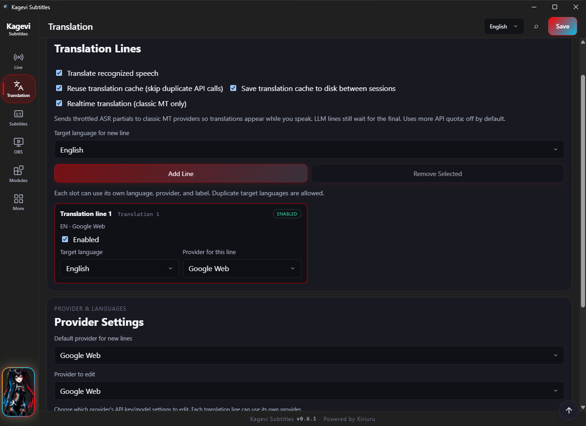<br>
      <strong>Translation</strong><br>
      <sub>Providers, cache, and up to 4 translation lines</sub>
    </td>
    <td align="center" width="50%">
      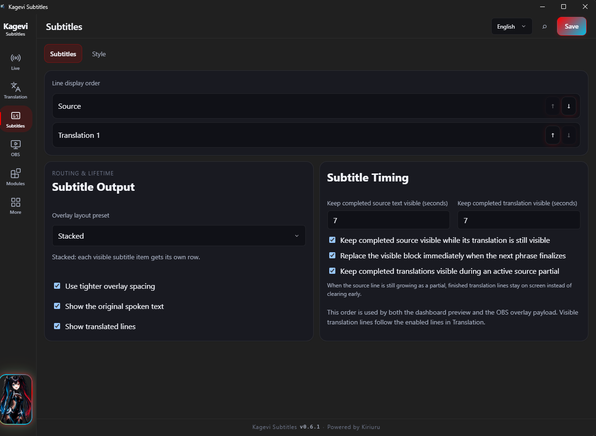<br>
      <strong>Subtitles</strong><br>
      <sub>Overlay preset, visibility, order, and TTL</sub>
    </td>
  </tr>
  <tr>
    <td align="center">
      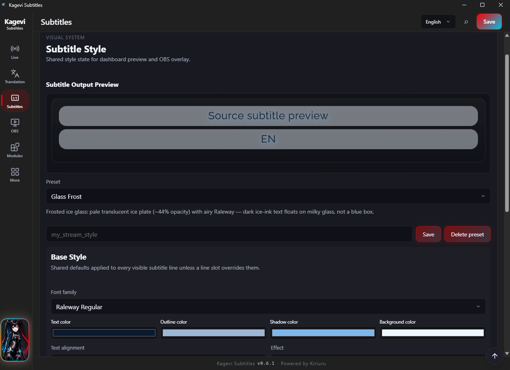<br>
      <strong>Subtitle Style</strong><br>
      <sub>Fonts, colors, effects, and per-slot styles</sub>
    </td>
    <td align="center">
      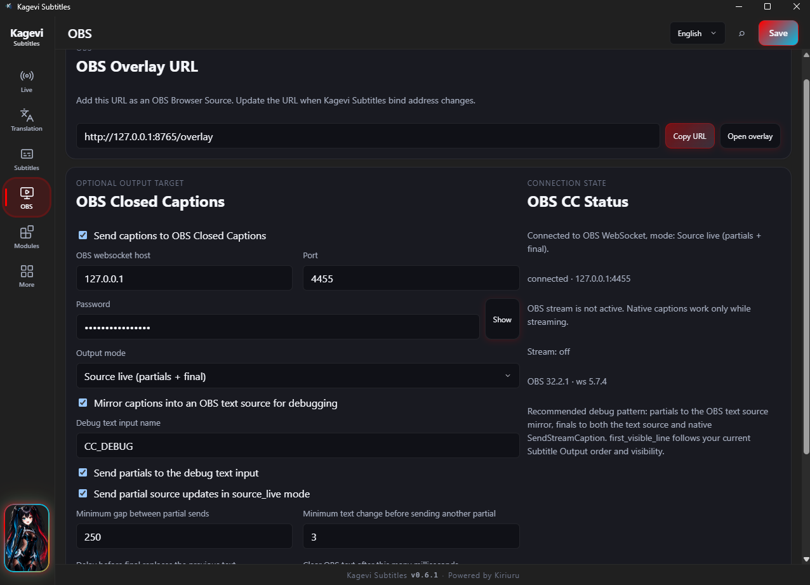<br>
      <strong>OBS</strong><br>
      <sub>Overlay URL and Closed Captions (Twitch)</sub>
    </td>
  </tr>
  <tr>
    <td align="center">
      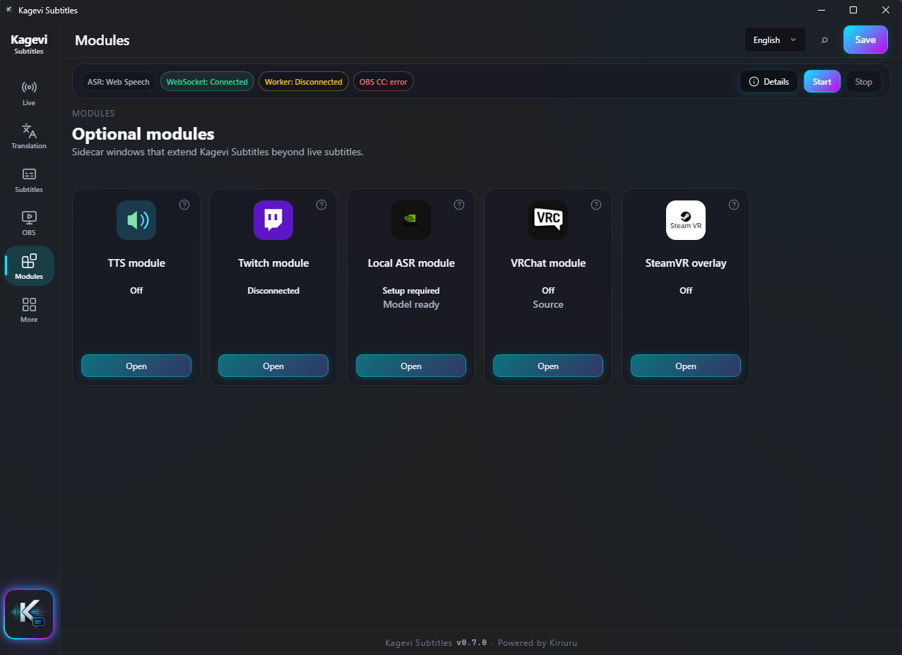<br>
      <strong>Modules</strong><br>
      <sub>Open sidecar TTS and Local ASR windows</sub>
    </td>
    <td align="center">
      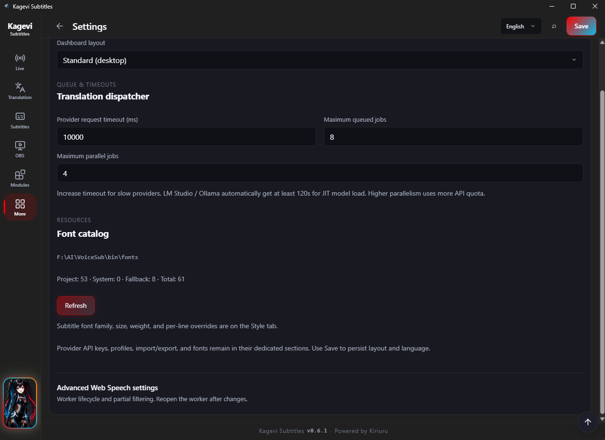<br>
      <strong>Settings</strong><br>
      <sub>Layout, dispatcher, fonts, Advanced Web Speech</sub>
    </td>
  </tr>
  <tr>
    <td align="center">
      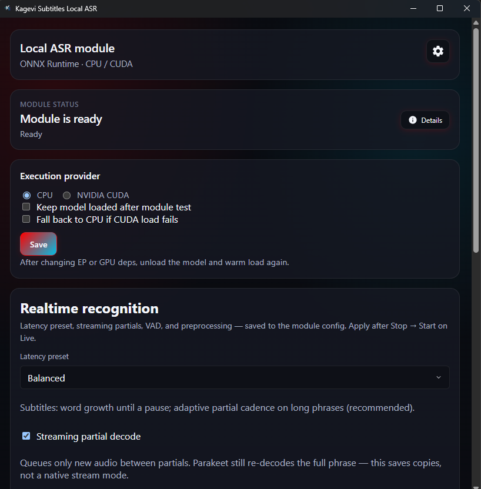<br>
      <strong>Local ASR</strong><br>
      <sub>Offline Parakeet / ONNX (CPU or CUDA)</sub>
    </td>
    <td align="center">
      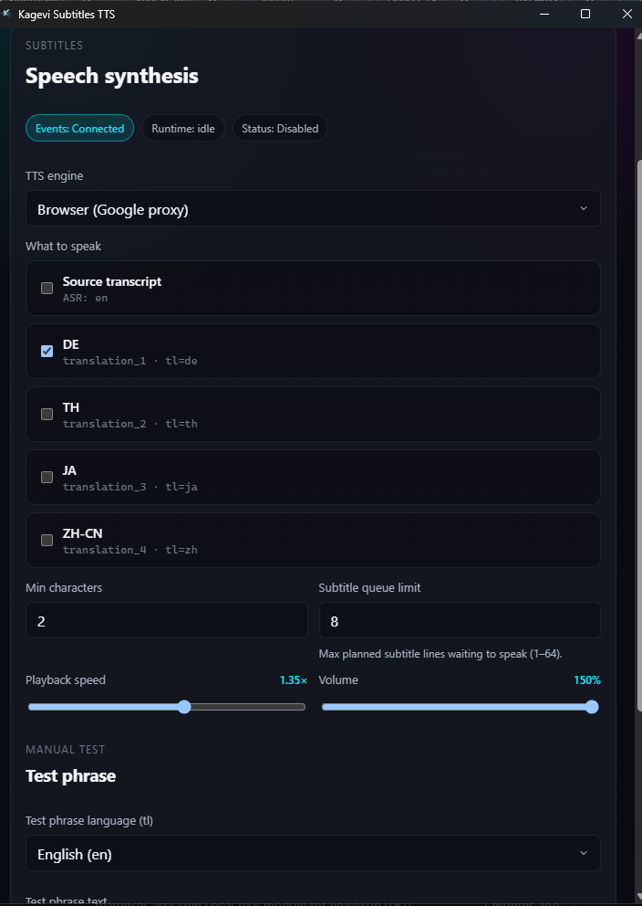<br>
      <strong>TTS</strong><br>
      <sub>Subtitle speech and playback</sub>
    </td>
  </tr>
  <tr>
    <td align="center">
      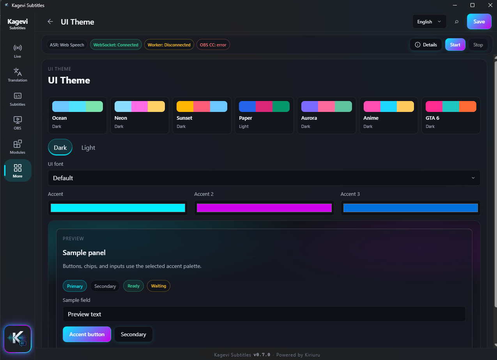<br>
      <strong>UI Theme</strong><br>
      <sub>Dark/light mode and accent palette</sub>
    </td>
    <td align="center">
      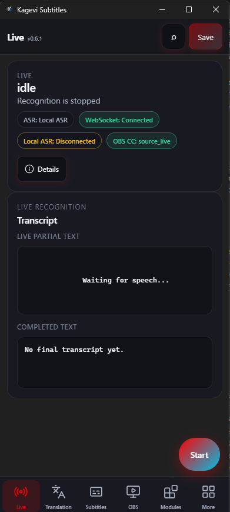<br>
      <strong>Compact layout</strong><br>
      <sub>Phone-style window for a second monitor</sub>
    </td>
  </tr>
  <tr>
    <td align="center">
      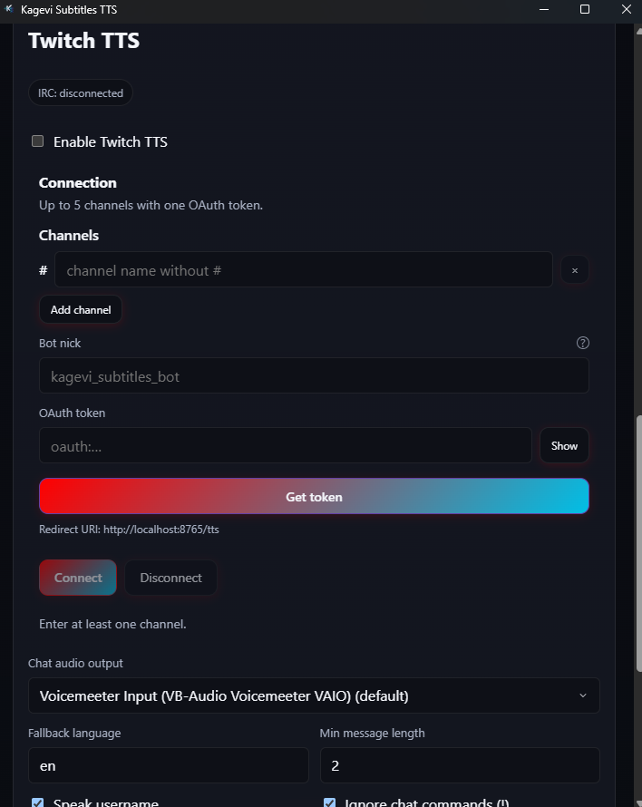<br>
      <strong>Twitch TTS</strong><br>
      <sub>Chat TTS for up to five channels</sub>
    </td>
    <td align="center">
      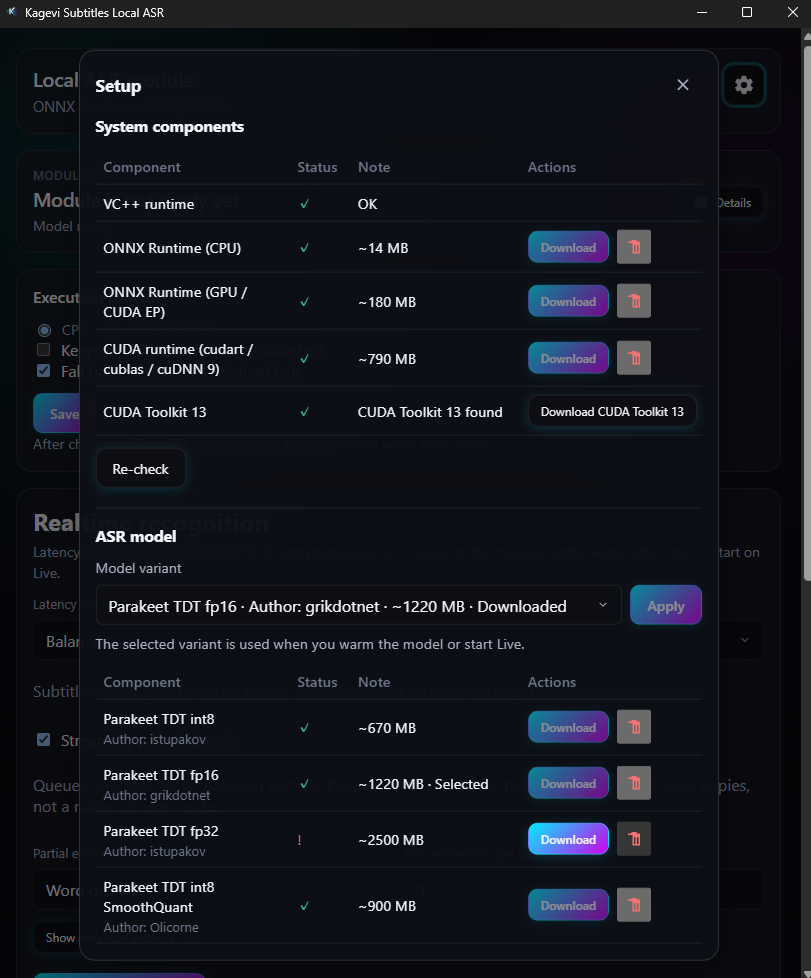<br>
      <strong>Local ASR setup</strong><br>
      <sub>ORT / CUDA components and Parakeet models</sub>
    </td>
  </tr>
  <tr>
    <td align="center" colspan="2">
      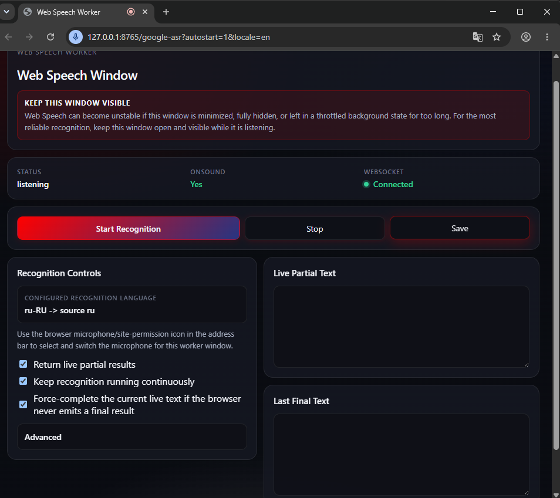<br>
      <strong>Web Speech worker</strong><br>
      <sub>Chrome <code>/google-asr</code> window — keep visible while listening</sub>
    </td>
  </tr>
</table>

More UI walkthroughs (Word Replace, Tools & Data, More/Help, Local ASR test bench): [Wiki](https://kiriuru.github.io/Kagevi-Subtitles/wiki.html).

## System requirements

- Windows 10 or 11 (x64)
- **Microsoft Edge WebView2 Runtime** (usually preinstalled on Windows 11; the NSIS installer can bootstrap it on Windows 10)
- **Google Chrome** — only for the Web Speech worker (not needed for Local ASR alone)
- Microphone access
- Internet — optional for cloud translation providers; also used for first-time Local ASR model / ORT downloads

No Python, Node.js, or CUDA in the core installer. CUDA is an optional Local ASR download.

## Quick start

1. Install from `Kagevi Subtitles_0.6.2_x64-setup.exe` (or the latest build in your release folder).
2. Launch **Kagevi Subtitles.exe** — the dashboard opens at `http://127.0.0.1:8765/`.
3. In OBS, add a **Browser Source** → `http://127.0.0.1:8765/overlay`.
4. Configure translation and subtitle style if needed, then click **Start**.
5. Choose recognition:
   - **Web Speech** — don't minimize the Chrome worker (it can sit behind other apps; mic permission is granted there).
   - **Local ASR** — **Modules → Local ASR**, finish setup until ready, select Local ASR on Live, then Start.

Step-by-step UI guide: [Wiki](https://kiriuru.github.io/Kagevi-Subtitles/wiki.html)

## Local URLs

| URL | Purpose |
| --- | --- |
| `http://127.0.0.1:8765/` | Dashboard |
| `http://127.0.0.1:8765/overlay` | OBS Browser Source |
| `http://127.0.0.1:8765/google-asr?autostart=1` | Browser Speech worker |
| `http://127.0.0.1:8765/tts` | TTS module |
| `http://127.0.0.1:8765/local-asr` | Local ASR module |

Overlay query examples: `?preset=single` · `?compact=1` · `?profile=default`

## Data paths

| Path | Contents |
| --- | --- |
| `user-data/config.toml` | Main settings |
| `user-data/profiles/` | Named profiles |
| `user-data/modules/tts/` | TTS settings |
| `user-data/modules/local-asr/` | Local ASR config, models, ORT / CUDA runtime |
| `user-data/translation-cache/` | Translation cache |
| `logs/` | `core.log`, `runtime-events.log`, `session-latest.jsonl` |
| `bin/fonts/` | Subtitle fonts |

## Troubleshooting

| Symptom | What to check |
| --- | --- |
| No subtitles | **Start** pressed; Chrome worker not minimized (Web Speech) **or** Local ASR ready + mic selected |
| Source text, no translation | Translation on; at least one line active; provider credentials |
| Empty OBS | Browser Source URL is `/overlay`; visibility on Subtitles tab; reload source after updates |
| Text stuck after TTL / Stop | Update build; reload Browser Source |
| Port in use | Free `8765` or change bind (dev builds) |
| Local ASR missing on Live | Modules → Local ASR: finish wizard until `ready` |

Full guide: [Wiki → Troubleshooting](https://kiriuru.github.io/Kagevi-Subtitles/wiki.html).

## Documentation

- [Wiki](https://kiriuru.github.io/Kagevi-Subtitles/wiki.html) — user guide (EN/RU on the site)
- [Changelog](https://kiriuru.github.io/Kagevi-Subtitles/changelog.html) — release notes (EN/RU on the site)
- [Technical Architecture (EN)](./docs/TECHNICAL_ARCHITECTURE.en.md) / [(RU)](./docs/TECHNICAL_ARCHITECTURE.md)
- Source markdown in-repo: [`docs/WIKI.*.md`](./docs/WIKI.en.md), [`docs/CHANGELOG*.md`](./docs/CHANGELOG.en.md)

## Contributing

Pull requests are welcome. For larger changes, open an issue first.

```powershell
cargo test --workspace
npm run build
npm run test:frontend
```

<details>
<summary><strong>Developers — stack and build</strong></summary>

### Stack

| Layer | Tech |
| --- | --- |
| Core | Rust workspace (`crates/voicesub-*`) + Axum HTTP/WS |
| Shell | Tauri 2 → `Kagevi Subtitles.exe` (NSIS) |
| Dashboard | Svelte 5 + Vite → `bin/dashboard/` |
| Worker | Svelte 5 → `bin/worker/` |
| Overlay | Vanilla HTML/JS → `bin/overlay/` |
| TTS | Svelte + Rust service + embedded `google_tts_fetch.exe` runtime |
| Local ASR | Svelte + `voicesub-asr-local` + ONNX Runtime (lazy download) |

Node.js is **build-time only** — not shipped in the installer.

### Build from source

```powershell
npm install
npm run build          # dashboard + worker + TTS + Local ASR
npm run i18n:export    # scripts/i18n-source → locale JSON
npm run i18n:bundle    # overlay locales bundle
cargo test --workspace
build-release-msi.bat  # → NSIS setup.exe in release_root
```

Tauri `beforeBuildCommand`: `npm run build`. Bundled resources: `bin/dashboard`, `overlay`, `worker`, `tts`, `local-asr`, `fonts`, `modules`.

### Key crates

`voicesub-runtime` · `voicesub-subtitle` · `voicesub-translation` · `voicesub-browser` · `voicesub-ws` · `voicesub-tts` · `voicesub-asr-local` · `voicesub-partial-emit` · `voicesub-obs`

`src-tauri/` is a thin IPC shell — no domain logic.

Version source: `voicesub-types::PROJECT_VERSION` in `crates/voicesub-types/src/version.rs` — bump there, then `npm run version:sync` (also from `npm run build`).

Full reference: [Technical Architecture](./docs/TECHNICAL_ARCHITECTURE.en.md).

</details>

## License

Copyright (c) 2026 Kiriuru. Source code is licensed under the [MIT License](./LICENSE).

**Trademarks:** “Kagevi”, “Kagevi Subtitles”, and the project logos/icons are marks of Kiriuru. The MIT License covers the copyrighted software only — it does **not** grant rights to those names or branding. Forks and redistributions that are not the official project must use different branding. See the Trademarks section in [LICENSE](./LICENSE).

Third-party model weights and runtimes (NVIDIA Parakeet under **CC-BY-4.0**, ONNX Runtime, Silero VAD, Sonic/libsonic, and others) keep their own licenses — see [THIRD_PARTY_NOTICES.md](./THIRD_PARTY_NOTICES.md).
