#  Kagevi Subtitles

**Живые переводимые субтитры для стримеров — локально, privacy-first, готово для OBS.**

[](https://kiriuru.github.io/Kagevi-Subtitles/changelog.html)
[](#системные-требования)
[](./LICENSE)
[](https://kiriuru.github.io/Kagevi-Subtitles/changelog.html)
[](https://www.donationalerts.com/r/kiriuru)

<p align="center">
  <a href="https://kiriuru.github.io/Kagevi-Subtitles/">Сайт</a> ·
  <a href="./README.md">English</a> ·
  <a href="./README.ru.md">Русский</a> ·
  <a href="https://kiriuru.github.io/Kagevi-Subtitles/wiki.html">Wiki</a> ·
  <a href="./docs/TECHNICAL_ARCHITECTURE.md">Архитектура</a> ·
  <a href="https://kiriuru.github.io/Kagevi-Subtitles/changelog.html">Список изменений</a>
</p>

Kagevi Subtitles — Windows desktop-приложение, которое превращает речь в субтитры в реальном времени с опциональным переводом. Распознавание — через **Google Chrome Web Speech** или опциональный офлайн **Local ASR** (Parakeet / ONNX). Всё работает локально: bind по умолчанию `127.0.0.1:8765`, без cloud backend и аккаунтов.

Первый релиз Kagevi Subtitles: **`0.5.0`**. Текущая линия: **`0.7.0`**.

<p align="center">
  
  <br>
  <em>Live — Start/Stop, статус распознавания, транскрипт и превью субтитров</em>
</p>

## Содержание

- [Возможности](#возможности)
- [Скриншоты](#скриншоты)
- [Системные требования](#системные-требования)
- [Быстрый старт](#быстрый-старт)
- [Локальные URL](#локальные-url)
- [Пути данных](#пути-данных)
- [Troubleshooting](#troubleshooting)
- [Документация](#документация)
- [Contributing](#contributing)
- [License](#license)

## Возможности

| Область | Что даёт |
| --- | --- |
| **Речь** | Google Chrome Web Speech worker или офлайн Local ASR (Parakeet / ONNX, CPU или CUDA) |
| **Формат текста** | В этой сборке скрыт / выключен (пайплайн не активен) |
| **Перевод** | 17 провайдеров (в т.ч. Baidu / Youdao / Tencent / Caiyun), до **4** линий перевода (исходник отдельно). Опциональный **realtime**-перевод для классического MT (по умолчанию выкл.). Три работают **без API key**: Google Web, Free Web Translate и Bing Translator |
| **OBS** | Browser Source overlay (**Прокручивание субтитров** + скорость) + опциональные Closed Captions через OBS WebSocket (в основном для Twitch) |
| **Стиль** | Анимированные пресеты субтитров, стили по слотам; галерея темы UI с предпросмотром |
| **TTS** | Native / Sonic playback; озвучка субтитров (без окна; нужен Эфир) |
| **Twitch** | IRC (Broadcaster сам подключается к чату стримера; доп. каналы необязательны, только чат, до 5 JOIN), EventSub-алерты на канале стримера (фоллоу / саб / рейд / чир), фильтры, опциональная озвучка чата и событий независимо от TTS субтитров |
| **Local ASR** | Wizard на `/local-asr`; режим `local_parakeet` на Эфире при `ready` |
| **VRChat** | Chatbox OSC (`/vrchat`) — финалы в социальный Chatbox VRChat (144 символа) |
| **SteamVR HUD** | OpenVR overlay (`/vr-overlay`) — субтитры только для носителя в PCVR; отдельно от OBS и VRChat |
| **Ops** | Diagnostics ZIP; сброс к заводским и профили (dashboard + TTS / Twitch / Local ASR / VRChat / SteamVR HUD); локали UI en / ru / ja / ko / zh |

Компактный макет под второй монитор / узкое окно.

## Скриншоты

<details>
<summary><strong>Показать скриншоты</strong></summary>

<table>
  <tr>
    <td align="center" width="50%">
      <br>
      <strong>Перевод</strong><br>
      <sub>Провайдеры, кэш и до 4 линий перевода</sub>
    </td>
    <td align="center" width="50%">
      <br>
      <strong>Субтитры</strong><br>
      <sub>Пресет overlay, видимость, порядок и TTL</sub>
    </td>
  </tr>
  <tr>
    <td align="center">
      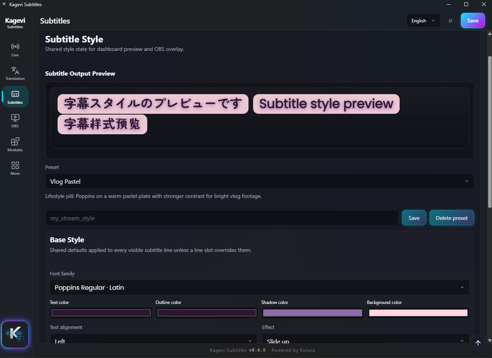<br>
      <strong>Стиль субтитров</strong><br>
      <sub>Шрифты, цвета, эффекты и стили по слотам</sub>
    </td>
    <td align="center">
      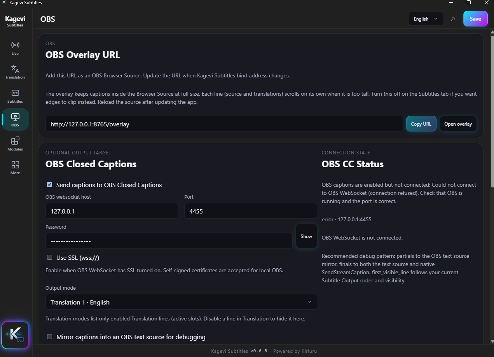<br>
      <strong>OBS</strong><br>
      <sub>URL overlay и Closed Captions (Twitch)</sub>
    </td>
  </tr>
  <tr>
    <td align="center">
      <br>
      <strong>Модули</strong><br>
      <sub>Открытие sidecar-окон TTS, Twitch, Local ASR, VRChat и SteamVR HUD</sub>
    </td>
    <td align="center">
      <br>
      <strong>Настройки</strong><br>
      <sub>Layout, dispatcher, шрифты, Advanced Web Speech</sub>
    </td>
  </tr>
  <tr>
    <td align="center">
      <br>
      <strong>Local ASR</strong><br>
      <sub>Офлайн Parakeet / ONNX (CPU или CUDA)</sub>
    </td>
    <td align="center">
      <br>
      <strong>TTS</strong><br>
      <sub>Озвучка субтитров и playback</sub>
    </td>
  </tr>
  <tr>
    <td align="center">
      <br>
      <strong>Тема UI</strong><br>
      <sub>Галерея пресетов с предпросмотром при наведении; тёмная/светлая тема и accent</sub>
    </td>
    <td align="center">
      <br>
      <strong>Компактный layout</strong><br>
      <sub>Узкое окно под второй монитор</sub>
    </td>
  </tr>
  <tr>
    <td align="center">
      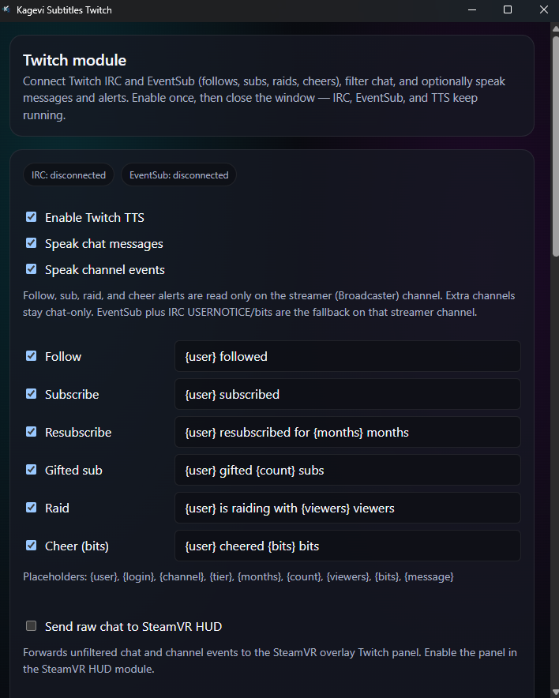<br>
      <strong>Twitch</strong><br>
      <sub>Лог IRC-чата, подключение и опциональный chat TTS</sub>
    </td>
    <td align="center">
      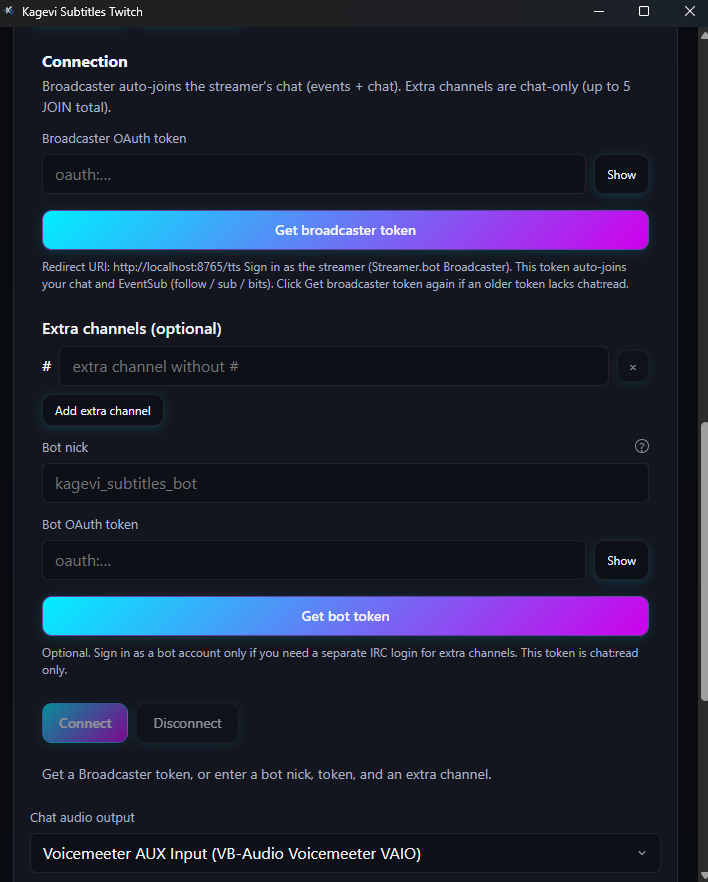<br>
      <strong>Подключение Twitch</strong><br>
      <sub>OAuth вещателя, каналы и EventSub-алерты</sub>
    </td>
  </tr>
  <tr>
    <td align="center">
      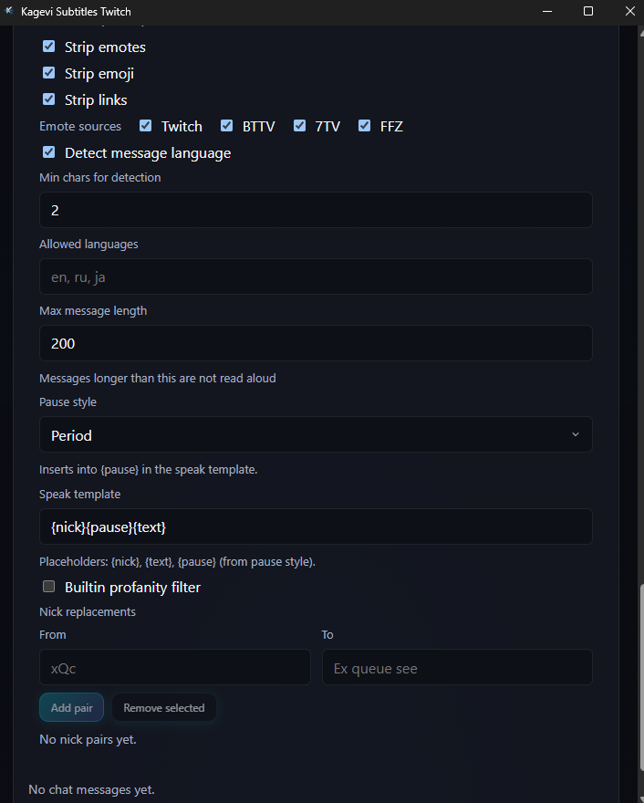<br>
      <strong>Фильтры Twitch</strong><br>
      <sub>Эмоуты, язык, шаблон озвучки, замена ников</sub>
    </td>
    <td align="center">
      <br>
      <strong>Local ASR setup</strong><br>
      <sub>Компоненты ORT / CUDA и модели Parakeet</sub>
    </td>
  </tr>
  <tr>
    <td align="center">
      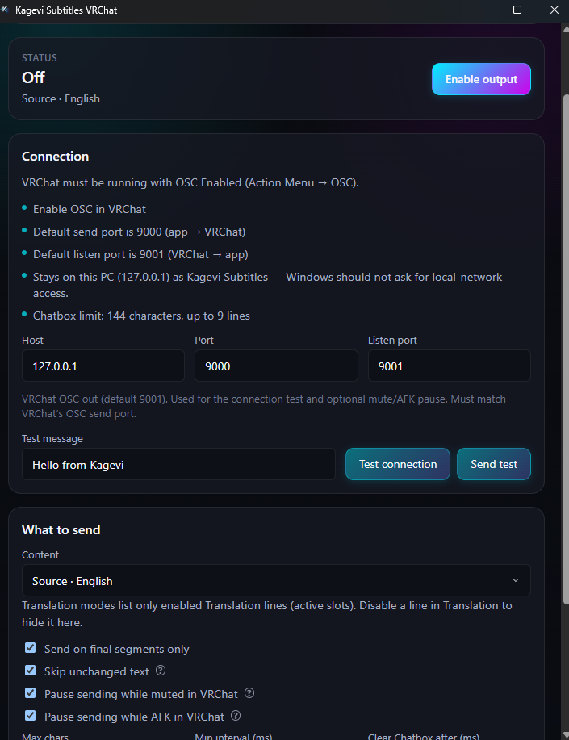<br>
      <strong>VRChat</strong><br>
      <sub>OSC Chatbox — социальные субтитры в VR</sub>
    </td>
    <td align="center">
      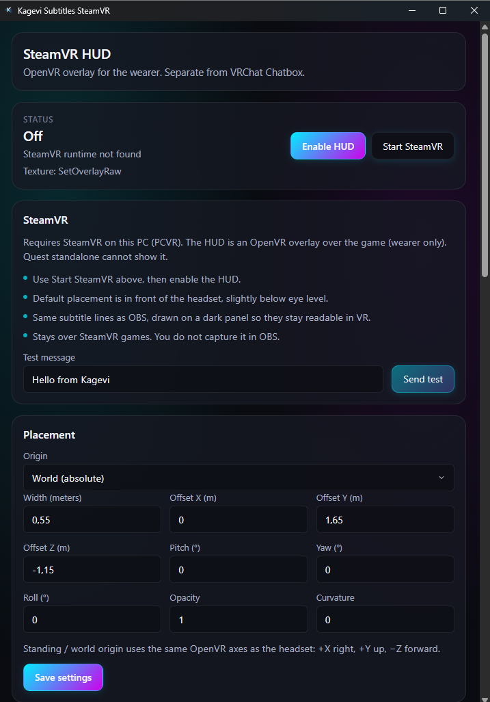<br>
      <strong>SteamVR HUD</strong><br>
      <sub>OpenVR overlay только для носителя в PCVR</sub>
    </td>
  </tr>
  <tr>
    <td align="center">
      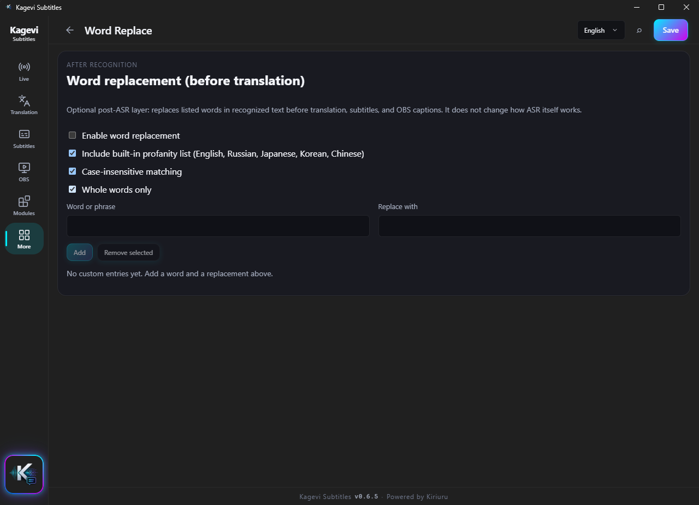<br>
      <strong>Замена слов</strong><br>
      <sub>Правка ошибок ASR до перевода и overlay</sub>
    </td>
    <td align="center">
      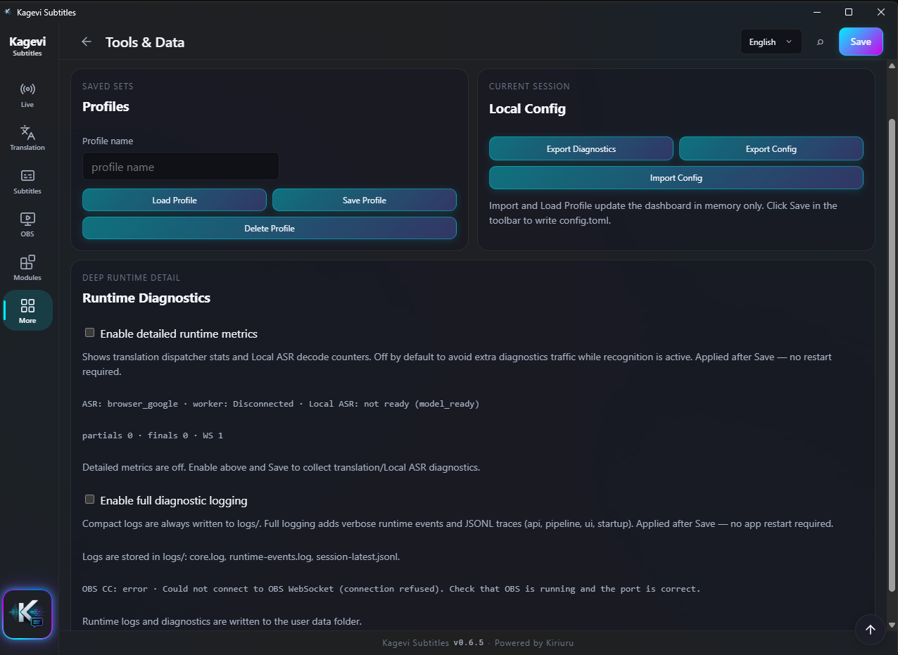<br>
      <strong>Инструменты и данные</strong><br>
      <sub>Профили, diagnostics ZIP, статус runtime</sub>
    </td>
  </tr>
  <tr>
    <td align="center">
      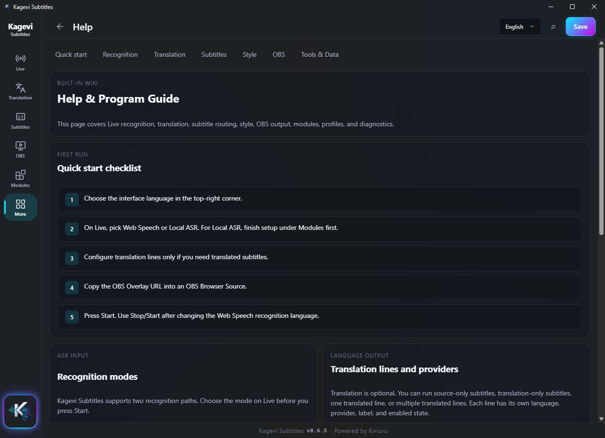<br>
      <strong>Справка</strong><br>
      <sub>Встроенный гайд и чеклист быстрого старта</sub>
    </td>
    <td align="center">
      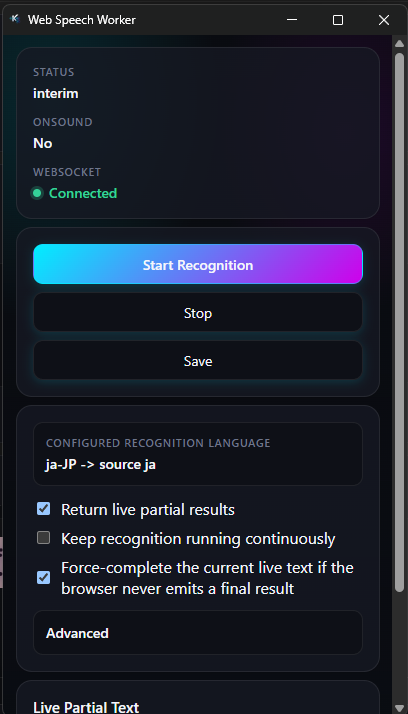<br>
      <strong>Компактный worker</strong><br>
      <sub>Окно Chrome <code>/google-asr-compact</code> --app</sub>
    </td>
  </tr>
  <tr>
    <td align="center" colspan="2">
      <br>
      <strong>Web Speech worker</strong><br>
      <sub>Окно Chrome <code>/google-asr</code> — держите видимым во время распознавания</sub>
    </td>
  </tr>
</table>

</details>

Оверрайды слотов, доп. Closed Captions, API-ключи провайдеров, test bench Local ASR, размещение SteamVR HUD и фильтры Twitch-чата: [Wiki](https://kiriuru.github.io/Kagevi-Subtitles/wiki.html).

## Системные требования

- Windows 10 или 11 (x64)
- **Microsoft Edge WebView2 Runtime** (на Windows 11 обычно уже есть; NSIS-установщик может запустить bootstrapper на Windows 10)
- **Google Chrome** — только для Web Speech worker (не нужен, если используется только Local ASR)
- Доступ к микрофону
- Интернет — опционально для облачных провайдеров перевода; также для первой загрузки модели / ORT Local ASR

Python, Node.js и CUDA **не входят** в core-установщик. CUDA — опциональная загрузка модуля Local ASR.

## Быстрый старт

1. Установите из `Kagevi Subtitles_0.7.0_x64-setup.exe` (или последней сборки в папке релиза).
2. Запустите **Kagevi Subtitles.exe** — dashboard откроется на `http://127.0.0.1:8765/`.
3. В OBS добавьте **Browser Source** → `http://127.0.0.1:8765/overlay`.
4. При необходимости настройте перевод и стиль субтитров, нажмите **Start**.
5. Выберите распознавание:
   - **Web Speech** — не сворачивайте окно Chrome worker (можно перекрывать другими окнами; разрешение микрофона выдаётся там). Опционально компактный worker: `/google-asr-compact`.
   - **Local ASR** — **Модули → Local ASR**, завершите setup до `ready`, выберите Local ASR на Эфире, затем Start.
6. Опционально **VRChat Chatbox** — **Модули → VRChat** → OSC в VRChat → **Проверить соединение** / **Отправить тест** → **Включить вывод** → **Start** на Эфире → закройте окно.
7. Опционально **PCVR HUD** — **Модули → SteamVR HUD** → **Запустить SteamVR** (верхняя карточка) → настройте размещение и **Что показывать** → **Включить оверлей субтитров** и/или **Включить чат-оверлей** → **Start** на Эфире (для субтитров) → закройте окно модуля. Quest standalone HUD не показывает.
8. Опционально **Twitch** — **Модули → Twitch** → **Токен стримера** (redirect через `/tts`) → **Подключить** (чат стримера подключается сам). Доп. каналы и бот необязательны. **Озвучивать сообщения чата** / **Озвучивать события канала**, если нужна озвучка (независимо от TTS субтитров; для IRC **Start** на Эфире не нужен). Если старый токен без `chat:read` — снова **Токен стримера**.

Статус-бар (ASR / WebSocket / Worker / OBS CC + Старт / Стоп) закреплён на всех вкладках — полный на Эфире, сжатый на остальных.

Пошаговый гайд: [Wiki](https://kiriuru.github.io/Kagevi-Subtitles/wiki.html)

## Локальные URL

| URL | Назначение |
| --- | --- |
| `http://127.0.0.1:8765/` | Dashboard |
| `http://127.0.0.1:8765/overlay` | OBS Browser Source |
| `http://127.0.0.1:8765/google-asr?autostart=1` | Browser Speech worker |
| `http://127.0.0.1:8765/google-asr-compact?autostart=1` | Компактный Browser Speech worker (`--app=`) |
| `http://127.0.0.1:8765/tts` | TTS-модуль |
| `http://127.0.0.1:8765/twitch` | Модуль Twitch |
| `http://127.0.0.1:8765/local-asr` | Модуль Local ASR |
| `http://127.0.0.1:8765/vrchat` | Модуль VRChat Chatbox OSC |
| `http://127.0.0.1:8765/vr-overlay` | Модуль SteamVR HUD overlay |

Примеры query для overlay: `?preset=single` · `?compact=1` · `?profile=default` · `?fit=0` (выключить **Прокручивание субтитров** для этого источника)

## Пути данных

| Путь | Содержимое |
| --- | --- |
| `user-data/config.toml` | Основные настройки |
| `user-data/profiles/` | Именованные профили |
| `user-data/modules/tts/` | Настройки TTS |
| `user-data/modules/twitch/` | Настройки Twitch IRC / chat TTS |
| `user-data/modules/local-asr/` | Config Local ASR, модели, ORT / CUDA runtime |
| `user-data/modules/vrchat/` | Настройки VRChat Chatbox OSC |
| `user-data/modules/vr-overlay/` | Настройки SteamVR HUD overlay |
| `user-data/translation-cache/` | Кэш перевода |
| `logs/` | `core.log`, `runtime-events.log`, `session-latest.jsonl` |
| `bin/fonts/` | Шрифты субтитров |

## Troubleshooting

| Симптом | Что проверить |
| --- | --- |
| Нет субтитров | Нажат **Start**; Chrome worker не свёрнут (Web Speech) **или** Local ASR ready + выбран mic |
| Есть исходник, нет перевода | Перевод включён; активна хотя бы одна линия; credentials провайдера |
| Пустой OBS | Browser Source на `/overlay`; видимость во вкладке «Субтитры»; после обновления — reload source |
| Текст обрезается в OBS | Вкладка Субтитры: **«Прокручивание субтитров»** (по умолчанию вкл.) и **скорость прокрутки**; после обновления перезагрузите Browser Source |
| Google Web / keyless MT 429 | Подождите, меньше линий перевода или измените интервал в Настройках; Free Web Translate и Bing — отдельные корзины |
| Текст не исчезает после TTL / Stop | Обновите сборку; перезагрузите Browser Source |
| Порт занят | Освободите `8765` или смените bind (dev-сборки) |
| Нет Local ASR на Эфире | Модули → Local ASR: завершите wizard до `ready` |
| HUD SteamVR не виден | Только PCVR; нажмите **Запустить SteamVR** в верхней карточке модуля; **Включить оверлей субтитров** и/или **Включить чат-оверлей** + **Start** на Эфире (субтитры); SteamVR запущен |
| SteamVR перезапускается после ручного выхода | Обновите сборку — HUD не должен вызывать `VR_Init`, пока вы снова не запустите SteamVR из модуля |

Полный гайд: [Wiki → Troubleshooting](https://kiriuru.github.io/Kagevi-Subtitles/wiki.html).

## Документация

- [Wiki](https://kiriuru.github.io/Kagevi-Subtitles/wiki.html) — пользовательский гайд (EN/RU на сайте)
- [Список изменений](https://kiriuru.github.io/Kagevi-Subtitles/changelog.html) — релизы (EN/RU на сайте)
- [Technical Architecture (RU)](./docs/TECHNICAL_ARCHITECTURE.md) / [(EN)](./docs/TECHNICAL_ARCHITECTURE.en.md)
- Исходники в репозитории: [`docs/WIKI.*.md`](./docs/WIKI.ru.md), [`docs/CHANGELOG*.md`](./docs/CHANGELOG.md)

## Contributing

PR приветствуются. Для крупных изменений — сначала issue.

**Гайд для контрибьюторов:** [CONTRIBUTING.md](./CONTRIBUTING.md) — чеклисты PR для нового провайдера перевода или шрифта, i18n и тесты (на английском).

Также: [Code of Conduct](./CODE_OF_CONDUCT.md) · [Security policy](./SECURITY.md) · [Support](./SUPPORT.md)

```powershell
cargo test --workspace
npm run build
npm run test:frontend
```

<details>
<summary><strong>Разработчикам — стек и сборка</strong></summary>

### Стек

| Слой | Технологии |
| --- | --- |
| Core | Rust workspace (`crates/voicesub-*`) + Axum HTTP/WS |
| Shell | Tauri 2 → `Kagevi Subtitles.exe` (NSIS) |
| Dashboard | Svelte 5 + Vite → `bin/dashboard/` |
| Worker | Svelte 5 → `bin/worker/` |
| Overlay | Vanilla HTML/JS → `bin/overlay/` |
| TTS | Svelte + Rust service + встроенный runtime `google_tts_fetch.exe` |
| Twitch | Svelte + `voicesub-twitch` (опциональный chat TTS через общий sidecar) |
| Local ASR | Svelte + `voicesub-asr-local` + ONNX Runtime (lazy download) |
| VRChat / SteamVR HUD | Svelte UI модулей + Rust output crates (`voicesub-vrchat`, `voicesub-vr-overlay`) |

Node.js — **только на этапе сборки**, не в установщике.

### Сборка из исходников

```powershell
npm install
npm run build          # dashboard + worker + TTS + Twitch + Local ASR + VRChat + SteamVR HUD
npm run i18n:export    # scripts/i18n-source → locale JSON
npm run i18n:bundle    # overlay locales bundle
cargo test --workspace
build-release-msi.bat  # → NSIS setup.exe в release_root
```

Tauri `beforeBuildCommand`: `npm run build && npm run scrub:shipped-bin`. В bundle: `bin/dashboard`, `overlay`, `worker`, `tts`, `twitch`, `local-asr`, `vrchat`, `vr-overlay`, плюс allowlist-копии `bin/.bundle-fonts/` → `bin/fonts` (шрифты верхнего уровня + лицензии) и `bin/.bundle-modules/` → `bin/modules` (`module.toml` и платформенные бинарники — без Python/build-скриптов TTS и распакованных семейств шрифтов).

### Ключевые crates

`voicesub-runtime` · `voicesub-subtitle` · `voicesub-translation` · `voicesub-browser` · `voicesub-ws` · `voicesub-tts` · `voicesub-asr-local` · `voicesub-vrchat` · `voicesub-vr-overlay` · `voicesub-partial-emit` · `voicesub-obs`

`src-tauri/` — тонкая IPC-оболочка, без domain logic.

Источник версии: `voicesub-types::PROJECT_VERSION` в `crates/voicesub-types/src/version.rs` — bump только там, затем `npm run version:sync` (также из `npm run build`).

Полный справочник: [Technical Architecture](./docs/TECHNICAL_ARCHITECTURE.md).

</details>

## License

Copyright © 2026 Kiriuru. Все права защищены. Условия использования — в **[лицензии Kagevi Subtitles](./LICENSE)**.

Программой можно **бесплатно пользоваться** как инструментом, в том числе на стриме или канале с монетизацией (реклама, подписки, донаты). **Продавать приложение, распространять его или иначе коммерциализировать само ПО** (платные сборки, платные функции, SaaS, платные бандлы и т.п.) нельзя.

Релизы **по 0.6.5 включительно**, вышедшие под MIT, остаются под MIT.

**Товарные знаки / бренд:** «Kagevi», «Kagevi Subtitles» и логотипы/иконки проекта — обозначения Kiriuru. Лицензия покрывает авторские права на ПО и **не** даёт права на эти имена и брендинг. См. раздел Trademarks в [LICENSE](./LICENSE).

Сторонние модели и рантаймы (NVIDIA Parakeet — **CC-BY-4.0**, ONNX Runtime, Silero VAD, Sonic/libsonic и др.) остаются под своими лицензиями — см. [THIRD_PARTY_NOTICES.md](./THIRD_PARTY_NOTICES.md).
