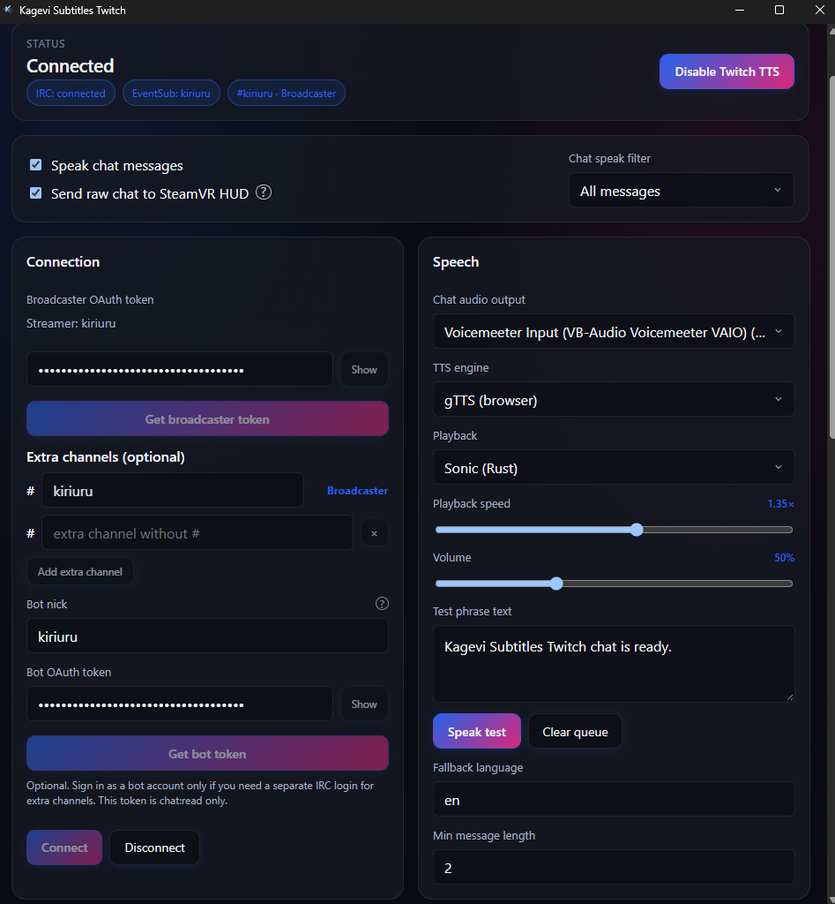

#  Kagevi Subtitles

**面向主播的实时翻译字幕 — 本地优先、隐私优先、OBS 可用。**

[](https://kiriuru.github.io/Kagevi-Subtitles/changelog.html)
[](#系统要求)
[](./LICENSE)
[](https://kiriuru.github.io/Kagevi-Subtitles/changelog.html)
[](https://www.donationalerts.com/r/kiriuru)

<p align="center">
  <a href="https://kiriuru.github.io/Kagevi-Subtitles/">Website</a> ·
  <a href="./README.md">English</a> ·
  <a href="./README.de.md">Deutsch</a> ·
  <a href="./README.ru.md">Русский</a> ·
  <a href="./README.ja.md">日本語</a> ·
  <a href="./README.ko.md">한국어</a> ·
  <a href="./README.zh.md">中文</a> ·
  <a href="https://kiriuru.github.io/Kagevi-Subtitles/wiki.html">Wiki</a> ·
  <a href="./docs/TECHNICAL_ARCHITECTURE.en.md">架构</a> ·
  <a href="https://kiriuru.github.io/Kagevi-Subtitles/changelog.html">Changelog</a>
</p>

Kagevi Subtitles 是一款 Windows 桌面应用，可将语音转为实时字幕并可选翻译。识别通过 **Google Chrome Web Speech**，或可选离线 **Local ASR**（Parakeet / ONNX）。一切在本机运行 — 默认绑定 `127.0.0.1:8765`，无云端后端、无账户。

Kagevi Subtitles 首个版本：**`0.5.0`**。当前产品线：**`0.7.2`**。

<p align="center">
  
  <br>
  <em>Live — Start/Stop、识别状态、转写与字幕预览</em>
</p>

## 目录

- [功能](#功能)
- [截图](#截图)
- [系统要求](#系统要求)
- [快速开始](#快速开始)
- [数据路径](#数据路径)
- [故障排除](#故障排除)
- [文档](#文档)
- [贡献](#贡献)
- [许可](#许可)

## 功能

| 领域 | 能力 |
| --- | --- |
| **语音** | Google Chrome Web Speech 工作进程，或离线 Local ASR（Parakeet / ONNX，CPU 或 CUDA） |
| **文本格式** | 本构建中隐藏 / 禁用（管线保持关闭） |
| **翻译** | 17 家提供商（含 Baidu / Youdao / Tencent / Caiyun），最多 **4** 条翻译行（源文单独）。经典 MT 可选 **realtime** 翻译（默认关）。**无需 API 密钥**三者：Google Web、Free Web Translate、Bing Translator |
| **OBS** | Browser Source 叠加层（**字幕滚动** + 速度）+ 可选 Closed Captions（经 OBS WebSocket，主要用于 Twitch） |
| **样式** | 动画字幕预设、按槽样式；带悬停预览的 UI 主题库 |
| **TTS** | Native / Sonic 播放；字幕朗读（可不打开窗口启用；需 Live Start） |
| **Twitch** | IRC（Broadcaster 自动加入主播聊天；额外频道可选、仅聊天、最多 5 JOIN）、主播频道 EventSub 提醒（关注 / 订阅 / raid / cheer / 频道积分奖励）、过滤、与字幕 TTS 独立的聊天与事件 TTS |
| **Local ASR** | `/local-asr` 安装向导；就绪后 Live 模式 `local_parakeet` |
| **VRChat** | Chatbox OSC 输出（`/vrchat`）— 定稿送入 VRChat 社交 Chatbox（144 字符） |
| **SteamVR HUD** | OpenVR 叠加层（`/vr-overlay`）— PCVR 中仅佩戴者可见字幕；与 OBS、VRChat 分离 |
| **运维** | Diagnostics ZIP；恢复出厂与配置档（dashboard + TTS / Twitch / Local ASR / VRChat / SteamVR HUD）；UI 语言 en / de / ru / ja / ko / zh |

提供适用于副屏的紧凑手机式布局。

## 截图

<details>
<summary><strong>显示截图</strong></summary>

<table>
  <tr>
    <td align="center" width="50%">
      <br>
      <strong>翻译</strong><br>
      <sub>提供商、缓存与最多 4 条翻译行</sub>
    </td>
    <td align="center" width="50%">
      <br>
      <strong>字幕</strong><br>
      <sub>叠加层预设、可见性、顺序与 TTL</sub>
    </td>
  </tr>
  <tr>
    <td align="center">
      <br>
      <strong>字幕样式</strong><br>
      <sub>字体、颜色、效果与按槽样式</sub>
    </td>
    <td align="center">
      <br>
      <strong>OBS</strong><br>
      <sub>叠加层 URL 与 Closed Captions（Twitch）</sub>
    </td>
  </tr>
  <tr>
    <td align="center">
      <br>
      <strong>模块</strong><br>
      <sub>打开 TTS、Twitch、Local ASR、VRChat、SteamVR HUD 侧窗</sub>
    </td>
    <td align="center">
      <br>
      <strong>设置</strong><br>
      <sub>布局、调度、字体、Advanced Web Speech</sub>
    </td>
  </tr>
  <tr>
    <td align="center">
      <br>
      <strong>Local ASR</strong><br>
      <sub>离线 Parakeet / ONNX（CPU 或 CUDA）</sub>
    </td>
    <td align="center">
      <br>
      <strong>TTS</strong><br>
      <sub>字幕朗读与播放</sub>
    </td>
  </tr>
  <tr>
    <td align="center">
      <br>
      <strong>UI 主题</strong><br>
      <sub>带悬停预览的预设库；深色/浅色与强调色</sub>
    </td>
    <td align="center">
      <br>
      <strong>紧凑布局</strong><br>
      <sub>适用于副屏的手机式窗口</sub>
    </td>
  </tr>
  <tr>
    <td align="center">
      <br>
      <strong>Twitch</strong><br>
      <sub>IRC 聊天日志、连接与可选聊天 TTS</sub>
    </td>
    <td align="center">
      <br>
      <strong>Twitch 连接</strong><br>
      <sub>主播 OAuth、频道与 EventSub 提醒</sub>
    </td>
  </tr>
  <tr>
    <td align="center">
      <br>
      <strong>Twitch 过滤</strong><br>
      <sub>表情、语言、朗读模板、昵称替换</sub>
    </td>
    <td align="center">
      <br>
      <strong>Local ASR 安装</strong><br>
      <sub>ORT / CUDA 组件与 Parakeet 模型</sub>
    </td>
  </tr>
  <tr>
    <td align="center">
      <br>
      <strong>VRChat</strong><br>
      <sub>VR 社交字幕的 OSC Chatbox 输出</sub>
    </td>
    <td align="center">
      <br>
      <strong>SteamVR HUD</strong><br>
      <sub>PCVR 中仅佩戴者可见的 OpenVR 叠加层</sub>
    </td>
  </tr>
  <tr>
    <td align="center">
      <br>
      <strong>词语替换</strong><br>
      <sub>在翻译与叠加层前修正 ASR 错误</sub>
    </td>
    <td align="center">
      <br>
      <strong>工具与数据</strong><br>
      <sub>配置档、Diagnostics ZIP、运行时状态</sub>
    </td>
  </tr>
  <tr>
    <td align="center">
      <br>
      <strong>帮助</strong><br>
      <sub>应用内指南与快速开始清单</sub>
    </td>
    <td align="center">
      <br>
      <strong>紧凑工作进程</strong><br>
      <sub>Chrome <code>/google-asr-compact</code> --app 窗口</sub>
    </td>
  </tr>
  <tr>
    <td align="center" colspan="2">
      <br>
      <strong>Web Speech 工作进程</strong><br>
      <sub>Chrome <code>/google-asr</code> 窗口 — 识别时请保持可见</sub>
    </td>
  </tr>
</table>

</details>

槽位覆盖、OBS Closed Captions 附加项、提供商 API 密钥、Local ASR 测试台、SteamVR HUD 摆放与 Twitch 聊天过滤：[Wiki](https://kiriuru.github.io/Kagevi-Subtitles/wiki.html)。

## 系统要求

- Windows 10 或 11（x64）
- **Microsoft Edge WebView2 Runtime**（Windows 11 通常已预装；Windows 10 上 NSIS 安装程序可引导安装）
- **Google Chrome** — 仅 Web Speech 工作进程需要（仅用 Local ASR 时不需要）
- 麦克风权限
- 互联网 — 云翻译提供商可选；亦用于首次下载 Local ASR 模型 / ORT

核心安装包不含 Python、Node.js 或 CUDA。CUDA 为 Local ASR 可选下载。

## 快速开始

1. 从 `Kagevi Subtitles_0.7.2_x64-setup.exe`（或发布目录中的最新构建）安装。
2. 启动 **Kagevi Subtitles.exe** — 仪表盘打开于 `http://127.0.0.1:8765/`。
3. 在 OBS 中添加 **Browser Source** → `http://127.0.0.1:8765/overlay`。
4. 按需配置翻译与字幕样式，然后点击 **Start**。
5. 选择识别方式：
   - **Web Speech** — 不要最小化 Chrome 工作进程（可置于其他应用后方；麦克风权限在该窗口授予）。可选紧凑工作进程：`/google-asr-compact`。
   - **Local ASR** — **模块 → Local ASR**，完成安装至 ready，在 Live 选择 Local ASR，再 Start。
6. 可选 **VRChat Chatbox** — **模块 → VRChat** → 在 VRChat 打开 OSC → **测试连接** / **发送测试** → **启用输出** → Live 上 **Start** → 关闭窗口。
7. 可选 **PCVR HUD** — **模块 → SteamVR HUD** → **启动 SteamVR**（主卡片）→ 配置摆放与 **显示内容** → **启用字幕叠加层** 和/或 **启用聊天叠加层** → Live 上 **Start**（字幕）→ 关闭模块窗口。Quest 独立模式无法显示此 HUD。
8. 可选 **Twitch 聊天** — **模块 → Twitch** → **获取主播令牌**（经 `/tts` 重定向）→ **连接**（自动加入主播聊天）。额外频道与机器人账号可选。需要 TTS 时启用 **朗读聊天** / **朗读频道事件**（独立于字幕 TTS；IRC 不需要 Live **Start**）。若旧令牌缺少 `chat:read`，再次 **获取主播令牌**。

状态栏（ASR / WebSocket / Worker / OBS CC + Start/Stop）固定在每个标签页 — Live 为完整，其余为紧凑。

分步 UI 指南：[Wiki](https://kiriuru.github.io/Kagevi-Subtitles/wiki.html)

## 数据路径

| 路径 | 内容 |
| --- | --- |
| `user-data/config.toml` | 主设置 |
| `user-data/profiles/` | 命名配置档 |
| `user-data/modules/tts/` | TTS 设置 |
| `user-data/modules/twitch/` | Twitch IRC / 聊天 TTS 设置 |
| `user-data/modules/local-asr/` | Local ASR 配置、模型、ORT / CUDA 运行时 |
| `user-data/modules/vrchat/` | VRChat Chatbox OSC 设置 |
| `user-data/modules/vr-overlay/` | SteamVR HUD 叠加层设置 |
| `user-data/translation-cache/` | 翻译缓存 |
| `logs/` | `core.log`, `runtime-events.log`, `session-latest.jsonl` |
| `bin/fonts/` | 字幕字体 |

## 故障排除

| 现象 | 检查项 |
| --- | --- |
| 无字幕 | 已按 **Start**；Chrome 工作进程未最小化（Web Speech）**或** Local ASR ready + 已选麦克风 |
| 有源文无翻译 | 翻译已开；至少一行激活；提供商凭据 |
| OBS 空白 | URL 必须为 `/overlay`；应用在运行且 Live 已 **Start**。若 OBS 在应用*之前*已打开，请 **右键 Browser Source → 刷新** 一次（OBS 不会自行重载失败页面）。之后 Start/Stop/重启会自动重连 |
| OBS 中文字被裁切 | 字幕页：**字幕滚动**（默认开）与 **滚动速度**；在会更改叠加层 JS/CSS 的*应用更新*后重新加载 Browser Source |
| Google Web / 无密钥 MT 429 | 等待、减少翻译行，或在设置中改间隔；Free Web Translate 与 Bing 为独立配额 |
| 关闭应用后文字残留 | 重连时通过 `/live` 探测 + idle 回放清除；若旧 Browser Source 仍保留最后一帧，请更新构建 |
| 端口占用 | 释放 `8765` 或更改绑定（开发构建） |
| Live 上无 Local ASR | 模块 → Local ASR：完成向导至 `ready` |
| 看不到 SteamVR HUD | 仅 PCVR；在主卡片按 **启动 SteamVR**；**启用字幕叠加层** 和/或 **启用聊天叠加层** + Live **Start**（字幕）；SteamVR 已运行 |
| 手动退出后 SteamVR 重启 | 更新构建 — 在模块中再次启动 SteamVR 之前，HUD 不得调用 `VR_Init` |

完整指南：[Wiki → Troubleshooting](https://kiriuru.github.io/Kagevi-Subtitles/wiki.html)。

## 文档

- [Wiki](https://kiriuru.github.io/Kagevi-Subtitles/wiki.html) — 用户指南（站点为 EN/RU）
- [Changelog](https://kiriuru.github.io/Kagevi-Subtitles/changelog.html) — 发行说明（站点为 EN/RU）
- [Technical Architecture (EN)](./docs/TECHNICAL_ARCHITECTURE.en.md) / [(RU)](./docs/TECHNICAL_ARCHITECTURE.md)
- 仓库内 Markdown：[`docs/WIKI.*.md`](./docs/WIKI.en.md)、[`docs/CHANGELOG*.md`](./docs/CHANGELOG.en.md)

## 贡献

欢迎 Pull request。较大改动请先开 issue。

**贡献者指南：** [CONTRIBUTING.md](./CONTRIBUTING.md) — 添加翻译提供商或字幕字体的 PR 清单、i18n 与测试（英文）。

另见：[Code of Conduct](./CODE_OF_CONDUCT.md) · [Security policy](./SECURITY.md) · [Support](./SUPPORT.md)

```powershell
cargo test --workspace
npm run build
npm run test:frontend
```

<details>
<summary><strong>开发者 — 技术栈与构建</strong></summary>

### 技术栈

| 层 | 技术 |
| --- | --- |
| Core | Rust 工作区（`crates/voicesub-*`）+ Axum HTTP/WS |
| Shell | Tauri 2 → `Kagevi Subtitles.exe`（NSIS） |
| Dashboard | Svelte 5 + Vite → `bin/dashboard/` |
| Worker | Svelte 5 → `bin/worker/` |
| Overlay | Vanilla HTML/JS → `bin/overlay/` |
| TTS | Svelte + Rust 服务 + 内嵌 `google_tts_fetch.exe` 运行时 |
| Twitch | Svelte + `voicesub-twitch`（经共享 sidecar 的可选聊天 TTS） |
| Local ASR | Svelte + `voicesub-asr-local` + ONNX Runtime（惰性下载） |
| VRChat / SteamVR HUD | Svelte 模块 UI + Rust 输出 crate（`voicesub-vrchat`, `voicesub-vr-overlay`） |

Node.js **仅用于构建时** — 不随安装包分发。

### 从源码构建

```powershell
npm install
npm run build          # dashboard + worker + TTS + Twitch + Local ASR + VRChat + SteamVR HUD
npm run i18n:export    # scripts/i18n-source → locale JSON
npm run i18n:bundle    # overlay locales bundle
cargo test --workspace
build-release-msi.bat  # → release_root 中的 NSIS setup.exe
```

Tauri `beforeBuildCommand`：`npm run build && npm run scrub:shipped-bin`。打包资源：`bin/dashboard`、`overlay`、`worker`、`tts`、`twitch`、`local-asr`、`vrchat`、`vr-overlay`，以及白名单复制 `bin/.bundle-fonts/` → `bin/fonts`（顶层字面 + 许可）与 `bin/.bundle-modules/` → `bin/modules`（`module.toml` + 平台二进制 — 不含 TTS Python/构建脚本或解压后的字体系树）。

### 关键 crate

`voicesub-runtime` · `voicesub-subtitle` · `voicesub-translation` · `voicesub-browser` · `voicesub-ws` · `voicesub-tts` · `voicesub-twitch` · `voicesub-asr-local` · `voicesub-vrchat` · `voicesub-vr-overlay` · `voicesub-partial-emit` · `voicesub-obs`

`src-tauri/` 为薄 IPC 壳 — 无领域逻辑。

版本来源：`crates/voicesub-types/src/version.rs` 中的 `voicesub-types::PROJECT_VERSION` — 在此 bump，再 `npm run version:sync`（也可由 `npm run build` 触发）。

完整参考：[Technical Architecture](./docs/TECHNICAL_ARCHITECTURE.en.md)。

</details>

## 许可

Copyright © 2026 Kiriuru. 保留所有权利。使用条款见 **[Kagevi Subtitles License](./LICENSE)**。

可作为最终用户工具**免费**使用本应用，包括在有广告、订阅、打赏等变现的直播或频道上。**不得出售、再分发或以其他方式将本软件本身商业化**（付费构建、付费功能、SaaS、付费捆绑等）。

**商标：** “Kagevi”、“Kagevi Subtitles” 以及项目徽标/图标为 Kiriuru 的标识。本许可仅覆盖软件著作权 — **不**授予这些名称或品牌的权利。见 [LICENSE](./LICENSE) 中的 Trademarks 一节。

第三方模型权重与运行时（NVIDIA Parakeet 为 **CC-BY-4.0**，以及 ONNX Runtime、Silero VAD、Sonic/libsonic 等）保留各自许可 — 见 [THIRD_PARTY_NOTICES.md](./THIRD_PARTY_NOTICES.md)。
