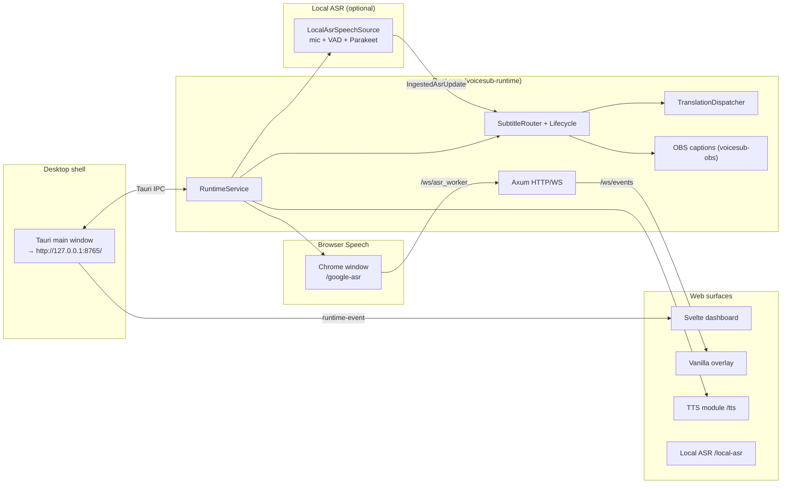

# Kagevi Subtitles 0.6.5 — Technical Architecture Document

Valid for the codebase where `voicesub-types::PROJECT_VERSION = "0.6.5"`.

This document describes the Kagevi Subtitles project layout, HTTP/WebSocket/Tauri IPC contracts, configuration schema, data flow through the Rust runtime, and frontend surfaces. It is the **canonical technical reference** for active development. README is a short product overview; CHANGELOG is release history; agent policy is `AGENTS.md`.

**Maintenance rule:** any change to API/WS/IPC contracts, config schema, subtitle/translation lifecycle, overlay renderer, browser worker, or NSIS installer bundle **updates the corresponding sections in the same task**. Outdated wording is removed or rewritten — not kept "for history".

## Table of Contents

- [Related Documentation](#related-documentation)
- [Quick Reference](#quick-reference)
- [1. Purpose and System Boundaries](#1-purpose-and-system-boundaries)
- [2. Technology Stack](#2-technology-stack)
- [3. High-Level Runtime Diagram](#3-high-level-runtime-diagram)
- [4. Repository Layout](#4-repository-layout)
- [5. Rust Workspace (crates)](#5-rust-workspace-crates)
- [6. RuntimeService: Orchestration and Lifecycle](#6-runtimeservice-orchestration-and-lifecycle)
- [7. Configuration and Migrations](#7-configuration-and-migrations)
- [8. HTTP API (local)](#8-http-api-local)
- [9. WebSocket Surface](#9-websocket-surface)
- [10. Tauri IPC](#10-tauri-ipc)
- [11. Logs, Diagnostics, Export](#11-logs-diagnostics-export)
- [12. Browser Speech Worker](#12-browser-speech-worker)
- [13. Translation: Lifecycle and Invariants](#13-translation-lifecycle-and-invariants)
- [14. Subtitle Lifecycle and Presentation](#14-subtitle-lifecycle-and-presentation)
- [15. Subtitle Styles and Overlay](#15-subtitle-styles-and-overlay)
- [16. OBS Closed Captions](#16-obs-closed-captions)
- [17. TTS Module](#17-tts-module)
- [18. Local ASR Module](#18-local-asr-module)
- [19. Desktop Runtime and NSIS Release](#19-desktop-runtime-and-nsis-release)
- [20. Storage and Paths](#20-storage-and-paths)
- [21. Frontend: Dashboard (Svelte)](#21-frontend-dashboard-svelte)
- [22. Frontend: Overlay (vanilla)](#22-frontend-overlay-vanilla)
- [23. Frontend: Browser Worker (Svelte)](#23-frontend-browser-worker-svelte)
- [24. UI Localization (i18n)](#24-ui-localization-i18n)
- [25. Versioning and Update Checks](#25-versioning-and-update-checks)
- [26. Testing](#26-testing)
- [27. Product Invariants](#27-product-invariants)
- [28. Known Limitations & Technical Debt](#28-known-limitations--technical-debt)
- [29. Security & Privacy Model](#29-security--privacy-model)
- [30. Extension Points](#30-extension-points)
- [31. Glossary](#31-glossary)

## Related Documentation

| Document | Purpose |
| --- | --- |
| `docs/WIKI.en.md` | User guide (EN) |
| `docs/WIKI.ru.md` | User guide (RU) |
| `docs/TECHNICAL_ARCHITECTURE.en.md` | Technical architecture (English) |
| `docs/CHANGELOG.md` | Change history |
| `AGENTS.md` | Agent policy |

## Quick Reference

### Dev build and test

```bash
# Rust tests
cargo test --workspace

# Frontend build (dashboard + worker + TTS + Local ASR)
npm run build

# NSIS release (Windows)
build-release-msi.bat   # → build-release.ps1
```

Tauri dev: embedded HTTP on `http://127.0.0.1:8765`; main webview opens the dashboard at that URL.

### Key URLs (default bind)

| URL | Purpose |
| --- | --- |
| `http://127.0.0.1:8765/` | Svelte dashboard |
| `http://127.0.0.1:8765/overlay` | OBS Browser Source |
| `http://127.0.0.1:8765/google-asr?autostart=1` | Browser Speech worker (full UI) |
| `http://127.0.0.1:8765/google-asr-compact?autostart=1` | Compact Browser Speech worker (Chrome `--app=`) |
| `http://127.0.0.1:8765/tts` | TTS module UI |
| `http://127.0.0.1:8765/local-asr` | Local ASR module UI |

### Key API endpoints

| Endpoint | Purpose |
| --- | --- |
| `POST /api/runtime/start` | Start session (Chrome worker **or** Local ASR) |
| `POST /api/runtime/stop` | Stop worker / local ASR, translation, OBS |
| `GET /api/runtime/status` | Runtime snapshot + diagnostics (`asr.local_module`) |
| `GET /api/settings/load` | Load config + presets + fonts |
| `POST /api/settings/save` | Normalize + save `config.toml` |
| `POST /api/ui/sync` | UI theme/locale/font sync → `ui_config_sync` |
| `GET /api/exports/diagnostics` | Redacted diagnostics ZIP |
| `GET /api/obs/url` | `{ overlay_url }` for OBS |
| `GET /api/asr/local/status` | Local ASR module readiness / deps / model |

### WebSocket channels

| Channel | Purpose |
| --- | --- |
| `/ws/events` | OBS overlay (+ optional external / legacy `src/lib/ws.ts`); live `overlay_update` + runtime events |
| `/ws/asr_worker` | Browser Speech worker transport |

Production Tauri dashboard and module windows use in-process `runtime-event` IPC (`src/lib/runtime-events.ts`), not `/ws/events`.

### Key files

| File | Purpose |
| --- | --- |
| `crates/voicesub-types/src/version.rs` | `PROJECT_VERSION` |
| `crates/voicesub-runtime/src/service.rs` | Orchestration, start/stop |
| `crates/voicesub-runtime/src/http/router.rs` | All HTTP/WS routes |
| `crates/voicesub-subtitle/src/lifecycle.rs` | Subtitle FSM/TTL |
| `crates/voicesub-translation/src/dispatcher.rs` | Translation queue + stale drop |
| `src-tauri/src/lib.rs` | Tauri shell + IPC |
| `bin/overlay/shared/js/subtitle-style/` | Shared overlay renderer (ESM modules; entry `index.js`) |

## 1. Purpose and System Boundaries

**Kagevi Subtitles** is a local Windows-first desktop app for real-time subtitles:

- speech capture via **Browser Speech worker** (separate Chrome window with visible address bar, Web Speech API) **or** optional **Local ASR** (Parakeet ONNX, in-process mic);
- optional translation to **0..4 lines** (`translation_1`…`translation_4`) with independent provider per slot;
- unified subtitle payload routing to Svelte dashboard, vanilla OBS overlay, and OBS Closed Captions;
- optional **TTS module** (subtitle speech, Twitch chat TTS);
- optional **Local ASR module** (`/local-asr`, mode `local_parakeet` when `local_module.ready`);
- diagnostics ZIP export and client-side trace logs.

**ASR modes:** `browser_google` (default Web Speech at `/google-asr`) and optional `local_parakeet` (Local ASR module, gated on `asr.local_module.ready`).

Hard boundaries:

- local-first runtime, default bind `127.0.0.1:8765`;
- no cloud backend, accounts, or hosted database;
- **Node.js forbidden in shipped runtime**; Vite/Node only on dev/build machines;
- dashboard and worker are Svelte (compile-time bundle); overlay is **vanilla HTML/JS** (no Svelte);
- **WebView2 Runtime** — required for the Tauri shell (`Kagevi Subtitles.exe`, dashboard, `/tts`, `/local-asr`); NSIS installer can run the bootstrapper if missing.
- Chrome is a separate system dependency for the Web Speech worker; core installer does not bundle Python/torch/Node. Local ASR ONNX/CUDA deps and model weights are **lazy-downloaded** into `user-data/modules/local-asr/` (not in the core installer).

## 2. Technology Stack

| Layer | Technologies |
| --- | --- |
| Core runtime | Rust 1.85+ (edition 2024), Tokio, Axum 0.8 |
| Desktop shell | Tauri 2 → `Kagevi Subtitles.exe` (NSIS `setup.exe`) |
| Dashboard UI | Svelte 5 + Vite → `bin/dashboard/` |
| Browser worker | Svelte 5 + Vite → `bin/worker/` |
| TTS UI | Svelte 5 + Vite → `bin/tts/` |
| Local ASR UI | Svelte 5 + Vite → `bin/local-asr/` |
| OBS overlay | Vanilla HTML/CSS/JS → `bin/overlay/` |
| Config | TOML (`user-data/config.toml`), JSON-shaped document inside |
| HTTP client (providers) | `reqwest` + rustls |
| Logging | `tracing` + rotating files + opt-in JSONL |
| TTS sidecar | Embedded Python exe in `bin/modules/tts/runtime/` (not core Rust) |
| Local ASR inference | `parakeet-rs` + ONNX Runtime DLL (CPU / optional CUDA EP) |

**Forbidden in active tree:** React, Webpack, Electron, pywebview, FastAPI runtime, in-process NeMo/torch.

## 3. High-Level Runtime Diagram



**Hot path (browser):** `external_asr_update` (WS) → transcript controller → subtitle lifecycle → translation dispatcher → `overlay_update` (WS live + Tauri `runtime-event`) → OBS overlay + dashboard. **Hot path (local ASR):** mic → VAD/decode → `PartialEmitCoordinator` (`should_emit`) → same ingest as browser. `subtitle_payload_update` is **Tauri IPC snapshot only** (not live on `/ws/events`). WS connect replay = `runtime_update` + `overlay_update` + `ui_config_sync`. Partial `transcript_update` is coalesced (default 90 ms); subtitle lifecycle and `overlay_update` still see every partial.

## 4. Repository Layout

```
F:\AI\VoiceSub\
├── Cargo.toml                  # workspace members, workspace.dependencies
├── Cargo.lock
├── package.json                # Vite/Svelte build scripts
├── vite.config.ts              # → bin/dashboard/
├── vite.worker.config.ts       # → bin/worker/
├── vite.tts.config.ts          # → bin/tts/
├── vite.local-asr.config.ts    # → bin/local-asr/
├── build-release-msi.bat       # back-compat → build-release.ps1
├── build-release.ps1           # NSIS release pipeline
├── build/release.config.json   # release_root for setup.exe copy
│
├── crates/                     # Rust domain + adapters (see §5)
├── src-tauri/                  # Tauri binary shell (thin)
├── src/                        # Svelte dashboard sources
├── src-worker/                 # Svelte browser worker sources
├── src-tts/                    # Svelte TTS module sources
├── src-local-asr/              # Svelte Local ASR module sources
│
├── bin/                        # Shipped static assets (NSIS resources)
│   ├── dashboard/              # Vite build output
│   ├── worker/                 # Worker bundle
│   ├── tts/                    # TTS UI bundle
│   ├── local-asr/              # Local ASR UI bundle
│   ├── overlay/                # Vanilla OBS overlay
│   ├── fonts/                  # Project fonts
│   └── modules/                # Sidecar modules (tts, local-asr)
│
├── tests/
│   ├── golden/                 # Regression fixtures
│   └── integration/
│
├── docs/
├── user-data/                  # runtime (gitignored)
└── logs/                       # runtime (gitignored)
```

### Source vs build artifacts

| Surface | In git | After `npm run build` / installer |
| --- | --- | --- |
| `crates/`, `src/`, `src-worker/`, `src-tts/`, `src-local-asr/` | yes | compiled into exe + static |
| `bin/dashboard`, `bin/worker`, `bin/tts`, `bin/local-asr` | build output | in NSIS `resources/bin/` |
| `bin/overlay/` | yes | in installer |
| `user-data/`, `logs/` | no | created at runtime |

## 5. Rust Workspace (crates)

Workspace members (`Cargo.toml`): 16 domain crates + `src-tauri` (no separate `xtask` crate).

### Dependency graph (simplified)

```
voicesub-types (Layer 0: DTO, WS types, errors)
    ↑
voicesub-config, voicesub-subtitle, voicesub-translation, voicesub-browser,
voicesub-ws, voicesub-logging, voicesub-export, voicesub-obs, voicesub-audio,
voicesub-tts, voicesub-twitch, voicesub-asr-local, voicesub-partial-emit (Layer 1–2)
    ↑
voicesub-runtime (Layer 3: wiring, HTTP router, orchestration)
    ↑
src-tauri (Layer 4: IPC, window, bundle only)
```

### Crate reference

| Crate | Purpose |
| --- | --- |
| `voicesub-types` | `PROJECT_VERSION`, WS envelope types, ASR event DTO |
| `voicesub-config` | TOML store, defaults, normalize/migrate, paths, bind policy |
| `voicesub-subtitle` | `SubtitleLifecycleCore`, `SubtitleRouter`, presentation, overlay contract |
| `voicesub-translation` | `TranslationDispatcher`, `TranslationEngine`, 17 providers |
| `voicesub-browser` | Chrome supervisor, worker launch flags, operational FSM |
| `voicesub-ws` | `/ws/events` hub, `/ws/asr_worker` hub, event sequence |
| `voicesub-http` | Re-export `voicesub-runtime::http` (thin) |
| `voicesub-logging` | `tracing` backbone, rotation, session JSONL, deep trace flags |
| `voicesub-export` | Diagnostics ZIP, config redaction |
| `voicesub-obs` | OBS WebSocket closed captions client |
| `voicesub-audio` | WASAPI device enum, native/Sonic `PlaybackHub`, legacy WinAPI per-process routing (TTS) |
| `voicesub-tts` | TTS service, queue, Twitch IRC, OAuth bridge |
| `voicesub-twitch` | Twitch IRC (up to 5 channels), emotes, link/symbol filters, Lingua lang detect, `apply_settings` hot-apply |
| `voicesub-asr-local` | Local ASR module: deps, model, Parakeet ONNX, VAD/pipeline, test bench, status |
| `voicesub-partial-emit` | Shared partial emit policy (`word_growth` / `char_delta`, coalesce) — **applied on Local ASR path**; browser Web Speech does not run `should_emit` |
| `voicesub-runtime` | `RuntimeService`, HTTP router, transcript controller, session wiring |

**Rule:** business logic does not live in `src-tauri/`; Tauri is IPC + lifecycle hooks only.

## 6. RuntimeService: Orchestration and Lifecycle

**File:** `crates/voicesub-runtime/src/service.rs`

`RuntimeService` is the single wiring point:

1. **Start** (`POST /api/runtime/start`):
   - merge optional inline `config_payload`;
   - apply live settings (translation, OBS, subtitle, logging);
   - if `asr.mode = browser_google`: launch Chrome worker → `{base}/google-asr` or `/google-asr-compact` (`asr.browser.compact_worker_ui`) with `?autostart=1[&locale=…]` and browser speech ingest;
   - if `asr.mode = local_parakeet`: assert `asr.local_module.ready`, start `LocalAsrSpeechSource` (no Chrome worker);
   - start translation dispatcher, OBS captions;
   - broadcast `preflight_update`, `runtime_update`.

2. **Stop** (`POST /api/runtime/stop`):
   - browser mode: send `browser_asr_control` stop on `/ws/asr_worker`; kill Chrome process tree (`taskkill /T /F` on Windows);
   - local mode: stop `LocalAsrSpeechSource`;
   - stop translation, OBS; reset subtitle state/metrics.

3. **Tauri shutdown** (`src-tauri/src/lib.rs`):
   - TTS shutdown → `POST /api/runtime/stop` → runtime handle drop.

Embedded HTTP server: dedicated Tokio runtime in Tauri process; bind from `AppConfig` + `VOICESUB_ALLOW_LAN`.

**0.5.4 hot-path notes:**

- `browser_speech_source.rs` — sync `accept_update` + async `process_ingest_work` (ingest mutex not held across subtitle/WS work).
- `SubtitlePayloadForwarder` — TTS listener on dedicated ordered thread (`voicesub-subtitle-payload-forward`), not inside subtitle actor publish loop.
- Live subtitle WS fanout is **`overlay_update` only**; `subtitle_payload_update` is Tauri IPC snapshot / replay, not duplicated on `/ws/events`.

## 7. Configuration and Migrations

### Storage

- **Path:** `{project_root}/user-data/config.toml`
- **Format:** JSON-shaped document serialized as TOML (`voicesub-config::store`)
- **Current version:** `config_version = 8` (`defaults.rs`)

### Top-level keys

| Key | Role |
| --- | --- |
| `config_version` | Schema version (migrate on load) |
| `profile` | Active profile name |
| `ui` | `language`, `layout`, `theme`, `palette`, `font_family`, `show_translation_results` |
| `source_lang` | ASR source (`auto` default) |
| `targets` | Deprecated; normalized into `translation.lines` on load |
| `asr` | `mode` + `browser` tuning (+ legacy `realtime` keys for normalize/diagnostics; see §12) |
| `overlay` | `preset`, `compact` |
| `obs_closed_captions` | OBS WebSocket CC settings |
| `translation` | Provider, lines (up to 4), cache, limits, `live_partial`, `provider_settings` |
| `subtitle_output` | Source/translation display order |
| `subtitle_lifecycle` | TTL, sync flags; deprecated timing keys normalized only |
| `source_text_replacement` | Find/replace for ASR text (custom pairs + builtin stems/obfuscation normalize; applied in `TranscriptController` before subtitle/translation) |
| `logging` | `full_enabled` — master switch for deep diagnostics; `runtime_metrics_enabled` — detailed Tools runtime metrics / Local ASR decode counters (default off; avoids high-churn `diagnostics_update` while recognition is active) |
| `updates` | GitHub Releases check (`enabled`, `github_repo`, `check_interval_hours`, `latest_known_version`, …) |

### ASR mode (Kagevi Subtitles 0.6.0)

| `asr.mode` | Status |
| --- | --- |
| `browser_google` | **Active default** — Chrome Web Speech worker |
| `local_parakeet` | Optional Local ASR; Live selector only when `asr.local_module.ready` |

Readiness for `local_parakeet` is a runtime gate (`asr.local_module.ready`), not a config rewrite.

**Removed providers.** `resolve_translation_provider` in `translation_normalize.rs` maps names that no longer ship on the save path (mirrored in `src/lib/config-normalize.ts`):

| Removed | Maps to | Reason |
| --- | --- | --- |
| `mymemory` | `google_translate_v2` (caller fallback) | Anonymous quota of 5,000 chars/day is unusable for live subtitles |
| `public_libretranslate_mirror` | `bing_translator` | All keyless public LibreTranslate instances went offline or now refuse API traffic; the replacement is also keyless, so no API key is suddenly required |
| `microsoft_edge` | `bing_translator` | Microsoft’s anonymous Edge auth/translate path is dead (HTTP 404); Bing remains keyless |

Any other unrecognized provider name falls back to the caller's default provider.

### Profiles

`user-data/profiles/{name}.json` — named snapshots via `/api/profiles/*`.

## 8. HTTP API (local)

**Router:** `crates/voicesub-runtime/src/http/router.rs`  
**Default bind:** `127.0.0.1:8765` (`voicesub-config::paths`)  
**LAN:** `VOICESUB_ALLOW_LAN=1` → bind `0.0.0.0`

**LAN security (OWASP ASVS V7):** with `VOICESUB_ALLOW_LAN=1`, HTTP `/api/*` still requires the per-session `x-kagevi-subtitles-token` (also accepted: `x-kagevi-voice-token`, legacy `x-voicesub-token`), and **non-loopback WebSocket clients must present `loopback_token` (query) or the same session header/cookie**. Loopback peers (OBS on the same PC) keep unauthenticated `/ws/events` + `/ws/asr_worker`. Prefer default `127.0.0.1` + OBS Browser Source on localhost.

Global middleware: CSP header, `Cache-Control: no-store`.

### Health / Version

| Method | Path | Auth | Purpose |
| --- | --- | --- | --- |
| GET | `/live` | public | Minimal liveness probe (`{"ok":true}`) for OBS overlay |
| GET | `/api/health` | loopback token | Liveness + WS connections + worker connected |
| GET | `/api/version` | loopback token | Product metadata + `sync` (updates config, `update_available`, `latest_known_version`) |

**Loopback API auth:** Tauri UI windows obtain the per-session token via IPC `get_loopback_api_token` and send `x-kagevi-subtitles-token` (also accepted: `x-kagevi-voice-token`, legacy `x-voicesub-token`). App HTML (`/`, `/tts`, `/local-asr`, `/google-asr`, `/google-asr-compact`) requires a one-time `?bootstrap=<nonce>` (sets HttpOnly cookie `kagevi_loopback`) **or** an already-valid session cookie/header — otherwise **401** (except unauthenticated `/tts`, which serves a minimal Twitch OAuth shell only). `POST /api/tts/twitch/oauth-complete` is public (system-browser Twitch redirect bridge — pending token/error only). OBS overlay does **not** call protected `/api/*` (only `/live` + WebSocket).

### Devices / OpenAI helpers

| Method | Path | Purpose |
| --- | --- | --- |
| GET | `/api/devices/audio-inputs` | Empty list (browser ASR uses `getUserMedia`) |
| GET | `/api/openai/recommended-models` | Static recommended models |
| POST | `/api/openai/models` | Live OpenAI-compatible `GET {base}/models` (chat filter for api.openai.com) |
| POST | `/api/openai/usable-models` | Alias |

### Settings / Profiles

| Method | Path | Purpose |
| --- | --- | --- |
| GET | `/api/settings/load` | Config + subtitle presets + font catalog |
| POST | `/api/settings/save` | Merge/save + live apply |
| GET/POST/DELETE | `/api/profiles`, `/api/profiles/{name}` | Profile CRUD |
| POST | `/api/ui/sync` | Debounced UI-only sync → `ui_config_sync` on EventBus (theme/locale/`ui.font_family` across dashboard, Web ASR, TTS, Local ASR) |

### Runtime / OBS

| Method | Path | Purpose |
| --- | --- | --- |
| POST | `/api/runtime/start` | Start session (`config_payload?`) |
| POST | `/api/runtime/stop` | Stop session |
| GET | `/api/runtime/status` | Full runtime snapshot |
| GET | `/api/obs/url` | `{ overlay_url }` |

### Logging / Exports

| Method | Path | Purpose |
| --- | --- | --- |
| POST | `/api/logs/client-event` | Client → `session-latest.jsonl` |
| POST | `/api/logs/ui-trace` | UI render trace → `ui-trace.jsonl` |
| GET | `/api/exports` | List export bundles |
| GET | `/api/exports/diagnostics` | Diagnostics ZIP |

### TTS / Twitch OAuth

| Method | Path | Purpose |
| --- | --- | --- |
| GET | `/api/tts/google` | Google Translate TTS proxy |
| GET | `/api/tts/python` | TTS via embedded Python module |
| GET | `/api/tts/python/status` | Python runtime probe |
| POST | `/api/tts/twitch/oauth-open` | Open Twitch OAuth in system browser |
| GET | `/api/tts/twitch/oauth-pending` | Poll pending token **or** OAuth error (`status`: `token` \| `error` \| `none`) |
| POST | `/api/tts/twitch/oauth-complete` | **Public** bridge: store OAuth token **or** browser cancel/deny (`error` + `message`) |

### Local ASR (`/api/asr/local/*`)

Protected like other `/api/*`. Full table in [§18 Local ASR Module](#18-local-asr-module). Summary: status/config, deps check/download/delete/probe, model download/select/delete/load/unload, test bench, mic list, transfer progress, driver URL.

### Updates

| Method | Path | Purpose |
| --- | --- | --- |
| POST | `/api/updates/check` | Poll GitHub Releases (forced on dashboard bootstrap); persists `updates.latest_known_version`, `last_checked_utc` |

### HTML pages

| Method | Path | Handler |
| --- | --- | --- |
| GET | `/` | `bin/dashboard/index.html` |
| GET | `/overlay` | `bin/overlay/overlay.html` |
| GET | `/google-asr` | `bin/worker/index.html` (full worker UI) |
| GET | `/google-asr-compact` | `bin/worker/index.html` (compact worker UI; same bundle) |
| GET | `/tts` | `bin/tts/index.html` |
| GET | `/local-asr` | `bin/local-asr/index.html` |
| GET | `/project-fonts.css` | Generated `@font-face` from `bin/fonts/` |

### Static mounts

| URL prefix | Disk path |
| --- | --- |
| `/overlay-assets` | `bin/overlay/` |
| `/static` | `bin/overlay/shared/` (legacy shared assets) |
| `/worker-assets` | `bin/worker/` |
| `/assets` | `bin/dashboard/assets/` |
| `/tts-assets` | `bin/tts/` |
| `/local-asr-assets` | `bin/local-asr/` |
| `/project-fonts` | `bin/fonts/` |

`bin/` resolved via `ProjectPaths::locate_bin_dir()` — workspace `bin/` or Tauri NSIS `resources/bin/`.

## 9. WebSocket Surface

**Authentication:** WebSocket from **loopback** stays unauthenticated (OBS overlay + Chrome worker on the same PC). **Non-loopback** clients must pass `loopback_token` query (or session header/cookie). With `VOICESUB_ALLOW_LAN=1` see §8.

### `/ws/events` — OBS overlay (+ optional external clients)

**Implementation:** `crates/voicesub-ws/src/events.rs`

- Client receive-only (inbound text ignored)
- On connect: `hello` (`type: "hello"`, `message: "connected"`)
- Replay last: `runtime_update`, `overlay_update`, `ui_config_sync`
- Bounded per-socket queue (default 128), dedupe by `type`

**Envelope:** `{ "type": "<channel>", "payload": {…} }`  
Payload enrichment: `event_sequence`, `created_at_ms`, `event_type` (`WsEventPublisher`).

| `type` | Transport | Purpose |
| --- | --- | --- |
| `hello` | WS | Handshake |
| `runtime_update` | WS + EventBus | Phase, ASR/worker state, metrics |
| `preflight_update` | WS + EventBus | `{ running: bool }` during start/stop |
| `diagnostics_update` | WS + EventBus | ASR diagnostics snapshot |
| `model_status_update` | WS + EventBus | Model/ASR readiness |
| `transcript_update` | WS + EventBus | ASR partial/final events (sole live ASR text channel since 0.5.4; partials coalesced) |
| `overlay_update` | WS + EventBus | Overlay render body (live + **replay on connect**) |
| `translation_update` | WS + EventBus | Per-sequence translation results |
| `twitch_connection_update` | WS + EventBus | Twitch connection state (also snapshot replay) |
| `ui_config_sync` | WS + EventBus | `{ ui: … }` theme/locale/`font_family` (via `/api/ui/sync`; **replay on connect**) |
| `subtitle_payload_update` | **EventBus / Tauri snapshot only** | Subtitle presentation — **not** published on `/ws/events`; live + WS replay use `overlay_update` |
| `twitch_chat_message` | **EventBus only** | Twitch chat for TTS — `publish_event_bus_only` (no `/ws/events` fanout) |

**Stale guard:** overlay (`overlay.js` + `ws-stale-guard-logic.js`) drops stale events after stop/start (timestamp-first on sequence reset).

### In-process runtime events — Tauri dashboard + TTS (0.5.2+)

**Implementation:** `RuntimeEventBus` (`crates/voicesub-ws/src/event_bus.rs`) + Tauri emit `runtime-event` (`src-tauri/src/lib.rs`).

- Main dashboard (`src/lib/runtime-events.ts`) and TTS module (`src-tts/App.svelte`) **do not** open `ws://127.0.0.1:8765/ws/events`; they receive the same `{ type, payload }` envelopes via Tauri events.
- On subscribe: attach `listen(runtime-event)` **first** (buffer live frames), then IPC `get_runtime_state_snapshot`, then drain the buffer so a stale snapshot cannot overwrite newer live events. Dashboard replay prefers `overlay_update` (falls back to `subtitle_payload_update`); TTS replay is scoped to `runtime_update` + `twitch_connection_update` only.
- `WsEventPublisher` mirrors most broadcasts into the EventBus for shell clients; OBS overlay remains WS-only. **Twitch chat** uses `publish_event_bus_only` (no `/ws/events` fanout); connection updates still hit the hub for snapshot replay.

**Legacy:** `src/lib/ws.ts` (`EventsSocket`) for dev/external browser clients; production Tauri shell uses `runtime-events.ts`.

### `/ws/asr_worker` — browser worker

**Implementation:** `crates/voicesub-ws/src/asr_worker.rs`

**Server → worker:**

| `type` | Fields | Purpose |
| --- | --- | --- |
| `hello` | `message: "browser_asr_worker_connected"`, `transport_id` | Handshake |
| `browser_asr_control` | `action`, `reason?`, `issued_at_ms`, `transport_id` | Control (e.g. `stop`) |

**Worker → server:**

| `type` | Handler |
| --- | --- |
| `external_asr_update` | ASR text ingest (partial/final, generation guards) |
| `browser_asr_status` | Worker state snapshot |
| `browser_asr_heartbeat` | Same as status |
| `hello` | Recognized, no special handling |

## 10. Tauri IPC

**Registration:** `src-tauri/src/lib.rs` → `tauri::generate_handler!`

**Capabilities (per window):** `src-tauri/capabilities/default.json` (main — shell-only `allow-voicesub-ipc`), `tts.json` (`allow-voicesub-tts-ipc`), `local-asr.json` (`allow-voicesub-local-asr-ipc`). `get_loopback_api_token` is allowlisted on all three. All capabilities deny frontend `core:event` emit / emit-to (listen only). ACL matrix guarded by `src-tauri/src/acl_matrix.rs` tests.

### Shell commands (`main` only)

| Command | Purpose |
| --- | --- |
| `get_loopback_api_token` | Per-session token for protected `/api/*` (Tauri windows; HTML must not embed the token) |
| `get_runtime_state_snapshot` | Replay runtime/subtitle/overlay/translation/diagnostics for Tauri shell on connect |
| `set_dashboard_layout` | Compact (390×844) vs standard (1280×900) window |
| `tts_open_window` | Open/focus `/tts` webview |
| `local_asr_open_window` | Open/focus `/local-asr` webview |
| `open_external_https_url` | Open allowlisted HTTPS URL in system browser (update banner, translation provider setup, Credits donate link) |
| `open_local_http_url` | Open validated loopback HTTP URL in system browser |

### TTS commands (`tts` window — `src-tauri/src/tts.rs`)

| Command | Purpose |
| --- | --- |
| `tts_get_config` | Load TTS config |
| `tts_set_provider` / `tts_set_enabled` | Provider toggle |
| `tts_set_audio_device` / `tts_set_channel_audio_device` | Speech / Twitch audio output |
| `tts_set_playback_mode` | `native` (cpal @ 1.0×) or `sonic` (libsonic); legacy `browser` → `sonic` on load |
| `tts_list_output_devices` | WASAPI enumeration (label-first for native) |
| `tts_get_audio_routing` / `tts_bind_window_audio` | Legacy WinAPI per-process routing (single device) |
| `tts_update_speech_settings` / `tts_update_voice_settings` | Speech params |
| `tts_speak_sample` | Manual Speak test → Rust `ChannelOrchestrator` (`speech` channel, `source: test`) |
| `tts_reset_subtitle_planner` | Reset subtitle dedupe planner |
| `tts_channel_clear` / `tts_channel_force_idle` | Drain or reset channel state |
| `tts_get_resource_telemetry` | Playback / queue resource metrics |
| `tts_report_webview_activity` | TTS webview heartbeat → `WebviewMemoryManager` suspend policy |
| `tts_twitch_*` | Twitch connect/disconnect/status/settings |
| `tts_open_system_url` | Open validated Twitch OAuth URL externally |
| `get_runtime_state_snapshot` | Snapshot replay for TTS window connect |

### Local ASR window (`local-asr` capability)

Webview ACL: `get_loopback_api_token` + `open_external_https_url` only. Window open/focus is a **main**-shell command (`local_asr_open_window`). Module domain logic stays in `voicesub-asr-local` + HTTP.

### `src-tauri/` modules (shell only)

| File | Role |
| --- | --- |
| `lib.rs` | Tauri setup, HTTP runtime bootstrap, IPC registration, EventBus pump |
| `shell.rs` | Allowlisted `open_external_https_url` / `open_local_http_url` |
| `event_routing.rs` | Per-window `runtime-event` type filters + snapshot replay envelopes |
| `ipc_pump.rs` | Bus→IPC pump: overlay coalescing (dashboard only), lag-resync debounce |
| `webview_memory.rs` | WebView2 suspend/memory policy (`WebviewMemoryManager`) |
| `dashboard_nav.rs` | Main webview URL helpers |
| `webview2_gate.rs` | WebView2 runtime presence check before window create |
| `tts.rs` | TTS IPC adapter → `voicesub-tts` |
| `local_asr.rs` | Local ASR window open/focus only |
| `acl_matrix.rs` | Capability ACL matrix tests |

**Tauri events (shell clients):** `runtime-event` (WS-shaped envelopes), `tts-speech-activity` / `playback-finished` — **`emit_to(tts)` only** (not global `emit`).

**`runtime-event` routing (per window):** the bus→IPC pump (`src-tauri/src/ipc_pump.rs`, filters in `event_routing.rs`) emits with `emit_to(label, …)`, not a global `emit`. The **main** dashboard window receives every envelope; the **tts** window receives only `twitch_chat_message`, `twitch_connection_update`, `runtime_update`, `runtime_status`, `ui_config_sync` (the types `handleRuntimeEvent` acts on); the **local-asr** window receives only `ui_config_sync` for live theme/locale/font sync without Save. The Local ASR and TTS module UIs must **not** open `/ws/events` for UI sync (BroadcastChannel + Tauri IPC only) — a WS client would still receive full-rate overlay/runtime frames. `setLocale` is idempotent so locale-changed / BroadcastChannel handlers cannot feedback-spin. This keeps the high-frequency `transcript_update` / `overlay_update` stream off module webview IPC channels. Payloads are forwarded by reference (no per-event deep clone). **`overlay_update` IPC to the main dashboard is trailing-edge coalesced** (default 90 ms, env `VOICESUB_OVERLAY_IPC_MIN_INTERVAL_MS`); OBS `/ws/events` still receives every frame. `runtime_update` / `translation_update` flush any pending coalesced overlay immediately. On `broadcast::RecvError::Lagged`, the pump records metrics (`event_bus_consumer_lagged_*`), queues a pending snapshot resync (never drops the last needed sync; 200 ms coalesce between follow-ups), then re-emits envelopes (`snapshot_to_envelopes` — overlay preferred over raw subtitle).

**Partial coalescing:** `transcript_update` partials are leading-edge throttled in `TranscriptController` (default 90 ms, env `VOICESUB_TRANSCRIPT_PARTIAL_MIN_INTERVAL_MS`; new phrase/`sequence` and all finals bypass). Subtitle lifecycle and WS `overlay_update` still see every partial; ingest applies subtitle state **before** async transcript fanout. Only the redundant transcript IPC/WS channel is rate-limited.

**Lifecycle:** main webview → `http://{bind_addr}/` on setup; on close → TTS shutdown → runtime stop.

## 11. Logs, Diagnostics, Export

**Directory:** `{project_root}/logs/`

### Backbone (always)

| File | Purpose |
| --- | --- |
| `core.log` | `tracing` backbone (+ stderr); rotate → `core.old.log` on startup |
| `runtime-events.log` | Compact structured events (5 MB rotation) |
| `session-latest.jsonl` | Client events from `/api/logs/client-event` (max 5000 lines) |

### Opt-in JSONL traces

Master switch: `logging.full_enabled` in config **or** `VOICESUB_DEEP_DIAGNOSTICS`.

| File | Enable env |
| --- | --- |
| `subtitle-trace.jsonl` | `VOICESUB_TRACE_SUBTITLE` |
| `tts-trace.jsonl` | `VOICESUB_TRACE_TTS` |
| `browser-trace.jsonl` | `VOICESUB_TRACE_BROWSER` |
| `obs-trace.jsonl` | `VOICESUB_TRACE_OBS` |
| `ui-trace.jsonl` | `VOICESUB_TRACE_UI` |
| `ws-trace.jsonl` | `VOICESUB_TRACE_WS` |
| `pipeline-trace.jsonl` | `VOICESUB_TRACE_PIPELINE` |
| `session-lifecycle.json` | always (session marker); shutdown/panic steps also in `pipeline-trace.jsonl` when deep diagnostics on |

### Timestamp field formats (0.5.4+)

Several log and subtitle lifecycle fields that previously held **Unix epoch seconds as strings** now use **RFC 3339 UTC** strings (e.g. `2026-06-21T07:01:00Z`). Payload **keys are unchanged**; only the value format changed.

| Field | Where | Notes |
| --- | --- | --- |
| `timestamp_utc` | `session-latest.jsonl`, deep JSONL traces (`session.rs`, `jsonl_trace.rs`) | External tooling should accept both formats during transition |
| `finalized_at_utc`, `completed_expires_at_utc` | Subtitle lifecycle payload (`voicesub-subtitle/lifecycle.rs`) | Not parsed as numbers by overlay or dashboard render paths |

Helpers: `voicesub_types::utc_now_rfc3339()`, `epoch_secs_to_rfc3339()`.

With deep diagnostics, `pipeline-trace.jsonl` ASR ingest records may include `ingest_latency_ms` (`trace.rs` + `transcript_controller.rs`).

Disable: same vars `=0` / `false`.  
Verbose runtime-events: `VOICESUB_TRACE_RUNTIME_EVENTS_VERBOSE`.

With `logging.full_enabled`, close steps (`shutdown_begin`, `shutdown_step`, `shutdown_complete`) go to `core.log` (`voicesub.lifecycle`) and `pipeline-trace.jsonl`. `session-lifecycle.json` is always updated: `running` → `graceful` or `panic`. If the next start still finds `running`, `core.log` gets `previous session exited without graceful shutdown` (even in compact mode).

### Other env vars

| Variable | Purpose |
| --- | --- |
| `VOICESUB_ALLOW_LAN` | Bind `0.0.0.0` |
| `VOICESUB_TRANSCRIPT_PARTIAL_MIN_INTERVAL_MS` | Min interval for partial `transcript_update` IPC/WS (default **90**; `0` = no coalescing; does not affect `overlay_update`) |
| `VOICESUB_OVERLAY_IPC_MIN_INTERVAL_MS` | Trailing-edge coalesce for dashboard `overlay_update` IPC only (default **90**; **`0`** = disabled; OBS WS unaffected) |
| `VOICESUB_BROWSER_AFFINITY` | Enable CPU affinity for browser worker (`1` / `true`) |
| `VOICESUB_BROWSER_AFFINITY_MASK` | Hex CPU affinity mask override |
| `VOICESUB_BROWSER_AFFINITY_EXCLUDE_LOW` | Exclude low-power cores from affinity mask (`1` default) |
| `RUST_LOG` | `tracing` filter override |
| `VOICESUB_TTS_PER_PROCESS_ROUTING` | WinAPI TTS audio routing |
| `VOICESUB_TTS_ALLOW_SYSTEM_PYTHON` | Allow system Python for TTS fetcher |

### Diagnostics ZIP

`GET /api/exports/diagnostics` bundles: `runtime_status.json`, `config_redacted.json`, `environment.txt`, `latest_session.jsonl`, `core.log`, `runtime-events.log` (plus deep JSONL traces when `logging.full_enabled`).

ZIP files are written under `user-data/exports/` as `diagnostics-{unix}_{ms}.zip`. The exporter keeps the newest **12** diagnostics ZIPs and deletes older ones.

## 12. Browser Speech Worker

### URL and launch

| Constant | Value |
| --- | --- |
| `WORKER_PATH` | `/google-asr` |
| `WORKER_COMPACT_PATH` | `/google-asr-compact` |
| Launch URL (full) | `{base}/google-asr?autostart=1[&locale={ui.language}]` |
| Launch URL (compact) | `{base}/google-asr-compact?autostart=1[&locale={ui.language}]` when `asr.browser.compact_worker_ui = true` |

`worker_launch_browser`: `auto` | `google_chrome` (unknown → `auto`).

`asr.browser.compact_worker_ui` (bool, default `false`): Live-tab checkbox; selects compact page + Chrome `--app=` launch.

### Chrome launch invariants

- **Full worker** (`/google-asr`): **separate** Chrome window with **visible address bar** (`--new-window` + trailing URL)
- **Compact worker** (`/google-asr-compact`): Chrome **`--app=<url>`** (no omnibox), `--window-size=420,720`; never `--new-window` for this path
- Isolated `--user-data-dir`: `{user-data}/browser-worker-profile-classic-{engine}/`
- **Never** `--disable-extensions` / `--bwsi`. Stored config never keeps `--app=` (stripped); `--app=` is applied only at launch for compact URLs
- **No** hidden windows or in-tab worker
- Anti-throttling Chrome flags + Windows EcoQoS opt-out (`launch_config.rs`, `ecoqos.rs`): occlusion/backgrounding switches, `IntensiveWakeUpThrottling` + `AllowAggressiveThrottlingWithWebSocket` + `BatterySaverModeAvailable` disabled, `--disable-field-trial-config`, `--audio-process-high-priority`, `--hide-crash-restore-bubble`
- Detached process at **`ABOVE_NORMAL_PRIORITY_CLASS`** when `use_high_priority` (default true): keeps ASR responsive without `HIGH_PRIORITY_CLASS` preempting foreground apps and starving the rest of the system. Falls back to normal priority on `ERROR_ACCESS_DENIED`. Stop via `taskkill /T /F` (only when real `pid > 0`)
- **Orphan reaping (`orphan_guard.rs`):** the live worker PID is persisted to `user-data/browser-worker.pid` on launch and cleared after a successful kill. `RuntimeService::start` reaps a leftover worker from a previous *crashed* session — but only if the persisted PID still maps to `chrome.exe`. Failed kills keep the PID file for retry.
- **Launch stability (0.5.2+):** `launch_stability.rs` (flag profile), `profile_bloat_guard.rs` (profile dir hygiene + clear `exit_type`/`exited_cleanly` before spawn so force-kill does not show Chrome’s “Restore pages?” bubble; launch also includes `--hide-crash-restore-bubble`), `process_affinity.rs` (opt-in Windows CPU affinity via `VOICESUB_BROWSER_AFFINITY`); contract tests in `crates/voicesub-browser/tests/chrome_launch_contract.rs`

### Test harness (no Chrome spawn)

- `voicesub-browser::browser_worker_launch_skipped()` — `cfg(test)` in crate unit tests + env `VOICESUB_SKIP_BROWSER_WORKER=1`
- Integration tests (`voicesub-http/tests/`, `voicesub-runtime/tests/`) set skip in `integration_lock()` — dependencies build **without** `cfg(test)`
- Stub launch: `pid: 0`, `worker_pid = None`; optional `VOICESUB_FORCE_BROWSER_WORKER=1` for manual verification

### Worker frontend (`src-worker/`)

| Module | Role |
| --- | --- |
| `worker-controller.ts` | Autostart, recognition lifecycle |
| `socket-bridge.ts` | `/ws/asr_worker` connect, `browser_asr_control` |
| `session-manager.ts` | Session age, reconnect, watchdog |
| `long-segment-flush-logic.ts` | Post-monologue Web Speech buffer flush (≥450 chars) |
| `web-speech-policy.ts` | Strip on-device hints, overlap policy |

**Worker UI defaults:** lang `ru-RU`, interim/continuous on, force-finalization idle **1600 ms** (worker settings panel), max session age **180 s**.

**Silence rearm (native continuous only):** with `continuous=true`, Chrome often waits ~8 s of silence before `no-speech`. The watchdog cycles recognition after **9000 ms** without start/result during the **current** mic-hot streak (`activeSpeechStallMs` / `web_speech_stalled`; cold-start **4.5 s**). A long pause then new speech does **not** immediately rearm — the stall clock starts when the mic becomes hot again. Overlap / `continuous=false` does **not** use this path (own silence rearm). `no_speech` restart delay is fixed (`no_speech_restart_delay_ms`, default 150) without accumulating +800 ms backoff. `network` / `audio_capture` restart delay is also fixed (`network_reconnect_initial_ms`, default 500) — no exponential growth.

**Visible idle rearm (all modes):** if the worker window is visible, the mic is quiet, and there is no transcript activity (`lastStartAtMs` / `lastResultAtMs`) for **30 s** (`visibleIdleRestartMs`; hidden window **60 s`), the watchdog force-rearms recognition (`watchdog forced rearm`). Separate from active-speech stall (**9 s** with mic energy).

**Overlap (dual-buffer):** with `continuous=false`, two `SpeechRecognition` slots alternate: **`preStartNextInstance`** on natural/forced final (immediate buddy `start()` while active lives); **`switchToNextInstance`** on active `onend` when the buddy is listening/warming; **`safeRestartRecognition`** (~50 ms in-generation flip+start) when no buddy is ready. Idle slots are recreated before `start()`. **Do not** early-warm buddy on active `onstart` — a second simultaneous `SpeechRecognition` makes Chrome abort/chop the active session (observed thrash: ~1–2 s slot flips, flood of `duplicate-partial`). Buddy hypotheses are **shadowed** until handoff. Hard errors (`network`, `audio_capture`) still force a global restart. **Phrase coalesce:** soft-join under one `client_segment_id` (~1.8 s quiet **and mic quiet**, or ≥450 chars). **Silence rearm:** slot with no ASR results since start — **8 s** quiet / **3 s** only after the **current** mic-hot streak has lasted 3 s without ASR (not merely “mic is hot now” after a pause); stale soft-join `currentPartial` does not block. **Buddy shadow:** flushed on handoff against 1–2 s stalls.

### Long-segment flush (Web Speech buffer)

After a **committed** segment (natural or forced final) whose peak partial or final text reaches **≥450 characters**, the worker clears a bloated in-session `SpeechRecognition.results` buffer that otherwise causes the **next** utterances to finalize as many short fragments (observable in `pipeline-trace.jsonl` as rapid `asr_ingest_final_published` with small `text_len`).

| Mode | Action |
| --- | --- |
| `native_continuous` (`continuous=true`, default) | `requestRecognitionFlush` → `recognition.stop()` → restart with reason `long_segment_flush` (~100 ms delay) |
| Overlap (`continuous=false`) | `preStartNextOverlapInstance` then `stop()` on the **active** slot → handoff to warming buddy |

**Not configurable** (hardcoded threshold `DEFAULT_LONG_SEGMENT_FLUSH_MIN_CHARS = 450` in `long-segment-flush-logic.ts`). State: `currentSegmentPeakPartialChars`, counter `longSegmentFlushCount`. Does **not** replace session-age rotation (`max_browser_session_age_ms`) or idle forced-final (`force_finalization_timeout_ms`). Native continuous stall: `web_speech_stalled` / `active_speech_stall` after **9 s** without ASR results during the current mic-hot streak; if a partial exists the watchdog **commits** it without restart (avoids multi-second gaps); empty stall rearms via `stop()` (`watchdog_stall`, ~100 ms).

### Advanced Web Speech settings (dashboard)

**UI:** Settings → More → Recognition → «Advanced Web Speech settings» (`WebSpeechAdvancedSettings.svelte`). Each numeric field has an **`!` help button** (`FieldHelpButton.svelte`) with a localized description (en, ru, ja, ko, zh); click opens a popover, hover shows `title`.

**Config mapping:**

| UI section | Config path | Runtime |
| --- | --- | --- |
| Forced-final thresholds | `asr.browser.force_final_min_*` | Browser worker (`transcript-logic.ts`) |
| Restart & recovery | `asr.browser.*_restart_delay_ms`, `minimum_reconnect_interval_ms`, `stuck_stopping_timeout_ms` | Worker session manager |
| Network reconnect | `asr.browser.network_reconnect_*` | Worker fixed restart delay (`network` / `audio_capture`) |
| Session rotation | `asr.browser.max_browser_session_age_ms`, `prepare_cycle_before_ms` | Worker session cycle |
| Partial filtering (UI) | `asr.realtime.partial_min_delta_chars`, `partial_coalescing_ms` | Stored + shown in browser ASR **diagnostics**; **not** applied on browser ingest (`browser_event_builder` skips `should_emit`). Live Local ASR uses module `realtime` in `user-data/modules/local-asr/config.toml` via `voicesub-partial-emit` |

**Canonical defaults** (single source `src/lib/webspeech-advanced-defaults.ts`, mirrored in `defaults.rs`, `config-normalize.ts`, `worker-defaults.ts`):

| Key | Default |
| --- | ---: |
| `force_final_min_chars` | 8 |
| `force_final_min_stable_ms` | 750 |
| `minimum_reconnect_interval_ms` | 500 |
| `normal_restart_delay_ms` | 150 |
| `no_speech_restart_delay_ms` | 150 |
| `stuck_stopping_timeout_ms` | 2000 |
| `network_reconnect_initial_ms` | 500 |
| `network_reconnect_max_ms` | 30000 (legacy; unused — retries stay at `network_reconnect_initial_ms`) |
| `max_browser_session_age_ms` | 180000 |
| `prepare_cycle_before_ms` | 30000 |
| `partial_min_delta_chars` | 0 |
| `partial_coalescing_ms` | 0 |

**Not in this panel:** `asr.browser.force_finalization_timeout_ms` — forced-final **idle** timeout; edited in the **Web Speech worker window** UI. Reopen the worker after changing advanced lifecycle keys.

## 13. Translation: Lifecycle and Invariants

**Crate:** `voicesub-translation`  
**Entry:** `TranslationDispatcher` (`dispatcher.rs`)

### Providers (17)

`SUPPORTED_PROVIDERS` in `providers/mod.rs`:

| ID | Group |
| --- | --- |
| `google_translate_v2` | API (default) |
| `google_cloud_translation_v3` | API |
| `azure_translator` | API |
| `deepl` | API |
| `libretranslate` | API/self-hosted |
| `openai` | llm |
| `openrouter` | llm |
| `lm_studio` | local_llm |
| `ollama` | local_llm |
| `baidu_translate` | china (free-tier quota) |
| `youdao_translate` | china (free-tier quota) |
| `tencent_tmt` | china (free-tier quota) |
| `caiyun_translator` | china (zh/en/ja) |
| `google_gas_url` | experimental |
| `google_web` | experimental |
| `bing_translator` | experimental (keyless) |
| `free_web_translate` | experimental (keyless) |

Provider notes: DeepL maps UI codes (`en`/`zh-cn`/`pt`) to API targets and picks Free vs Pro URL from the key (`:fx` → free) unless a custom `api_url` is set. Google v3 short model ids expand to full resource names. Azure prefers `zh-Hans`/`zh-Hant`; LibreTranslate maps Chinese to `zh`/`zt`. China providers: Baidu / Youdao / Tencent use free monthly quotas after console registration; Caiyun supports zh/en/ja only.

**Keyless providers.** Three providers need no API key and are the free path for users without accounts. They are deliberately on **independent hosts** so a throttle or block on one does not take out the others:

| ID | Endpoint | Notes |
| --- | --- | --- |
| `google_web` | `translate.googleapis.com/translate_a/single?client=gtx` | Google page-widget path |
| `free_web_translate` | `clients5.google.com/translate_a/t?client=dict-chrome-ex` | Chrome-extension dictionary path; separate throttle bucket from `google_web`. `sl=auto` answers `[[text, lang]]`, an explicit `sl` answers `[text]` — both shapes are parsed |
| `bing_translator` | `bing.com/translator` → `ttranslatev3` | Keyless Bing Translator web session. Scrapes IG/IID + AbusePreventionHelper token (TTL from page, minus skew); concurrent partials share one bootstrap mutex. Target codes reuse `azure_lang`; `fromLang=auto-detect` for auto |

`microsoft_edge` was **removed**: Microsoft’s anonymous Edge auth/translate path (`edge.microsoft.com/translate/auth` → `api-edge.cognitive.microsofttranslator.com`) is dead (HTTP 404). Existing configs migrate to `bing_translator` — see *Removed providers* above. `public_libretranslate_mirror` was already removed (every keyless public LibreTranslate instance is offline or refuses API traffic); those configs now also map to `bing_translator`.

Up to **4 translation lines** (`translation_1`…`translation_4`). Test stub `stub` — not in production registry.

### Optional live-partial MT (opt-in)

Config `translation.live_partial` (default **off**):

| Key | Default | Role |
| --- | --- | --- |
| `enabled` | `false` | Translate throttled ASR partials, not only finals |
| `min_interval_ms` | `400` | Coalesce window between live jobs |
| `min_delta_chars` | `6` | Used when `word_growth = false` (default) |
| `word_growth` | `false` | When true, require new words (misses mid-word ASR growth) |

Semantics: incremental **full-text** HTTP `translate()` on growing ASR text (Google/DeepL-style typing), **not** LLM token streams.

- Capability `ProviderInfo.supports_live_partial`: **true** for classic MT / china / experimental web; **false** for `llm` / `local_llm` (`openai`, `openrouter`, `lm_studio`, `ollama`). Mixed lines: only eligible slots get partial jobs; LLM slots wait for final.
- Path: `TranscriptController` → `LivePartialGate` → `submit_partial` → dispatcher `JobKind::Partial` → `TranslationEvent.is_live_partial = true`.
- Gate defaults: **char_delta** (`word_growth = false`), `min_interval_ms = 400`, strict cumulative `min_delta_chars` (default 6) for **leading-edge** mid-speech submits, and one replaceable trailing timer. ASR corrections (including shorter hypotheses) are eligible after the coalesce window. **Below-delta** growth still arms the trailing flush so quiet gaps / slow ASR updates keep the live draft moving instead of waiting for final.
- When `translation.live_partial.enabled`, presentation **ignores** `subtitle_lifecycle.keep_completed_translation_during_active_partial`: previous-phrase completed MT is never painted onto a new active partial (source-only until the first live draft, then live drafts only).
- Dispatcher is segment-scoped **single-flight/latest-pending**: one already-started HTTP request may complete so continuous speech cannot starve the display; queued revisions collapse to the newest. Finals cancel only older **final** jobs (not in-flight live drafts), drop queued previews, and keep queue priority. Partials do not retry.
- Live drafts use an isolated bounded **memory-only** LRU. An exact final-text hit is promoted into the persistent final cache; ephemeral churn cannot evict or leak into persistent entries.
- Rendering: `composeRenderRows` takes the `partial_only` source-only shortcut **only** when the payload has no translation row; with live-partial rows it renders source (transient) + drafts. `bin/overlay/overlay.js` keeps `partial_only` rows in `livePartialItems` (separate from `completedItems`) and still reports `completed_block_visible: false`.
- Presentation: per-slot merge of live draft over completed uses ASR-revision hysteresis (not language-dependent target character counts). A completed in-flight draft may lag the current source revision, but per-slot source-sequence ordering prevents regression and segment lineage rejects a previous phrase. On ASR **final**, last drafts are carried as explicitly non-final entries until authoritative final MT replaces them (avoids a blank translation gap without satisfying final bookkeeping).
- TTS / OBS closed captions use **final** translations only (lifecycle `completed_*`); live drafts are overlay/dashboard only.
- Metrics: `translation_live_partial_submitted`, `translation_live_partial_superseded`.
- Full logging (`logging.full_enabled` / `VOICESUB_DEEP_DIAGNOSTICS`): pipeline-trace events `live_partial_asr_seen`, `live_partial_gate`, `live_partial_enqueued`, `live_partial_final_submit`, plus dispatcher `live_partial_line_published` / `translation_final_cache_hit` and subtitle `live_partial_draft_applied`.

### Critical lifecycle invariant (non-negotiable)

- Completed subtitle block **stays on screen** until a **new** phrase is finalized
- Late translations **allowed** (no wall-clock stale drop on browser path)
- Preview lineage by `segment_id`; queued revisions are superseded by generation
- One in-flight partial per segment may complete; only monotonically newer drafts for the active segment are presented
- Persistent cache under `user-data/translation-cache/` survives restart when settings are unchanged (first `apply_live_settings` does not wipe disk)
- Per-request HTTP timeouts honor `timeout_ms` (client ceiling 300s); local LLM providers (`lm_studio` / `ollama`) use a ≥120s floor so JIT model load is not aborted; provider concurrency limits refresh on live settings apply

## 14. Subtitle Lifecycle and Presentation

**Crate:** `voicesub-subtitle`

| Component | File | Role |
| --- | --- | --- |
| `SubtitleLifecycleCore` | `lifecycle.rs` | FSM, TTL, relevance, expiry scheduling |
| `SubtitleRouter` | `router.rs` | Transcript + translation → presentation events |
| `SubtitlePresentation` | `presentation.rs` | Payload assembly |
| Overlay contract | `tests/overlay_contract.rs` | Golden regression |

**Config keys (`subtitle_lifecycle`):**

- `completed_block_ttl_ms` (default 4500, min 500)
- `completed_source_ttl_ms`, `completed_translation_ttl_ms`
- sync flags (`allow_early_replace_on_next_final`, `sync_source_and_translation_expiry`, `keep_completed_translation_during_active_partial`)

**Deprecated (normalized on load only; no runtime effect):**

- `subtitle_lifecycle.pause_to_finalize_ms` ↔ `asr.realtime.finalization_hold_ms` — use `asr.browser.force_finalization_timeout_ms` (worker UI) for forced-final idle timing
- `subtitle_lifecycle.hard_max_phrase_ms` ↔ `asr.realtime.max_segment_ms` — legacy; no active replacement

**Router actor** (`router_actor.rs`) — async publish path; live fanout is `overlay_update` only (`OverlayBroadcaster` dedupe). TTS and snapshot still receive the same presentation payload from the router callback. Overlay payloads may include `completed_sequence` when `lifecycle_state` is `completed_with_partial` (active partial uses `sequence`; completed block uses `completed_sequence` for TTS dedupe).

## 15. Subtitle Styles and Overlay

### Backend config

Subtitle style presets loaded via `/api/settings/load` together with config (built-in catalog from `crates/voicesub-config/data/builtin_style_presets.json` via `include_str!`; legacy `beat_saber` migrates to `streamer_bold`). Font catalog from `bin/fonts/` + `project-fonts.css` (creative + dramatic/anime-title faces across Latin / Cyrillic / JP / CN / KR — e.g. Dela Gothic One, Rampart One, Metal Mania, Black Ops One, Stalinist One, Yeon Sung, Zhi Mang Xing). Dashboard `FontFamilyPicker` renders each list row in its own typeface; alphabet tags use **native scripts** (`Latin`, `Кириллица`, `日本語`, `中文`, `한국어`) and do not follow UI locale. Presets that already had Cyrillic stacks include matching CJK fallbacks. Style slots are `source` + `translation_1`…`translation_4` only (`inferStyleSlot` clamp 1…4).

### Overlay presets

`overlay.preset`: `single` | `dual-line` | `stacked`  
`overlay.compact`: `bool` — tighter gaps / slightly smaller scale (independent of preset).  
`overlay.fit_to_box`: `bool` (default **true**) — keep designed font size and scroll overflow inside the OBS Browser Source.

| Preset | Row grouping |
| --- | --- |
| `single` | All visible items share one physical row (left→right in display order) |
| `dual-line` | First visible item on the top row; remaining items share the second row |
| `stacked` | Each visible item gets its own row |

Legacy `preset=compact` (config or `?preset=compact`) normalizes to `preset=stacked` + `compact=true`.  
Query param override: `?preset=…&compact=1&profile=…&debug=…&fit=0`

### Fit-to-box (OBS Browser Source)

`overlay.fit_to_box` (default **true**; Subtitles checkbox). Captions sit on the **top** of the Browser Source and grow **downward**. Text wraps at designed font sizes. Each physical line (source + up to 4 translations, `single` / `dual-line` / `stacked`) that is taller than its share of the box **scrolls on its own** (`translateY(--overlay-scroll-y)` on `.subtitle-line__content`): pause on the latest wrapped text, crawl up, pause, crawl back. Short lines keep their natural height; leftover space goes to overflowing lines. Dashboard preview does **not** scroll (`overlay: false`). `ResizeObserver` + `document.fonts.ready` recompute overflow without a new payload. `?fit=0` / `?fit=1` override the checkbox for a single Browser Source. Unchecked `fit_to_box` still top-aligns and clips the bottom (no per-line scroll).

### Shared renderer

`bin/overlay/shared/js/subtitle-style/` (`index.js` + modules) — fast/slow path invariants. Dashboard preview uses the same payload **shape** via Tauri `runtime-event` / snapshot (not `/ws/events` in the production shell; not necessarily the same JS file).

### OBS overlay URL (Kagevi Subtitles 0.5.0)

```
http://127.0.0.1:8765/overlay
```

**Query-param backward compatibility with older products is not guaranteed.** Users update OBS Browser Source manually when overlay URL or params change.

### Empty-state cleanup (caller responsibility)

After fast-path optimizations the renderer keeps DOM/state across frames. Shape-equal fast-path frames still refresh **stage/row layout CSS** (`--subtitle-text-align`, `--subtitle-justify`, `--subtitle-line-gap`) so idle dashboard preview picks up alignment / line-gap edits without a full reload. On an empty payload (TTL expiry, Stop, `lifecycle_state: idle`) the caller **must** call `disposeRenderContainer`:

| Surface | Caller |
| --- | --- |
| Dashboard preview | `src/lib/components/SubtitleOutputPreview.svelte` |
| OBS overlay | `bin/overlay/overlay.js` — after `render()`, when `result?.empty` |

Without cleanup the last subtitle frame can stick in OBS. Contract: `crates/voicesub-subtitle/tests/overlay_contract.rs` → `overlay_disposes_renderer_when_payload_is_empty`.

## 16. OBS Closed Captions

**Crate:** `voicesub-obs`  
**Config:** `obs_closed_captions` in config

- OBS WebSocket v5 client (`host`, `port`, `password`)
- `output_mode`: `disabled` | `source_live` | `source_final_only` | `translation_1`…`translation_4` | `first_visible_line` (`translation_N` matches Translation line `slot_id`, not the Nth visible translation)
- `debug_mirror` — optional OBS Text Source mirror (`SetInputSettings`)
- `timing` — partial throttle, final replace delay, clear after ms, dedup; `send_partials` (source_live); optional `send_translation_partials` (default off) for live MT drafts on `translation_N`; `max_partial_caption_chars` (default **80**, `0` = unlimited) trailing **word** window for realtime partials (longest trailing whitespace-separated words that fit the budget). A completed final that follows live growth for the same phrase uses the same window so OBS CC does not dump the full phrase after scrolled partials; finals with no prior partial stay unclipped. Delayed clear/final-replace sleeps are interruptible — the next source partial or translation draft bumps generation and unblocks the worker immediately.
- Two inputs: ASR **source events** (`source_live` / `source_final_only`) and **subtitle payload** (`translation_*`, `first_visible_line`, debug mirror)
- Translation live partials: when `send_translation_partials` is on, growing `is_live_draft` text for the selected slot is throttled like source_live; completed non-draft finals still send (fallback for LLM / providers without live partials). On `CompletedWithPartial`, the completed final is delivered before the next-phrase draft in the same payload; publishing a sendable translation draft cancels pending `clear_after` so an in-flight DelayedClear cannot wipe the next phrase. Final dedupe keys on `completed_sequence` (not active partial `sequence`); payload queue coalesces sticky/draft frames only and retains distinct completed finals; `avoid_duplicate_text` blocks sticky republish of the same phrase after `clear_after`. Presentation keeps completed non-draft translations in `items` (possibly `visible=false`) during live-partial merge for OBS/TTS.
- Send/clear/dedup algorithm with 0.5.2 fixes (501 debug clear, supersede generation, partial native stop after 501)

Enabled when `obs_closed_captions.enabled = true` and connection succeeds (`enabled` is the master gate for both native captions and the optional debug mirror). Native `SendStreamCaption` only during an active stream; `stream_not_running` (obs-websocket 501) is readiness, not a connection error. Debug-mirror `SetInputSettings` failures must not block native caption delivery or tear down the WebSocket. Stop/disable clears remote outputs with short retries; empty native clear accepts 501 (no active stream).

**Twitch language / encoding note:** Twitch Live Closed Captions accept CEA-708/EIA-608 (CC1 / line 21) embedded in the stream or via RTMP `onCaptionInfo` ([Twitch Help](https://help.twitch.tv/s/article/guide-to-closed-captions)). OBS `SendStreamCaption` feeds that path; Latin-script text is reliable, while Cyrillic / CJK / Arabic and other non-Latin scripts usually fail or garble. Browser overlay and debug-mirror text sources are Unicode and are not limited by CEA-608.

## 17. TTS Module

Shipped as **module** under `bin/modules/tts/` + Svelte UI at `/tts`.

### Manifest

`bin/modules/tts/module.toml` — `entry_url_path = "/tts"`, requires core `>=0.5.0`.

### Components

| Layer | Path |
| --- | --- |
| UI | `src-tts/` → `bin/tts/` |
| Rust service | `crates/voicesub-tts/` |
| Native playback | `crates/voicesub-audio/src/playback.rs` (`PlaybackHub`) |
| Twitch | `crates/voicesub-twitch/` |
| Python sidecar | `bin/modules/tts/runtime/win-x64/google_tts_fetch.exe` (only the onefile binary; never `*.build`) |

### UI tabs

`speech` | `twitch` (`src-tts/lib/types.ts`)

### Dual sink (speech + twitch) — Rust hot path (0.5.2+)

Two independent playback channels with separate Rust queues and WASAPI devices:

| Channel | Source | Orchestrator | Config device fields |
| --- | --- | --- | --- |
| `speech` | `subtitle_payload` → `TtsSpeechPipeline` | `ChannelOrchestrator` (speech) | root `audio_output_device_*` |
| `twitch` | IRC → `TwitchChatService` | `ChannelOrchestrator` (twitch) | `[twitch].audio_output_device_*` |

Live path: plan → **`google_fetch.rs`** (HTTP + **`upstream_retry.rs`** 3× retry on transport/5xx/429/408) → enqueue → prefetch → in-process `PlaybackHub` (no webview IPC for audio bytes). Long text: `assemble_ordered_chunks` preserves chunk order after parallel fetch. TTS WebView — settings UI + manual sample test via `tts_speak_sample` (Rust orchestrator; no JS queue pump).

**0.5.4 pipeline hardening:**

| Area | Module | Behavior |
| --- | --- | --- |
| Network | `upstream_retry.rs`, `google_fetch.rs`, `python_runtime.rs` | Shared retry helper; connect/read timeouts |
| Prefetch | `channel_orchestrator.rs` | Single in-flight prefetch per channel; `Notify` wait (no busy-poll); symmetric cancel on `clear` / `set_enabled(false)` |
| Config I/O | `config.rs` | In-memory cache; atomic save (temp + rename); corrupt backup |
| Planner | `subtitle_speech.rs` | `completed_with_partial` speech planning; `completed_sequence` for dedupe |
| Chat log UI | `src-tts/lib/twitch-chat-log.ts` | Dedupe by Twitch `id` / `event_sequence` before prepend |
| Voice gain | `voicesub-audio/playback.rs`, `config.rs` | `speech_volume` clamp **0–150%**; Twitch override inherits or overrides root |

**Removed in 0.5.4 TTS cleanup:** `speech-engine.ts`, browser HTMLAudio/WebAudio in `google-tts.ts`, deprecated IPC (`tts_enqueue`, `tts_plan_subtitle_speech`, `tts_channel_enqueue` / `begin_next` / `finish`, `tts_sync_source_text_replacement`).

### Playback modes (`playback_mode` in `user-data/modules/tts/config.toml`)

| Mode | Mechanism | When |
| --- | --- | --- |
| `native` (default) | `PlaybackHub` (cpal) @ 1.0× in-process | Lowest latency |
| `sonic` | libsonic tempo stretch, pitch-preserving rate | Queue / rate boost |
| `browser` (legacy) | — | **Migrates to `sonic`** on config load |

Tauri event: `playback-finished` `{ channel, item_id, ok, error? }`.

Devices: **label-first** (WASAPI friendly name → `cpal::Device`). List via `tts_list_output_devices`.

### Voice gain and rate (`speech_volume`, `speech_rate`)

| Field | Range | Application |
| --- | --- | --- |
| `speech_volume` (root) | **0.0–1.5** (0–150%) | `clamp_speech_volume` in `voicesub-audio`; native `PlaybackHub` via `rodio` `amplify()` |
| `[twitch].speech_volume` | **≥ 0** override, **−1** inherit | Same clamp when override active (`effective_speech_volume`) |
| `speech_rate` / `[twitch].speech_rate` | **0.5–2.0×** | Sonic/browser path only; native mode forces 1.0× |

Normalization on every config save/load (`normalize_tts_config`, `update_voice_settings` IPC). UI: `src-tts/lib/playback-format.ts` — `formatSpeechVolume` (`85%`, `150%`), `formatPlaybackRate` (`1.25×`); Speech tab + Twitch advanced overrides show live values next to range sliders.

**Playback implementation:** MP3 is decoded to `f32` PCM; `apply_speech_volume_to_pcm` applies linear gain ≤100%. Above 100%: gentle compression + makeup gain + brick-wall limit at 0 dBFS (standard limiter/input-gain pattern — Web Audio / mastering docs). Browser sample path uses the same algorithm on decoded `AudioBuffer` samples.

### Twitch IRC and filters (`voicesub-twitch`)

| Aspect | Behavior |
| --- | --- |
| Channels | Up to **5** logins in `TwitchTtsSettings.channels`; IRC `JOIN #a,#b,…`; legacy `channel` → `channels[0]` |
| Hot-apply | `TwitchChatService.apply_settings()` on `tts_update_twitch_settings` — no reconnect for filter changes |
| Reconnect | `run_session_with_reconnect()` — auto-retry on stream/TCP/TLS loss; backoff 1→30 s; auth/settings errors stop the loop |
| Emotes | Twitch IRC tag (indices applied **before** trim) + BTTV/7TV/FFZ/Twitch lexical; edge punctuation peeled (`Kappa!`); **pure numeric tokens** are not matched as emote codes |
| Emoji strip | `strip_unicode_emoji` preserves decimal digits (ASCII / Arabic-Indic / Fullwidth); `\p{Emoji}` does not eat `0–9` in chat text |
| Invisible chars | `strip_invisible_chat_characters` (U+034F, U+3164, `\p{Cf}`, …) before symbol/link/lang filters |
| Links | When **`strip_links=true`**: `links.rs` removes URLs; link-only → `speakable: false`. When **`strip_links=false`**: URLs stay in speak text; rejection only if no linguistic content without link stripping |
| Mentions | TTS path: `normalize_twitch_mentions` (`@user` → `user`, message text kept). Clean/detection path: `strip_twitch_mentions` |
| Symbols | `strip_symbols` — comma-separated tokens (default `@, &, $, _`); `&`/`$` between digits → space only (URL query `&` preserved); digit groups (`500&100`) stay speakable; optional `replace_underscore_with_space` |
| Lang | Lingua 1.8 subset + Unicode heuristics + whatlang; `strip_leading_speaker_label` (does not treat `https:` as speaker label) |
| UI | `TwitchPanel.svelte`: connection card, `speak_chat` toggle, save queue (`saveNow` / debounce + `pagehide` flush), “Settings applied” badge; Speech tab exposes `speech.max_queue_items`; provider/playback-mode change clears queues + prefetch |

Config: `user-data/modules/tts/config.toml` → `[twitch]` section.

### Legacy audio routing

- WinAPI per-process routing: `VOICESUB_TTS_PER_PROCESS_ROUTING` + `tts_bind_window_audio` — one device per WebView process; **do not use** for dual sink (use native/Sonic `PlaybackHub` instead).

## 18. Local ASR Module

Optional sidecar module (TTS pattern): offline **Parakeet TDT** via ONNX Runtime (`parakeet-rs`), no Python/NeMo/torch. Shipped in Kagevi Subtitles **0.6.0**.

### Manifest

`bin/modules/local-asr/module.toml` — `entry_url_path = "/local-asr"`, `requires_core = ">=0.6.0"`, capabilities: CPU/CUDA ORT, streaming partials, mic capture.

### Components

| Layer | Path |
| --- | --- |
| UI | `src-local-asr/` → `bin/local-asr/` (`vite.local-asr.config.ts`, base `/local-asr-assets/`) |
| Rust service | `crates/voicesub-asr-local/` — `LocalAsrModuleService` |
| Partial emit | `crates/voicesub-partial-emit/` — `PartialEmitCoordinator` (`word_growth`, coalesce) |
| Runtime ingest | `voicesub-runtime/src/local_asr_speech_source.rs` — `LocalAsrSpeechSource` |
| HTTP | `voicesub-runtime/src/http/local_asr.rs` — `/api/asr/local/*` |
| Tauri shell | `src-tauri/src/local_asr.rs` — `local_asr_open_window` only |

### Config split

| File | Contents | Who edits |
| --- | --- | --- |
| `user-data/modules/local-asr/config.toml` | model, deps, EP, VAD, realtime presets, mic, recognition | Module UI only |
| `user-data/config.toml` → `asr.mode` | `browser_google` \| `local_parakeet` | Live tab (when ready) |

Lazy downloads land under `user-data/modules/local-asr/` (models, ORT CPU/GPU DLL, CUDA redist). **Not** bundled in the core NSIS installer. Model catalog includes **fp16** (`grikdotnet/parakeet-tdt-0.6b-fp16`) as a lighter floating-point option for CUDA; **`int8` / `int8_smoothquant` decode stays on CPU** (no CUDA kernels for integer-quant ops) — use **fp16** or **fp32** for GPU.

ONNX Runtime is initialized **lazily on first warm-load / probe / Live Start**, not when ORT DLLs finish downloading. Download only refreshes PATH / `AddDllDirectory` so CUDA redist extracted later in the same process is visible. A failed first `ort::init` is retried on the next warm-load (not cached for the process). Switching the configured **execution provider** (`cpu` ↔ `cuda`) does **not** require a restart — the GPU ORT package includes both EPs. An app restart is only needed if this process already loaded `runtime/cpu/onnxruntime.dll` and a later download prefers `runtime/gpu/onnxruntime.dll` (Windows cannot unmap ORT).

### Readiness gate

`GET /api/runtime/status` → `asr.local_module`:

| Field | Meaning |
| --- | --- |
| `ready` | CPU path usable (deps + model + warm load) — Live can show `local_parakeet` |
| `cuda_ready` | CUDA EP deps + probe OK |
| `phase` | setup / ready / error / … |
| `execution_provider` | configured `cpu` \| `cuda` |
| `active_execution_provider` | EP actually used (may fall back to CPU) |

Dashboard Modules card + Live mode selector read this snapshot (HTTP poll / runtime status). There is **no** dedicated `local_asr_module_update` runtime-event in 0.6.0.

### Runtime Start / Stop

When `asr.mode = local_parakeet`:

1. `POST /api/runtime/start` asserts `local_module.ready`;
2. starts `LocalAsrSpeechSource` (cpal mic → 16 kHz → VAD → Parakeet decode → partial/final);
3. **does not** launch Chrome Web Speech worker;
4. emits typed partial/final into the same `IngestedAsrUpdate` path as browser ASR (subtitle FSM / translation / overlay unchanged).
5. Local ASR omits `source_lang` on ingest; runtime resolves a concrete language for TTS/subtitle (`source_lang` if not `auto`, else `asr.browser.recognition_language`, else `en`) so Google TTS never sees `tl=auto`.

Stop tears down the local pipeline (and browser path when that mode is active).

### HTTP API (`x-kagevi-subtitles-token` / also `x-kagevi-voice-token` / legacy `x-voicesub-token`)

| Method | Path | Purpose |
| --- | --- | --- |
| GET | `/api/asr/local/status` | deps + model + ready + cuda_ready + EP |
| GET | `/api/asr/local/config` | module config |
| POST | `/api/asr/local/config/save` | save module config |
| POST | `/api/asr/local/deps/check` | re-run env check |
| POST | `/api/asr/local/deps/download` | `{ kind: ort_cpu \| ort_gpu \| cuda_redist \| silero_vad \| vcruntime }` |
| POST | `/api/asr/local/deps/delete` | remove downloaded dep kind |
| POST | `/api/asr/local/deps/probe` | `{ provider: cpu \| cuda }` |
| POST | `/api/asr/local/model/download` | `{ variant, family? }` |
| POST | `/api/asr/local/model/select` | select installed variant |
| POST | `/api/asr/local/model/delete` | delete model files |
| POST | `/api/asr/local/model/load` | warm ONNX session |
| POST | `/api/asr/local/model/unload` | free session RAM |
| POST | `/api/asr/local/test/start` | module test bench |
| POST | `/api/asr/local/test/stop` | stop test |
| GET | `/api/asr/local/test/status` | test bench snapshot |
| GET | `/api/asr/local/mics/list` | cpal microphone enumeration |
| GET | `/api/asr/local/transfer` | download progress |
| POST | `/api/asr/local/transfer/cancel` | cancel transfer |
| GET | `/api/asr/local/driver-url` | CUDA Toolkit 13 download URL |

Pages: `GET /local-asr`, static ` /local-asr-assets`.

### Emit invariant

Module produces ready-to-display **partial** or **final** text. Core subtitle/translation/overlay and browser Web Speech **do not** special-case Parakeet smoothness — they consume the same ingest contract as `browser_google`.

### Realtime UX (module)

- Latency presets: `low` / `balanced` / `quality`
- Partial policy: `word_growth` via `voicesub-partial-emit`
- VAD:
  - Default backend **WebRTC**; optional **Silero** ONNX (`vad.backend = silero`, lazy download via `POST /api/asr/local/deps/download` `{ kind: "silero_vad" }` → `user-data/modules/local-asr/runtime/silero_vad_v6/silero_vad.onnx`). Missing Silero falls back to WebRTC.
  - `vad.speech_pad_ms` extends finalize hold and keeps trailing pad audio in the segment
  - `vad.text_hold_enabled` + `vad.text_hold_extra_ms`: when the latest ASR draft looks incomplete (EN/RU/JA heuristics), silence must last longer before Final
  - Force-final ceiling: `vad.max_segment_ms` default **5500** (silence hold remains primary; ceiling stops sticky-speech partial growth)
- Hallucination filter, emit telemetry, setup checklist (deps → model → mic test → final received)
- After realtime/VAD changes: **Stop → Start** required for Live session

### Tests

- Golden fixtures: `tests/golden/local_asr/`
- Crate tests: `voicesub-asr-local`, `voicesub-partial-emit` (`tests/golden_*.rs`)

### Non-goals (v1)

- Other model families / diarization / Sortformer
- Model weights inside the core installer
- TensorRT EP
- Changing browser Web Speech or subtitle FSM for local ASR

## 19. Desktop Runtime and NSIS Release

### Tauri config

`src-tauri/tauri.conf.json`:

- `productName`: Kagevi Subtitles
- `identifier`: `com.kagevi.subtitles`
- `frontendDist`: `../bin/dashboard`
- `beforeBuildCommand`: `npm run build`
- Bundle: **NSIS** (`targets: ["nsis"]`, `installMode: currentUser`, languages en/ru/ja/ko/zh)
- `createUpdaterArtifacts: true` + `plugins.updater` (GitHub `latest.json` endpoint, minisign pubkey, Windows `installMode: passive`)
- NSIS template: `src-tauri/windows/installer.nsi`, hooks: `src-tauri/windows/hooks.nsh` (wired via `bundle.windows.nsis.template` / `installerHooks`)
- **Upgrade wipe:** `NSIS_HOOK_PREINSTALL` removes shipped `$INSTDIR\bin\{dashboard,worker,tts,local-asr,overlay,fonts,modules}` (and the same under `resources\bin`) before copying new resources, so Vite content-hash orphans and Nuitka `*.build` leftovers cannot survive updates. `user-data/` and `logs/` are never deleted.
- WebView2: `downloadBootstrapper` (silent=false)
- Resources: `bin/dashboard`, `overlay`, `worker`, `tts`, `local-asr`, `fonts`, `modules`

Legacy WiX `src-tauri/wix/main.wxs` — **not used** (reference only).

### Release pipeline

```
build-release-msi.bat          # back-compat entry
  → build-release-msi.ps1
  → build-release.ps1
    1. npm run build (+ build:tts + build:local-asr)
    2. bin\modules\tts\build_runtime.bat (if google_tts_fetch.exe missing); npm run scrub:shipped-bin (drop *.build / runtime/build before package)
    3. node scripts/validate-nsis-i18n.mjs
    4. cargo tauri build (NSIS + updater .sig; requires secrets/tauri-updater.key)
    5. Stage GitHub-safe names → release_root/v{version}/
    6. latest.json via scripts/generate-updater-manifest.mjs
    7. optional: npm run release:github  (or build-release.ps1 -PublishGitHub)
```

Unified npm entry: `npm run version:bump -- --patch` then `npm run release`.

Default `release_root`: `F:\AI\Kagevi Subtitles - release\v{version}\`

Upload assets must match `latest.json` URLs (spaces in product names become `.` on GitHub).

### Install layout

- Per-user install (`currentUser`) — typically `%LOCALAPPDATA%\Programs\Kagevi Subtitles\`
- `user-data/` and `logs/` — next to install dir / project root (`ProjectPaths`)

### Dev workflow

- `npm run dev` — Vite dashboard on port 5173 (optional; production path uses embedded server)
- Tauri loads `http://127.0.0.1:8765` (Axum serves built dashboard)

**End user install:** NSIS `setup.exe` only. No Python/Node/torch in core installer. Chrome is a system dependency for Web Speech. Local ASR model/ORT/CUDA are downloaded on demand in the module UI.

## 20. Storage and Paths

| Path | Purpose |
| --- | --- |
| `user-data/config.toml` | Main config |
| `user-data/profiles/` | Named profiles |
| `user-data/browser-worker.pid` | Last Chrome worker PID (orphan reap) |
| `user-data/browser-worker-profile-classic-*/` | Chrome isolated profiles |
| `user-data/modules/tts/` | TTS module config + runtime state (+ `webview2/`) |
| `user-data/modules/local-asr/` | Local ASR config, models, ORT/CUDA runtime (+ `webview2-local-asr/`) |
| `user-data/translation-cache/` | Persistent translation cache |
| `user-data/exports/` | Diagnostics ZIP bundles (newest 12 kept) |
| `logs/` | Runtime logs |
| `bin/` | Shipped static (workspace or NSIS resources) |

`ProjectPaths::discover(project_root)` resolves all paths relative to project root or Tauri resource dir.

## 21. Frontend: Dashboard (Svelte)

**Sources:** `src/`  
**Build:** `vite.config.ts` → `bin/dashboard/`

### Navigation (Material 3 shell, 0.5.3+)

Single-page app with **primary destinations** (`src/lib/navigation.ts`) — no SvelteKit router:

| Destination ID | Panel / hub |
| --- | --- |
| `live` | Live overview (`OverviewSection.svelte`) — compact layout primary pane |
| `translation` | `TranslationPanel.svelte` |
| `subtitles` | Hub → `SubtitlesPanel.svelte` + `StylePanel.svelte` |
| `obs` | `ObsPanel.svelte` |
| `modules` | `ModulesPanel.svelte` (TTS + Local ASR launchers) |
| `more` | Hub → `ThemePanel`, `ReplacementPanel`, `ToolsPanel`, `SettingsPanel`, `HelpPanel` |

Standard layout uses the same destinations via `NavRail` / `BottomNav`. Command palette (`Ctrl+K`) resolves deep links via `NavTarget`.

### Key libs

| File | Role |
| --- | --- |
| `src/lib/api.ts` | REST helpers (prefer `loopback-api-client.ts` for authed fetch) |
| `src/lib/loopback-api.ts` | Token bootstrap (`get_loopback_api_token`; cookie-tolerant fetch for Chrome worker) |
| `src/lib/runtime-events.ts` | **Production** Tauri `runtime-event` consumer + snapshot replay |
| `src/lib/ui-config-sync.ts` | Cross-window UI sync → `POST /api/ui/sync` + `ui_config_sync` |
| `src/lib/ws.ts` | Legacy `/ws/events` client (dev / external browser) |
| `src/lib/stores/app.ts` | App state + WS/event dispatch |
| `src/lib/config-*.ts` | Config normalize/save |

### Layout IPC

`set_dashboard_layout` Tauri command — compact vs standard window sizes.

### Idle subtitle preview (before Start)

**Files:** `src/lib/preview-payload.ts`, `src/lib/components/SubtitleOutputPreview.svelte` (embedded from `OverviewSection.svelte`)

While runtime is in `idle` phase, the dashboard shows **placeholder preview** with native-script sample text (source line from `source_lang` or browser `recognition_language`; translation lines from each target lang — not UI-locale copy) instead of live `overlay_update`. An empty `overlay_update` after Save **does not clear** the preview. When `running=true`, preview switches to live `overlay_update` (and `subtitle_payload_update` from Tauri snapshot on connect). Test: `src/lib/preview-payload.test.ts`.

## 22. Frontend: Overlay (vanilla)

**Path:** `bin/overlay/`

| File | Role |
| --- | --- |
| `overlay.html` | Shell |
| `overlay.js` | WS consumer, render loop; `disposeRenderContainer` on empty |
| `overlay.css` | Viewport fill + clip; compact padding |
| `shared/js/subtitle-style/` | Renderer ESM (`index.js`, `fit-box.js`, …; `source` + `translation_1`…`translation_4`; fit-to-box) |
| `shared/js/core/ws-stale-guard-logic.js` | Stale filter |
| `shared/js/i18n/` | Minimal overlay locale bundle (`document.title.overlay` only) |

**WS:** `ws(s)://{host}/ws/events` — **`overlay_update` only** (live subtitle frames + replay on connect). `transcript_update` is not consumed by OBS overlay (dashboard / external WS clients may still use it). Payloads are normalized in `overlay.js` (`normalizeOverlayPayload`, lifecycle allowlist aligned with `src/lib/overlay-normalizer.ts`); **`is_live_draft` is forwarded** so draft MT rows share the transient/fast-path with source partials. Completed previous-phrase MT in `completed_with_partial` stays non-transient. Shape signatures omit completed text so late MT supersession patches `textContent` in place.  
**Reconnect:** exponential backoff 1s → 10s max; last frame preserved on disconnect (OBS UX).  
**Debug:** `?debug=1` gates `writeDebug` → `console.debug`; `?debug-subtitles=1` enables subtitle-effect trace ring. No production `console.log` on hot path.  
**Paint coalesce:** long partials (≥200 chars) → ~66 ms; visible live drafts → ~40 ms; `completed_only` first paint uncapped.  
**Empty payload:** `disposeRenderContainer(linesContainer)` when render returns `empty: true` (TTL / Stop / idle). Idle TTL also requires `hasVisibleRenderedFrame()` so state-only clear does not skip DOM teardown. Pending RAF frames are cancelled on explicit clear. Cache-bust: `overlay.html` → `subtitle-style/index.js?v=20260820f`. Dashboard preview passes `obsPaintPolicy: true` (same paint budget as OBS: mid-phrase large deltas skip fragment animation; phrase-start/`jump` always keep the configured effect). Entrance `fade`/`blur_in`/`glow` start at opacity 0; glow also uses `text-shadow` for older CEF. Remount/finalize keep `effect-none`. Translation draft→final (including refined text) and duplicate finals do not replay entrance. OBS overlay applies overflow-scroll after render (`applyOverlayOverflow`; Subtitles `overlay.fit_to_box`, `?fit=0` disables).

## 23. Frontend: Browser Worker (Svelte)

**Sources:** `src-worker/`  
**Build:** `vite.worker.config.ts` → `bin/worker/` (`base: "/worker-assets/"`)

Entry: `main.ts` → `WorkerApp.svelte`  
Autostart: `?autostart=1` query param.

## 24. UI Localization (i18n)

**Locales:** `en`, `ru`, `ja`, `ko`, `zh`

| Surface | Catalog / source of truth |
| --- | --- |
| Dashboard / Local ASR / worker | **Edit** `scripts/voicesub-locale-overrides.mjs` (+ `scripts/local-asr-locale-supplement.mjs` for ja/ko/zh Local ASR). **Generated:** `src/lib/i18n/locales/{locale}.json` via `npm run i18n:export` |
| TTS module | Edit `src/lib/i18n/locales/tts-{locale}.json` directly |
| Overlay | **Edit** `scripts/i18n-source/locales/*.js` → `npm run i18n:bundle` → `bin/overlay/shared/js/i18n/` (whitelist: `document.title.overlay` only) |
| Worker locale | `locale` query param + worker i18n from dashboard catalogs |

Merge at runtime: `src/lib/i18n/index.ts` — main + TTS catalogs per locale.  
Export: `npm run i18n:export` → `scripts/export-i18n.mjs` (SST `scripts/i18n-source/locales/*.js` + extras, then **overrides win**).  
Overlay bundle: `npm run i18n:bundle` → `scripts/build-locale-bundle.mjs` (minimal CEF payload).  
Config key: `ui.language` (empty = browser default).

## 25. Versioning and Update Checks

- **Single source of truth:** `voicesub-types::PROJECT_VERSION` and `DEFAULT_GITHUB_REPO` (`kiriuru/Kagevi-Subtitles`) in `crates/voicesub-types/src/version.rs`
- Bump: `npm run version:bump -- --patch` (or `-- 0.6.5`) → edits `PROJECT_VERSION` + `npm run version:sync` (Cargo / package.json / tauri.conf.json / `project-version.ts` / brand / **updater endpoint**)
- Drift guards: `npm run version:check`; Rust test `project_version_matches_cargo_pkg`
- `GET /api/version`, `POST /api/updates/check` — GitHub Releases poll for dashboard metadata (`update_service.rs`); runtime force-check on HTTP start; dashboard reuses via `refreshVersionAfterStartupCheck`
- **In-app install:** `tauri-plugin-updater` + `tauri-plugin-process`; endpoint synced to `https://github.com/{DEFAULT_GITHUB_REPO}/releases/latest/download/latest.json`; minisign keys in `secrets/` (gitignored). Before download, shell IPC `prepare_updater_staging` redirects process `TEMP`/`TMP` to the install/project root (`discover_project_root`) so the NSIS exe is staged there (not `%TEMP%`). On failure, `abort_updater_staging` restores env and deletes partial staging. Successful install exits before NSIS finishes, so leftovers (`{product}-{ver}-updater-*`) are removed on the **next** app launch (`cleanup_updater_staging`).
- Prefer `npm run push:safe` when publishing commits: it **refuses** to push when `origin` is ahead (no auto `pull --rebase`, which checkouts remote and can look like a local docs/code rollback in the IDE).
- **Unified release (minimal edits after bump):**
  1. `npm run version:bump -- --patch`
  2. `npm run release`  (= `build-release.ps1` + `npm run release:github`)
  - Staging uses GitHub-safe asset names (spaces → `.`); shared helpers in `scripts/updater-release-lib.mjs`
  - Or step-by-step: `.\build-release.ps1` then `npm run release:github` / `.\build-release.ps1 -PublishGitHub`

## 26. Testing

### Policy

- **No new Rust module without tests** in the same task
- Golden fixtures in `tests/golden/` — update when behavioral contracts change
- `cargo test --workspace` required before done
- CI: `cargo clippy --workspace --all-targets -- -D warnings`; workspace lints in root `Cargo.toml` — `clippy::pedantic = warn` (curated allows for docs/API/cast/style noise), deny `unused_async` / `await_holding_lock` / `await_holding_refcell_ref` / `redundant_clone` + `clippy.toml` MSRV `1.85`
- Hot-path async hygiene: Chrome / Local ASR process work and Local ASR zip extract via `spawn_blocking`; avoid holding orchestrator / translation controller locks across status broadcast or enqueue awaits

### Levels

| Level | Where | What |
| --- | --- | --- |
| Unit | `crates/*/src/**` | FSM, stale drop, normalization |
| Golden | `tests/golden/` + crate `tests/golden_*.rs` | Payload parity |
| Integration | `tests/integration/`, `voicesub-http/tests/` | HTTP/WS smoke |
| Frontend | `npm run test:frontend` (Vitest: `test:lib` + `test:worker` + `test:renderer`) | i18n, normalizers, worker, preview, twitch-chat-log, loopback-api |

### Key test files

- `voicesub-subtitle/tests/golden_subtitle.rs`, `golden_ttl_lifecycle.rs`
- `voicesub-translation/tests/golden_translation.rs`, `golden_stale_translation.rs`
- `voicesub-http/tests/http_ws_smoke.rs` — runtime start **without** Chrome (`VOICESUB_SKIP_BROWSER_WORKER`)
- `voicesub-twitch` — pipeline/links/lang/emoji digits/emotes/`apply_settings` (105+ unit tests)
- `voicesub-browser/tests/worker_svelte_contract.rs`, `launcher.rs` launch skip
- `voicesub-subtitle/tests/overlay_contract.rs` — overlay lifecycle + empty cleanup
- `src/lib/preview-payload.test.ts`, `tests/renderer/dashboard-panel.contract.test.ts` — idle/live preview + `SubtitleOutputPreview` renderer contract
- `src-tts/lib/twitch-chat-log.test.ts`, `src-tts/lib/popover-position.test.ts`, `twitch-channels.test.ts`
- `tests/golden/local_asr/*`, `voicesub-asr-local` / `voicesub-partial-emit` golden tests
- `src/lib/local-asr-labels.test.ts`

## 27. Product Invariants

1. **Local-first:** default localhost bind; no cloud assumptions.
2. **Browser worker visibility:** full worker keeps a visible URL bar; compact worker uses Chrome `--app=` (still a separate window, not hidden/throttled-to-death).
3. **Subtitle lifecycle:** completed block persists until new phrase finalized; late translations allowed on browser path.
4. **Translation:** 17 providers, full dispatcher semantics (queue, stale drop, supersession).
5. **Overlay separation:** vanilla HTML for OBS; not bundled in dashboard Vite chunk.
6. **No Node in runtime:** only compile-time frontend toolchain.

## 28. Known Limitations & Technical Debt

### 28.1 Current limitations

- In-app updates use free Tauri minisign signatures only (no Authenticode). Windows SmartScreen may still warn on first/rare runs of an unsigned publisher exe.
- `POST /api/openai/models` — live OpenAI-compatible model list; official OpenAI host filters to chat models
- Browser ASR: audio input enumeration empty in core devices API (mic lives in Chrome). Local ASR enumerates mics via `GET /api/asr/local/mics/list` (cpal).

### 28.2 Technical debt

- _(none tracked)_

## 29. Security & Privacy Model

- **Bind policy:** localhost default; LAN only via explicit `VOICESUB_ALLOW_LAN=1`
- **Loopback API auth:** `/api/*` requires per-session `x-kagevi-subtitles-token` (also `x-kagevi-voice-token`, legacy `x-voicesub-token`) **or** HttpOnly `kagevi_loopback` cookie from Chrome worker bootstrap; HTML pages do not embed the token; `POST /api/tts/twitch/oauth-complete` is a public OAuth bridge; WS endpoints unauthenticated by design
- **CSP** on all HTTP responses (restrictive `default-src 'self'`)
- **Diagnostics export:** config redaction before ZIP
- **No telemetry** to vendor servers by default
- Translation provider API keys stored locally in `config.toml` / `provider_settings`
- Twitch OAuth tokens stored locally in TTS bridge
- Browser worker uses isolated Chrome profile (no sync)

## 30. Extension Points

### Safe extension

| Extension | How |
| --- | --- |
| New translation provider | Add to `voicesub-translation/src/providers/`, register in `mod.rs`, golden tests |
| New WS event type | Add to `voicesub-ws`, document in §9, update dashboard/overlay consumers |
| New config key | `voicesub-config` defaults + migrate + normalize + TECH_ARCH §7 |
| New module | `bin/modules/{name}/module.toml` + sidecar |
| Dashboard panel | New `src/lib/panels/*.svelte` + register in `navigation.ts` (`NavRail` / `BottomNav`); optional `PanelListDetailLayout` for long panels |

### Unsafe (forbidden without contract update)

- Changing subtitle lifecycle semantics
- Adding Node.js to runtime
- Reintroducing experimental routes in core HTTP server
- Business logic in `src-tauri/`

## 31. Glossary

| Term | Meaning |
| --- | --- |
| **ASR** | Automatic Speech Recognition |
| **Browser worker** | Chrome window running Web Speech at `/google-asr` or `/google-asr-compact` |
| **Completed block** | Finalized subtitle segment shown until next phrase finalizes |
| **Golden test** | Fixture-based regression test |
| **Overlay** | Vanilla OBS Browser Source page at `/overlay` |
| **Segment / revision** | Translation supersession identity `(segment_id, revision)` |
| **Sidecar module** | Optional feature (TTS, Local ASR) under `bin/modules/` |
| **Stale drop** | Discarding in-flight translation superseded by newer segment |
| **Local ASR** | Offline Parakeet module (`/local-asr`, mode `local_parakeet`) |
| **Kagevi Subtitles** | Product name for the 0.6.x line (baseline first release: 0.5.0) |
