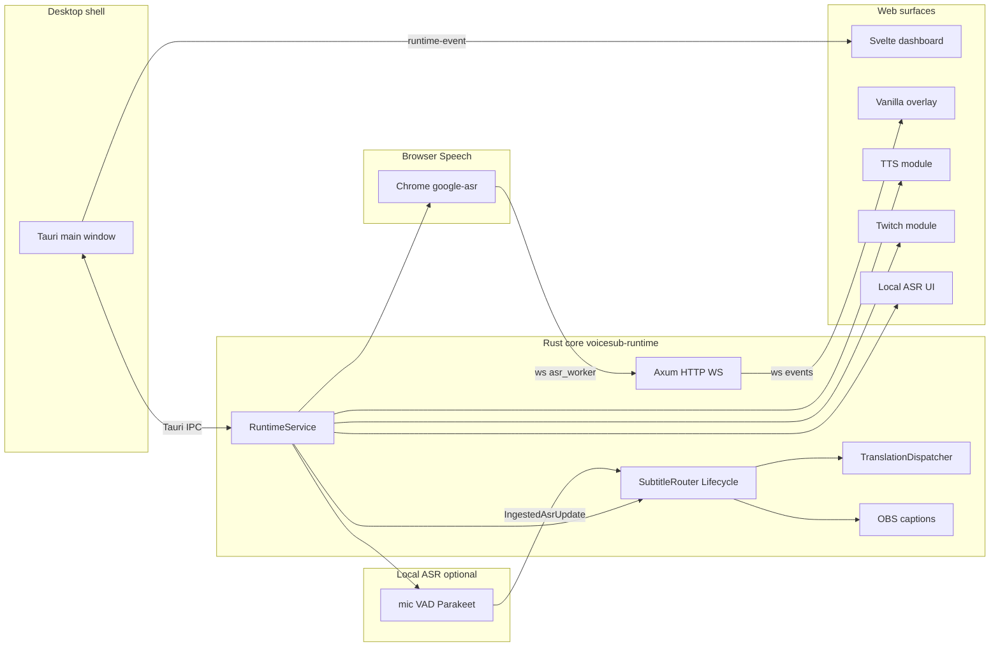

# Kagevi Subtitles 0.7.0 — Технический документ

Актуально для линии кода, где `voicesub-types::PROJECT_VERSION = "0.7.0"`.

Этот документ описывает layout проекта Kagevi Subtitles, контракт HTTP/WebSocket/Tauri IPC, схему конфигурации, поток данных через Rust runtime и поверхности frontend. Документ — **канонический технический справочник** для активной разработки. README — обзор продукта; CHANGELOG — история релизов; политика агентов — `AGENTS.md`.

**Правило сопровождения:** любое изменение контрактов API/WS/IPC, схемы config, lifecycle субтитров/перевода, renderer overlay, browser worker или NSIS installer bundle **обновляет соответствующие разделы в той же задаче**. Устаревшие формулировки удаляют или переписывают, а не оставляют «для истории».

## Оглавление

- [Связанная документация](#связанная-документация)
- [Краткая справка](#краткая-справка)
- [1. Назначение и границы системы](#1-назначение-и-границы-системы)
- [2. Технологический стек](#2-технологический-стек)
- [3. Верхнеуровневая схема рантайма](#3-верхнеуровневая-схема-рантайма)
- [4. Layout репозитория](#4-layout-репозитория)
- [5. Rust workspace (crates)](#5-rust-workspace-crates)
- [6. RuntimeService: orchestration и lifecycle](#6-runtimeservice-orchestration-и-lifecycle)
- [7. Конфигурация и миграции](#7-конфигурация-и-миграции)
- [8. HTTP API (локальный)](#8-http-api-локальный)
- [9. WebSocket-поверхность](#9-websocket-поверхность)
- [10. Tauri IPC](#10-tauri-ipc)
- [11. Логи, диагностика, экспорт](#11-логи-диагностика-экспорт)
- [12. Browser Speech worker](#12-browser-speech-worker)
- [13. Перевод: lifecycle и инварианты](#13-перевод-lifecycle-и-инварианты)
- [14. Subtitle lifecycle и presentation](#14-subtitle-lifecycle-и-presentation)
- [15. Стили субтитров и overlay](#15-стили-субтитров-и-overlay)
- [16. OBS Closed Captions](#16-obs-closed-captions)
- [17. TTS-модуль](#17-tts-модуль)
- [18. Модуль Local ASR](#18-модуль-local-asr)
- [18b. Модуль VRChat Chatbox OSC](#18b-модуль-vrchat-chatbox-osc)
- [18c. Модуль SteamVR OpenVR HUD overlay](#18c-модуль-steamvr-openvr-hud-overlay)
- [19. Desktop runtime и NSIS release](#19-desktop-runtime-и-nsis-release)
- [20. Хранилище и пути](#20-хранилище-и-пути)
- [21. Frontend: dashboard (Svelte)](#21-frontend-dashboard-svelte)
- [22. Frontend: overlay (vanilla)](#22-frontend-overlay-vanilla)
- [23. Frontend: browser worker (Svelte)](#23-frontend-browser-worker-svelte)
- [24. Локализация UI (i18n)](#24-локализация-ui-i18n)
- [25. Версионирование и проверка обновлений](#25-версионирование-и-проверка-обновлений)
- [26. Тестирование](#26-тестирование)
- [27. Продуктовые инварианты](#27-продуктовые-инварианты)
- [28. Известные ограничения и технический долг](#28-известные-ограничения-и-технический-долг)
- [29. Модель безопасности и приватности](#29-модель-безопасности-и-приватности)
- [30. Точки расширения](#30-точки-расширения)
- [31. Глоссарий](#31-глоссарий)

## Связанная документация

| Документ | Назначение |
| --- | --- |
| `docs/WIKI.ru.md` | Пользовательский гайд (RU) |
| `docs/WIKI.en.md` | Пользовательский гайд (EN) |
| `docs/TECHNICAL_ARCHITECTURE.en.md` | Техническая архитектура (English) |
| `docs/CHANGELOG.md` | История изменений |
| `AGENTS.md` | Политика для агентов |

## Краткая справка

### Запуск и сборка (разработка)

```bash
# Тесты Rust
cargo test --workspace

# Сборка frontend (dashboard + worker + TTS + Local ASR + VRChat + SteamVR HUD)
npm run build

# NSIS-релиз (Windows)
build-release-msi.bat   # → build-release.ps1
```

Tauri dev: встроенный HTTP на `http://127.0.0.1:8765`; главный webview открывает dashboard по этому URL.

### Ключевые URL (bind по умолчанию)

| URL | Назначение |
| --- | --- |
| `http://127.0.0.1:8765/` | Svelte dashboard |
| `http://127.0.0.1:8765/overlay` | OBS Browser Source |
| `http://127.0.0.1:8765/google-asr?autostart=1` | Browser Speech worker (полный UI) |
| `http://127.0.0.1:8765/google-asr-compact?autostart=1` | Компактный Browser Speech worker (Chrome `--app=`) |
| `http://127.0.0.1:8765/tts` | UI TTS-модуля |
| `http://127.0.0.1:8765/twitch` | UI модуля Twitch |
| `http://127.0.0.1:8765/local-asr` | UI модуля Local ASR |
| `http://127.0.0.1:8765/vrchat` | UI модуля VRChat Chatbox OSC |
| `http://127.0.0.1:8765/vr-overlay` | UI модуля SteamVR OpenVR HUD overlay |

### Ключевые API endpoint-ы

| Endpoint | Назначение |
| --- | --- |
| `POST /api/runtime/start` | Старт сессии (Chrome worker **или** Local ASR) |
| `POST /api/runtime/stop` | Остановка worker, translation, OBS |
| `GET /api/runtime/status` | Снимок runtime + diagnostics (`asr.local_module`) |
| `GET /api/settings/load` | Загрузка config + presets + fonts |
| `POST /api/settings/save` | Нормализация + сохранение `config.toml` |
| `POST /api/ui/sync` | Синхронизация UI theme/locale/font → `ui_config_sync` |
| `GET /api/ui/sync` | Последняя live-тема (пресет без Save) или `ui` с диска |
| `GET /api/exports/diagnostics` | Diagnostics ZIP с редактированием секретов |
| `GET /api/obs/url` | `{ overlay_url }` для OBS |
| `GET /api/asr/local/status` | Готовность модуля Local ASR / deps / model |
| `GET /api/vrchat/status` | Модуль VRChat Chatbox: enabled / слой / last send |
| `GET /api/vrchat/config` | Config модуля VRChat |
| `POST /api/vrchat/config/save` | Сохранить config VRChat |
| `POST /api/vrchat/test` | Тестовое сообщение в Chatbox OSC |
| `POST /api/vrchat/test-connection` | Слушать OSC-out (9001) на пакеты VRChat |
| `GET /api/vr-overlay/status` | Модуль SteamVR HUD: enabled / origin / last submit |
| `GET /api/vr-overlay/config` | Config SteamVR HUD overlay |
| `POST /api/vr-overlay/config/save` | Сохранить config SteamVR HUD |
| `POST /api/vr-overlay/test` | Тестовый кадр HUD через `SetOverlayTexture` (DXGI shared; запасной `SetOverlayRaw`) |
| `POST /api/vr-overlay/probe` | Probe SteamVR runtime / HMD / `IVROverlay` |
| `GET /api/vr-overlay/steamvr/status` | Статус процесса SteamVR (`vrserver` / compositor) + статус модуля |
| `POST /api/vr-overlay/steamvr/start` | Запуск SteamVR через `vrstartup.exe` (запасной `steam.exe -applaunch 250820`) — **только по действию пользователя**; модуль сам не стартует |
| `POST /api/vr-overlay/steamvr/stop` | Корректный выход: abandon OpenVR-сессии, затем `WM_CLOSE` на окна `vrmonitor` (запасной HTTP `:8998/console_command.action?sCommand=quit`) |

### Каналы WebSocket

| Channel | Назначение |
| --- | --- |
| `/ws/events` | OBS overlay (+ опциональные внешние / legacy `src/lib/ws.ts`); live `overlay_update` + runtime events |
| `/ws/asr_worker` | Транспорт Browser Speech worker |

Production Tauri dashboard и окна модулей используют in-process `runtime-event` IPC (`src/lib/runtime-events.ts`), а не `/ws/events`.

### Ключевые файлы

| Файл | Назначение |
| --- | --- |
| `crates/voicesub-types/src/version.rs` | `PROJECT_VERSION` |
| `crates/voicesub-runtime/src/service.rs` | Оркестрация, start/stop |
| `crates/voicesub-runtime/src/http/router.rs` | Все HTTP/WS routes |
| `crates/voicesub-subtitle/src/lifecycle.rs` | Subtitle FSM/TTL |
| `crates/voicesub-translation/src/dispatcher.rs` | Очередь перевода + stale drop |
| `src-tauri/src/lib.rs` | Tauri shell + IPC |
| `bin/overlay/shared/js/subtitle-style/` | Общий renderer overlay (ESM; entry `index.js`) |

## 1. Назначение и границы системы

**Kagevi Subtitles** — локальное Windows-first desktop-приложение для субтитров в реальном времени:

- захват речи через **Browser Speech worker** (отдельное окно Chrome с видимой адресной строкой, Web Speech API) **или** опциональный **Local ASR** (Parakeet ONNX, in-process mic);
- опциональный перевод на **0..4 линии** (`translation_1`…`translation_4`) с независимым выбором провайдера на слот;
- единая маршрутизация subtitle payload в Svelte dashboard, vanilla OBS overlay и OBS Closed Captions;
- опциональный **TTS-модуль** (озвучка субтитров; без окна, нужен Эфир);
- опциональный **модуль Twitch** (IRC, фильтры, опциональный chat TTS независимо от TTS субтитров);
- опциональный **модуль Local ASR** (`/local-asr`, режим `local_parakeet` при `local_module.ready`);
- экспорт diagnostics ZIP и client-side trace logs.

**Режимы ASR:** `browser_google` (default Web Speech на `/google-asr`) и опциональный `local_parakeet` (модуль Local ASR, gate `asr.local_module.ready`).

Жёсткие границы:

- рантайм local-first, default bind `127.0.0.1:8765`;
- без cloud backend, accounts, hosted database;
- **Node.js запрещён в shipped runtime**; Vite/Node — только на машине разработчика/сборки;
- dashboard и worker — Svelte (compile-time bundle); overlay — **vanilla HTML/JS** (без Svelte);
- **WebView2 Runtime** — обязателен для Tauri shell (`Kagevi Subtitles.exe`, dashboard, `/tts`, `/local-asr`, `/vrchat`, `/vr-overlay`); NSIS installer может поставить bootstrapper.
- Chrome — отдельная system dependency для Web Speech worker; core installer не тянет Python/torch/Node. Deps ONNX/CUDA и веса модели Local ASR — **lazy-download** в `user-data/modules/local-asr/` (не в core installer).

## 2. Технологический стек

| Слой | Технологии |
| --- | --- |
| Core runtime | Rust 1.85+ (edition 2024), Tokio, Axum 0.8 |
| Desktop shell | Tauri 2 → `Kagevi Subtitles.exe` (NSIS `setup.exe`) |
| Dashboard UI | Svelte 5 + Vite → `bin/dashboard/` |
| Browser worker | Svelte 5 + Vite → `bin/worker/` |
| TTS UI | Svelte 5 + Vite → `bin/tts/` |
| Twitch UI | Svelte 5 + Vite → `bin/twitch/` |
| Local ASR UI | Svelte 5 + Vite → `bin/local-asr/` |
| OBS overlay | Vanilla HTML/CSS/JS → `bin/overlay/` |
| Config | TOML (`user-data/config.toml`), JSON-shaped document inside |
| HTTP client (providers) | `reqwest` + rustls |
| Logging | `tracing` + rotating files + opt-in JSONL |
| TTS sidecar | Embedded Python exe в `bin/modules/tts/runtime/` (не в core Rust) |
| Local ASR inference | `parakeet-rs` + ONNX Runtime DLL (CPU / опционально CUDA EP) |

**Запрещено в active tree:** React, Webpack, Electron, pywebview, FastAPI runtime, in-process NeMo/torch.

## 3. Верхнеуровневая схема рантайма



**Hot path (browser):** `external_asr_update` (WS) → transcript controller → subtitle lifecycle → translation dispatcher → `overlay_update` (WS live + Tauri `runtime-event`) → OBS overlay + dashboard. **Hot path (local ASR):** mic → VAD/decode → `PartialEmitCoordinator` (`should_emit`) → тот же ingest, что и browser. `subtitle_payload_update` — только Tauri IPC snapshot/replay (не дублируется на live `/ws/events`). Replay при WS connect = `runtime_update` + `overlay_update` + `ui_config_sync`. Partial `transcript_update` коалесится (по умолчанию 90 ms); subtitle lifecycle и `overlay_update` видят каждый partial.

## 4. Layout репозитория

```
F:\AI\VoiceSub\
├── Cargo.toml                  # workspace members, workspace.dependencies
├── Cargo.lock
├── package.json                # Vite/Svelte build scripts
├── vite.config.ts              # → bin/dashboard/
├── vite.worker.config.ts       # → bin/worker/
├── vite.tts.config.ts          # → bin/tts/
├── vite.twitch.config.ts       # → bin/twitch/
├── vite.local-asr.config.ts    # → bin/local-asr/
├── vite.vrchat.config.ts       # → bin/vrchat/
├── vite.vr-overlay.config.ts   # → bin/vr-overlay/
├── build-release-msi.bat       # back-compat → build-release.ps1
├── build-release.ps1           # NSIS release pipeline
├── build/release.config.json   # release_root для setup.exe copy
│
├── crates/                     # Rust domain + adapters (см. §5)
├── src-tauri/                  # Tauri binary shell (тонкий)
├── src/                        # Svelte dashboard sources
├── src-worker/                 # Svelte browser worker sources
├── src-tts/                    # Svelte TTS module sources
├── src-twitch/                 # Svelte Twitch module sources
├── src-local-asr/              # Svelte Local ASR module sources
├── src-vrchat/                 # Svelte VRChat module sources
├── src-vr-overlay/             # Svelte SteamVR HUD module sources
│
├── bin/                        # Shipped static assets (в NSIS resources)
│   ├── dashboard/              # Vite build output
│   ├── worker/                 # Worker bundle
│   ├── tts/                    # TTS UI bundle
│   ├── local-asr/              # Local ASR UI bundle
│   ├── vrchat/                 # VRChat UI bundle
│   ├── vr-overlay/             # SteamVR HUD UI bundle
│   ├── overlay/                # Vanilla OBS overlay
│   ├── fonts/                  # Project fonts
│   └── modules/                # Sidecar modules (tts, local-asr, vrchat, vr-overlay)
│
├── tests/
│   ├── golden/                 # Regression fixtures
│   └── integration/
│
├── docs/
├── user-data/                  # runtime (gitignored)
└── logs/                       # runtime (gitignored)
```

### Исходники vs артефакты сборки

| Поверхность | В git | После `npm run build` / installer |
| --- | --- | --- |
| `crates/`, `src/`, `src-worker/`, `src-tts/`, `src-local-asr/`, `src-vrchat/`, `src-vr-overlay/` | да | компилируется в exe + static |
| `bin/dashboard`, `bin/worker`, `bin/tts`, `bin/local-asr`, `bin/vrchat`, `bin/vr-overlay` | build output (tracked или CI) | в NSIS `resources/bin/` |
| `bin/overlay/` | да | в installer |
| `user-data/`, `logs/` | нет | создаётся при runtime |

## 5. Rust workspace (crates)

Workspace members (`Cargo.toml`): 18 domain crates + `src-tauri` (отдельного `xtask` нет).

### Граф зависимостей (упрощённо)

```
voicesub-types (Layer 0: DTO, WS types, errors)
    ↑
voicesub-config, voicesub-subtitle, voicesub-translation, voicesub-browser,
voicesub-ws, voicesub-logging, voicesub-export, voicesub-obs, voicesub-audio,
voicesub-tts, voicesub-twitch, voicesub-asr-local, voicesub-vrchat, voicesub-vr-overlay, voicesub-partial-emit (Layer 1–2)
    ↑
voicesub-runtime (Layer 3: wiring, HTTP router, orchestration)
    ↑
src-tauri (Layer 4: IPC, window, bundle only)
```

### Crate reference

| Crate | Назначение |
| --- | --- |
| `voicesub-types` | `PROJECT_VERSION`, WS envelope types, ASR event DTO |
| `voicesub-config` | TOML store, defaults, normalize/migrate, paths, bind policy |
| `voicesub-subtitle` | `SubtitleLifecycleCore`, `SubtitleRouter`, presentation, overlay contract |
| `voicesub-translation` | `TranslationDispatcher`, `TranslationEngine`, 17 providers |
| `voicesub-browser` | Chrome supervisor, worker launch flags, operational FSM |
| `voicesub-ws` | `/ws/events` hub, `/ws/asr_worker` hub, event sequence |
| `voicesub-http` | Re-export `voicesub-runtime::http` (thin) |
| `voicesub-logging` | `tracing` backbone, rotation, session JSONL, deep trace flags |
| `voicesub-export` | Diagnostics ZIP, config redaction |
| `voicesub-obs` | OBS WebSocket closed captions client |
| `voicesub-audio` | WASAPI device enum, native/Sonic `PlaybackHub`, legacy WinAPI per-process routing (TTS) |
| `voicesub-tts` | Subtitle TTS service, speech queue/planner (`TtsModuleService`) |
| `voicesub-twitch` | Модуль Twitch: IRC (до 5 каналов), EventSub WebSocket-алерты, OAuth bridge, emotes, фильтры, опциональный chat + event TTS (`TwitchModuleService`) |
| `voicesub-asr-local` | Local ASR module: deps, model, Parakeet ONNX, VAD/pipeline, test bench, status |
| `voicesub-vrchat` | VRChat Chatbox OSC output (`/chatbox/input`) |
| `voicesub-vr-overlay` | SteamVR OpenVR HUD (`VRApplication_Background` → фолбэк `_Overlay`, `IVROverlay_028` → `_027`) |
| `voicesub-partial-emit` | Shared partial emit policy (`word_growth` / `char_delta`, coalesce) — **применяется на пути Local ASR**; browser Web Speech не вызывает `should_emit` |
| `voicesub-runtime` | `RuntimeService`, HTTP router, transcript controller, session wiring |

**Правило:** бизнес-логика не живёт в `src-tauri/`; Tauri — IPC + lifecycle hooks only.

## 6. RuntimeService: orchestration и lifecycle

**Файл:** `crates/voicesub-runtime/src/service.rs`

`RuntimeService` — единая точка wiring:

1. **Старт** (`POST /api/runtime/start`):
   - объединить опциональный inline `config_payload`;
   - применить live-настройки (translation, OBS, subtitle, logging);
   - если `asr.mode = browser_google`: запустить Chrome worker → `{base}/google-asr` или `/google-asr-compact` (`asr.browser.compact_worker_ui`) с `?autostart=1[&locale=…]` и ingest browser speech;
   - если `asr.mode = local_parakeet`: проверить `asr.local_module.ready`, стартовать `LocalAsrSpeechSource` (без Chrome worker);
   - стартовать translation dispatcher и OBS captions;
   - разослать `preflight_update`, `runtime_update`.

2. **Стоп** (`POST /api/runtime/stop`):
   - режим browser: `browser_asr_control` stop на `/ws/asr_worker`; убить дерево процессов Chrome (`taskkill /T /F` на Windows);
   - режим local: остановить `LocalAsrSpeechSource`;
   - остановить translation и OBS; сбросить состояние/метрики субтитров.

3. **Остановка Tauri** (`src-tauri/src/lib.rs`):
   - shutdown TTS → `POST /api/runtime/stop` → drop runtime handle.

Встроенный HTTP-сервер: отдельный Tokio runtime в процессе Tauri; bind из `AppConfig` + `VOICESUB_ALLOW_LAN`.

**Hot path 0.5.4:**

- `browser_speech_source.rs` — sync `accept_update` + async `process_ingest_work` (ingest mutex не удерживается на subtitle/WS work).
- `SubtitlePayloadForwarder` — TTS listener на отдельном упорядоченном потоке (`voicesub-subtitle-payload-forward`).
- Live subtitle WS fanout — только **`overlay_update`**; `subtitle_payload_update` — Tauri IPC snapshot, не дублируется на `/ws/events`.

## 7. Конфигурация и миграции

### Хранение

- **Путь:** `{project_root}/user-data/config.toml`
- **Формат:** JSON-shaped document, сериализованный как TOML (`voicesub-config::store`)
- **Текущая версия:** `config_version = 8` (`defaults.rs`)

### Ключи верхнего уровня

| Key | Роль |
| --- | --- |
| `config_version` | Версия схемы (миграция при load) |
| `profile` | Имя активного профиля |
| `ui` | `language`, `layout`, `theme`, `palette`, `font_family`, `show_translation_results` |
| `source_lang` | Язык источника ASR (`auto` по умолчанию) |
| `targets` | Deprecated; при load нормализуется в `translation.lines` |
| `asr` | `mode` + настройки `browser` (+ legacy-ключи `realtime` для normalize/diagnostics; см. §12) |
| `overlay` | `preset`, `compact` |
| `obs_closed_captions` | Настройки OBS WebSocket CC |
| `translation` | Провайдер, линии (до 4), cache, limits, `live_partial`, `provider_settings` |
| `subtitle_output` | Порядок отображения source/translation |
| `subtitle_lifecycle` | TTL, sync-флаги; deprecated timing-ключи только normalize |
| `source_text_replacement` | Find/replace для ASR текста (кастомные пары + builtin-корни/нормализация обходов; в `TranscriptController` до subtitle/translation). Builtin латиница/кириллица всегда по границам токена (флаг `whole_words` — только для своих пар); Hangul — по пробелам; короткая катакана / одиночный Han — изолированно; multi-char Han/hiragana — substring. Маска builtin / пустой target: первая и последняя буква (`fuck`→`f**k`, `whore`→`w***e`); уже замаскированные формы с `*` не переписываются |
| `transcript_format` | Пайплайн нарезки фраз после ASR (сейчас **принудительно выкл. / UI скрыт**) |
| `logging` | `full_enabled` — главный переключатель deep diagnostics; `runtime_metrics_enabled` — подробные runtime-метрики Tools / счётчики decode Local ASR (по умолчанию выкл.; без high-churn `diagnostics_update` при активном распознавании) |
| `updates` | Проверка GitHub Releases (`enabled`, `github_repo`, `check_interval_hours`, `latest_known_version`, …) |

### Режим ASR (Kagevi Subtitles 0.6.0)

| `asr.mode` | Статус |
| --- | --- |
| `browser_google` | **Активный default** — Chrome Web Speech worker |
| `local_parakeet` | Опциональный Local ASR; селектор на Эфире только при `asr.local_module.ready` |

Ready для `local_parakeet` — runtime gate (`asr.local_module.ready`), не перепись конфига.

**Удалённые providers.** `resolve_translation_provider` в `translation_normalize.rs` мапит имена, которые больше не поставляются, на пути save (зеркально в `src/lib/config-normalize.ts`):

| Удалён | Мапится в | Причина |
| --- | --- | --- |
| `mymemory` | `google_translate_v2` (fallback вызывающего) | Анонимная квота 5 000 символов/день непригодна для live-субтитров |
| `public_libretranslate_mirror` | `bing_translator` | Все публичные инстансы LibreTranslate без ключа офлайн или отклоняют API-трафик; замена тоже без ключа, поэтому API key внезапно не требуется |
| `microsoft_edge` | `bing_translator` | Анонимный Edge auth/translate путь Microsoft мёртв (HTTP 404); Bing остаётся безключевым |

Любое другое нераспознанное имя провайдера падает в fallback вызывающего.

### Профили

`user-data/profiles/{name}.json` — именованные снимки через `/api/profiles/*`.

Каждый профиль хранит payload dashboard `config.toml` **и** объект `modules` со снимками `config.toml` TTS, Local ASR, VRChat и SteamVR HUD (`vr_overlay`). `POST /api/profiles/{name}` всегда захватывает текущие файлы модулей. `POST /api/profiles/{name}/apply` пишет ядро + модули на диск и рассылает `ui_config_sync` (тема/язык/шрифт во все окна) и `module_config_sync` (открытые UI модулей перечитывают настройки). `POST /api/settings/reset-defaults` применяет профиль `default` и заполняет отсутствующие снимки модулей заводскими значениями. Скачанные модели/ORT Local ASR не удаляются.

Старые профили без `modules` по-прежнему применяют настройки панели; модули не трогаются, кроме заводского сброса.

## 8. HTTP API (локальный)

**Router:** `crates/voicesub-runtime/src/http/router.rs`  
**Bind по умолчанию:** `127.0.0.1:8765` (`voicesub-config::paths`)  
**LAN:** `VOICESUB_ALLOW_LAN=1` → bind `0.0.0.0`

**Безопасность LAN (OWASP ASVS V7):** при `VOICESUB_ALLOW_LAN=1` HTTP API `/api/*` по-прежнему требует per-session `x-kagevi-subtitles-token` (также принимаются `x-kagevi-voice-token`, legacy `x-voicesub-token`), а **не-loopback WebSocket-клиенты должны передать `loopback_token` (query) или тот же session header/cookie**. Loopback-пиры (OBS на этой же машине) по-прежнему ходят на `/ws/events` и `/ws/asr_worker` без токена. Предпочтителен default `127.0.0.1` + OBS Browser Source на localhost.

Глобальный middleware: заголовок CSP, `Cache-Control: no-store`.

### Health / Version

| Method | Path | Auth | Назначение |
| --- | --- | --- | --- |
| GET | `/live` | public | Минимальный liveness probe (`{"ok":true}`) для OBS overlay |
| GET | `/api/health` | loopback token | Liveness + WS connections + worker connected |
| GET | `/api/version` | loopback token | Product metadata + `sync` (updates config, `update_available`, `latest_known_version`) |

**Loopback API auth:** окна Tauri получают per-session token через IPC `get_loopback_api_token` и шлют `x-kagevi-subtitles-token` (также принимаются `x-kagevi-voice-token`, legacy `x-voicesub-token`). App HTML (`/`, `/tts`, `/twitch`, `/local-asr`, `/vrchat`, `/vr-overlay`, `/google-asr`, `/google-asr-compact`) требует одноразовый `?bootstrap=<nonce>` (HttpOnly cookie `kagevi_loopback`) **или** уже валидную session cookie/header — иначе **401** (исключение: неаутентифицированный `/tts` отдаёт только минимальный Twitch OAuth shell). `POST /api/tts/twitch/oauth-complete` публичный (bridge редиректа Twitch в system browser — только pending token/error). OBS overlay **не** вызывает protected `/api/*` (только `/live` + WebSocket).

### Devices / OpenAI helpers

| Method | Path | Назначение |
| --- | --- | --- |
| GET | `/api/devices/audio-inputs` | Empty list (browser ASR uses `getUserMedia`) |
| GET | `/api/openai/recommended-models` | Static recommended models |
| POST | `/api/openai/models` | Live OpenAI-compatible `GET {base}/models` (chat filter for api.openai.com) |
| POST | `/api/openai/usable-models` | Alias |

### Settings / Profiles

| Method | Path | Назначение |
| --- | --- | --- |
| GET | `/api/settings/load` | Config + subtitle presets + font catalog |
| POST | `/api/settings/save` | Merge/save + live apply |
| GET/POST/DELETE | `/api/profiles`, `/api/profiles/{name}` | CRUD профилей (снимок ядра + `modules`) |
| POST | `/api/profiles/{name}/apply` | Записать профиль (ядро + модули) и разослать UI/module sync |
| POST | `/api/settings/reset-defaults` | Применить профиль `default` + заводские настройки модулей, сохранить, разослать |
| POST | `/api/ui/sync` | Debounced UI-only sync → `ui_config_sync` на EventBus (theme/locale/`ui.font_family`/`palette` между dashboard, Web ASR, TTS, Local ASR, VRChat, SteamVR HUD) |
| GET | `/api/ui/sync` | Последняя live-презентация UI (горячий пресет темы) или `ui` с диска — окна модулей применяют после `/api/settings/load`, чтобы не оставаться на старой сохранённой теме |

### Runtime / OBS

| Method | Path | Назначение |
| --- | --- | --- |
| POST | `/api/runtime/start` | Start session (`config_payload?`) |
| POST | `/api/runtime/stop` | Stop session |
| GET | `/api/runtime/status` | Full runtime snapshot |
| GET | `/api/obs/url` | `{ overlay_url }` |

### Logging / Exports

| Method | Path | Назначение |
| --- | --- | --- |
| POST | `/api/logs/client-event` | Client → `session-latest.jsonl` |
| POST | `/api/logs/ui-trace` | UI render trace → `ui-trace.jsonl` |
| GET | `/api/exports` | List export bundles |
| GET | `/api/exports/diagnostics` | Diagnostics ZIP |

### TTS / Twitch OAuth

| Method | Path | Назначение |
| --- | --- | --- |
| GET | `/api/tts/google` | Google Translate TTS proxy |
| GET | `/api/tts/python` | TTS via embedded Python module |
| GET | `/api/tts/python/status` | Python runtime probe |
| POST | `/api/tts/twitch/oauth-open` | Open Twitch OAuth in system browser |
| GET | `/api/tts/twitch/oauth-pending` | Poll pending token **или** OAuth error (`status`: `token` \| `error` \| `none`) |
| POST | `/api/tts/twitch/oauth-complete` | **Публичный** bridge: store OAuth token **или** cancel/deny из браузера (`error` + `message`) |

### Local ASR (`/api/asr/local/*`)

Protected like other `/api/*`. Полная таблица в [§18 Модуль Local ASR](#18-модуль-local-asr).

### Updates

| Method | Path | Назначение |
| --- | --- | --- |
| POST | `/api/updates/check` | Poll GitHub Releases (`force` on dashboard bootstrap); persists `updates.latest_known_version`, `last_checked_utc` |

### HTML pages

| Method | Path | Handler |
| --- | --- | --- |
| GET | `/` | `bin/dashboard/index.html` |
| GET | `/overlay` | `bin/overlay/overlay.html` |
| GET | `/google-asr` | `bin/worker/index.html` (полный UI) |
| GET | `/google-asr-compact` | `bin/worker/index.html` (компактный UI; тот же бандл) |
| GET | `/tts` | `bin/tts/index.html` (без auth — только OAuth shell) |
| GET | `/twitch` | `bin/twitch/index.html` |
| GET | `/local-asr` | `bin/local-asr/index.html` |
| GET | `/project-fonts.css` | Generated `@font-face` from `bin/fonts/` |

### Static mounts

| URL prefix | Disk path |
| --- | --- |
| `/overlay-assets` | `bin/overlay/` |
| `/static` | `bin/overlay/shared/` (legacy shared assets) |
| `/worker-assets` | `bin/worker/` |
| `/assets` | `bin/dashboard/assets/` |
| `/tts-assets` | `bin/tts/` |
| `/twitch-assets` | `bin/twitch/` |
| `/local-asr-assets` | `bin/local-asr/` |
| `/project-fonts` | `bin/fonts/` |

`bin/` резолвится через `ProjectPaths::locate_bin_dir()` — workspace `bin/` или Tauri NSIS `resources/bin/`.

## 9. WebSocket-поверхность

**Аутентификация:** WebSocket с **loopback** без токена (OBS overlay + Chrome worker на этой же машине). **Не-loopback** клиенты обязаны передать query `loopback_token` (или session header/cookie). При `VOICESUB_ALLOW_LAN=1` см. §8.

### `/ws/events` — OBS overlay (+ опциональные внешние клиенты)

**Реализация:** `crates/voicesub-ws/src/events.rs`

- Клиент только на приём (входящий текст игнорируется)
- При connect: `hello` (`type: "hello"`, `message: "connected"`)
- Replay последних: `runtime_update`, `overlay_update`, `ui_config_sync`
- Ограниченная очередь на сокет (по умолчанию 128), dedupe по `type`

**Envelope:** `{ "type": "<channel>", "payload": {…} }`  
Обогащение payload: `event_sequence`, `created_at_ms`, `event_type` (`WsEventPublisher`).

| `type` | Транспорт | Назначение |
| --- | --- | --- |
| `hello` | WS | Handshake |
| `runtime_update` | WS + EventBus | Фаза, состояние ASR/worker, метрики |
| `preflight_update` | WS + EventBus | `{ running: bool }` во время start/stop |
| `diagnostics_update` | WS + EventBus | Снимок ASR diagnostics |
| `model_status_update` | WS + EventBus | Готовность модели/ASR |
| `transcript_update` | WS + EventBus | События ASR partial/final (единственный live ASR text channel с 0.5.4; partials коалесятся) |
| `overlay_update` | WS + EventBus | Тело кадра overlay (live + **replay при connect**) |
| `translation_update` | WS + EventBus | Результаты перевода по sequence |
| `twitch_connection_update` | WS + EventBus | Состояние подключения Twitch (также snapshot replay) |
| `ui_config_sync` | WS + EventBus | `{ ui: … }` sync theme/locale/`font_family` (через `/api/ui/sync`; **replay при connect**) |
| `subtitle_payload_update` | **только EventBus / Tauri snapshot** | Presentation субтитров — **не** публикуется на `/ws/events`; live + WS replay — через `overlay_update` |
| `twitch_chat_message` | **только EventBus** | Twitch chat для TTS — `publish_event_bus_only` (без fanout на `/ws/events`) |
| `twitch_channel_event` | **только EventBus** | Алерты канала (фоллоу / саб / ресаб / гифт / рейд / чир) + TTS событий — `publish_event_bus_only` |

**Stale guard:** overlay (`overlay.js` + `ws-stale-guard-logic.js`) отбрасывает устаревшие события после stop/start (timestamp-first при reset sequence).

### In-process runtime events — Tauri dashboard + TTS (0.5.2+)

**Реализация:** `RuntimeEventBus` (`crates/voicesub-ws/src/event_bus.rs`) + Tauri emit `runtime-event` (`src-tauri/src/lib.rs`).

- Главный dashboard (`src/lib/runtime-events.ts`) и TTS-модуль (`src-tts/App.svelte`) **не открывают** `ws://127.0.0.1:8765/ws/events` — получают те же envelope `{ type, payload }` через канал событий Tauri.
- При subscribe: сначала `listen(runtime-event)` (буфер live-кадров), затем IPC `get_runtime_state_snapshot`, затем drain буфера — чтобы stale snapshot не перезаписал более новый live event. Dashboard replay предпочитает `overlay_update` (fallback — `subtitle_payload_update`); TTS replay — `runtime_update` + `twitch_connection_update` + `ui_config_sync`.
- WS publisher (`WsEventPublisher`) дублирует большинство broadcast в EventBus; OBS overlay по-прежнему только WS. **Twitch chat** — `publish_event_bus_only` (без fanout на `/ws/events`); обновления connection идут в hub для snapshot replay.

**Legacy:** `src/lib/ws.ts` (`EventsSocket`) — для dev / опциональных внешних browser-клиентов; production Tauri shell использует `runtime-events.ts`.

### `/ws/asr_worker` — browser worker

**Реализация:** `crates/voicesub-ws/src/asr_worker.rs`

**Server → worker:**

| `type` | Поля | Назначение |
| --- | --- | --- |
| `hello` | `message: "browser_asr_worker_connected"`, `transport_id` | Handshake |
| `browser_asr_control` | `action`, `reason?`, `issued_at_ms`, `transport_id` | Control (e.g. `stop`) |

**Worker → server:**

| `type` | Handler |
| --- | --- |
| `external_asr_update` | ASR text ingest (partial/final, generation guards) |
| `browser_asr_status` | Worker state snapshot |
| `browser_asr_heartbeat` | Same as status |
| `hello` | Recognized, no special handling |

## 10. Tauri IPC

**Регистрация:** `src-tauri/src/lib.rs` → `tauri::generate_handler!`

**Capabilities (на окно):** `src-tauri/capabilities/default.json` (main — только shell `allow-voicesub-ipc`), `tts.json` (`allow-voicesub-tts-ipc`), `local-asr.json` (`allow-voicesub-local-asr-ipc`), `vrchat.json` (`allow-voicesub-vrchat-ipc`), `vr-overlay.json` (`allow-voicesub-vr-overlay-ipc`). `get_loopback_api_token` в allowlist на всех. Все capabilities запрещают frontend `core:event` emit / emit-to (только listen). Матрица ACL — тесты `src-tauri/src/acl_matrix.rs`.

### Shell-команды (только `main`)

| Command | Назначение |
| --- | --- |
| `get_loopback_api_token` | Per-session token для protected `/api/*` (окна Tauri; HTML не должен встраивать токен) |
| `get_runtime_state_snapshot` | Replay runtime/subtitle/overlay/translation/diagnostics для Tauri shell при connect |
| `set_dashboard_layout` | Окно compact (390×844) vs standard (1280×900) |
| `tts_open_window` | Открыть/сфокусировать webview `/tts` |
| `twitch_open_window` | Открыть/сфокусировать webview `/twitch` |
| `local_asr_open_window` | Открыть/сфокусировать webview `/local-asr` |
| `vrchat_open_window` | Открыть/сфокусировать webview `/vrchat` |
| `vr_overlay_open_window` | Открыть/сфокусировать webview `/vr-overlay` |
| `open_external_https_url` | Открыть allowlisted HTTPS URL в system browser (баннер обновлений, setup-ссылки провайдеров перевода, донат в «О программе») |
| `open_local_http_url` | Открыть validated loopback HTTP URL в system browser |

### Окна TTS и Twitch

ACL webview: только `get_loopback_api_token` + `get_runtime_state_snapshot`. Open/focus — shell-команды **main** (`tts_open_window`, `twitch_open_window`). Домен — в `RuntimeService` (`voicesub-tts` / `voicesub-twitch`) + HTTP `/api/tts/*` и `/api/twitch/*`. Закрытие **окна** всегда **уничтожает** WebView2 (RAM Chromium). Enable-without-window — это Rust-сервис: озвучка субтитров / IRC / TTS чата продолжают работать **только пока модуль включён**. Выключенный модуль + закрытое окно не оставляют скрытый webview.

### Окно Local ASR (capability `local-asr`)

ACL webview: только `get_loopback_api_token` + `open_external_https_url`. Open/focus окна — shell-команда **main** (`local_asr_open_window`). Доменная логика — в `voicesub-asr-local` + HTTP.

### Окна VRChat и SteamVR HUD

ACL webview: только `get_loopback_api_token`. Open/focus — shell-команды **main** (`vrchat_open_window`, `vr_overlay_open_window`). Доменная логика — в `voicesub-vrchat` / `voicesub-vr-overlay` + HTTP. Окна получают `ui_config_sync`, `runtime_update`, `module_config_sync`; live `overlay_update` / `transcript_update` на них **не** дублируются. Закрытие окна **уничтожает** WebView2; OSC / OpenVR продолжают работать только пока соответствующий вывод/HUD включён.

### Модули `src-tauri/` (только shell)

| File | Роль |
| --- | --- |
| `lib.rs` | Setup Tauri, bootstrap HTTP runtime, регистрация IPC, EventBus pump |
| `shell.rs` | Allowlisted `open_external_https_url` / `open_local_http_url` |
| `event_routing.rs` | Фильтры типов `runtime-event` по окнам + envelope snapshot replay |
| `ipc_pump.rs` | Bus→IPC pump: coalescing overlay (только dashboard), debounce lag-resync, не слать IPC в закрытые окна модулей |
| `module_windows.rs` | Метки окон модулей + политика close/destroy (RAM WebView vs enable-without-window) |
| `webview_memory.rs` | Политика suspend/memory WebView2 (`WebviewMemoryManager`) |
| `dashboard_nav.rs` | Helpers URL главного webview |
| `webview2_gate.rs` | Проверка наличия WebView2 runtime перед созданием окна |
| `tts.rs` | Только open/focus окна TTS |
| `twitch.rs` | Только open/focus окна Twitch |
| `local_asr.rs` | Только open/focus окна Local ASR |
| `vrchat.rs` | Только open/focus окна VRChat |
| `vr_overlay.rs` | Только open/focus окна SteamVR HUD |
| `acl_matrix.rs` | Тесты ACL matrix capabilities |

**События Tauri (shell-клиенты):** `runtime-event` (envelope в форме WS), `tts-speech-activity` / `playback-finished` — только **`emit_to(tts)`** (не global `emit`).

**`runtime-event` routing (per window):** bus→IPC pump (`src-tauri/src/ipc_pump.rs`, фильтры в `event_routing.rs`) эмитит через `emit_to(label, …)`, не global `emit`. **Main** dashboard получает все envelope; **tts** window — только `twitch_chat_message`, `twitch_connection_update`, `runtime_update`, `runtime_status`, `ui_config_sync`; **local-asr** window — только `ui_config_sync` (живая тема/локаль/шрифт без Save); **vrchat** и **vr-overlay** — `ui_config_sync`, `runtime_update`, `module_config_sync`. UI Local ASR, TTS, VRChat и SteamVR HUD **не** открывают `/ws/events` для UI sync (только BroadcastChannel + Tauri IPC) — иначе клиент всё равно получает overlay/runtime на полной частоте. `setLocale` идемпотентен, чтобы обработчики locale-changed / BroadcastChannel не зацикливались. Высокочастотный `transcript_update` / `overlay_update` не флудит IPC модулей. Payload по ссылке (без deep-clone). **`overlay_update` IPC на main dashboard коалесится** (trailing-edge, default 90 ms, env `VOICESUB_OVERLAY_IPC_MIN_INTERVAL_MS`); OBS `/ws/events` получает каждый кадр. `runtime_update` / `translation_update` сбрасывают pending overlay немедленно. При `RecvError::Lagged` — метрики `event_bus_consumer_lagged_*`, pending snapshot resync (последний нужный sync не дропается; 200 ms coalesce между follow-up), затем `snapshot_to_envelopes` (overlay предпочтительнее raw subtitle).

**Partial coalescing:** partial `transcript_update` — leading-edge throttle в `TranscriptController` (default 90 ms, env `VOICESUB_TRANSCRIPT_PARTIAL_MIN_INTERVAL_MS`; новая фраза/`sequence` и все final — без задержки). Subtitle lifecycle и WS `overlay_update` видят каждый partial; ingest сначала обновляет subtitle, затем async fanout transcript. Коалесится только избыточный transcript IPC/WS канал.

**Форматирование текста (`transcript_format`):** rule-based слой в `voicesub-transcript-text` **выключен и скрыт** в dashboard (Ещё / command palette). Normalize и runtime settings принудительно ставят `enabled = false`, чтобы legacy-конфиг не включал его. Код пайплайна сохранён для возможного возврата.

**Замена слов (`source_text_replacement`):** кастомные пары + опциональный builtin мат/стемы (`voicesub-twitch::source_text_replacement`, в `TranscriptController`). Builtin латиница/кириллица всегда с границами слова, даже при `whole_words = false` (флаг влияет только на свои пары; для CJK свои политики substring/isolation). Стемы: overlapping AC + leftmost-longest среди *принятых* хитов, плюс контекстные отсечения ложных RU-корней (`ебл` в `потреблять`, `блят` в `оскорблять`). Пустой / `***` target и builtin-хиты маскируются первой+последней буквой (`fuck`→`f**k`, `whore`→`w***e`); матчи с уже существующим `*` не переписываются. Twitch chat TTS — та же маска через `include_builtin_profanity` (пары с dashboard не шарятся).

**Lifecycle:** главный webview создаётся скрытым, затем `navigate()` на `http://{bind_addr}/?bootstrap=…` (Tauri `devUrl` — публичный `/live`, чтобы CLI/webview probe не ловил 401 на закрытом `/`); при close → shutdown TTS → stop runtime. `RunEvent::Exit` тоже ставит `session-lifecycle.json` в graceful, чтобы Ctrl+C / выход процесса не оставляли stale `running`.

## 11. Логи, диагностика, экспорт

**Директория:** `{project_root}/logs/`

### Backbone (всегда)

| File | Назначение |
| --- | --- |
| `core.log` | Backbone `tracing` (+ stderr); rotate → `core.old.log` при старте |
| `runtime-events.log` | Компактные structured events (ротация 5 MB) |
| `session-latest.jsonl` | Клиентские события из `/api/logs/client-event` (макс. 5000 строк) |

### Opt-in JSONL traces

Главный переключатель: `logging.full_enabled` в config **или** `VOICESUB_DEEP_DIAGNOSTICS`.

| File | Env включения |
| --- | --- |
| `subtitle-trace.jsonl` | `VOICESUB_TRACE_SUBTITLE` |
| `tts-trace.jsonl` | `VOICESUB_TRACE_TTS` |
| `browser-trace.jsonl` | `VOICESUB_TRACE_BROWSER` |
| `obs-trace.jsonl` | `VOICESUB_TRACE_OBS` |
| `ui-trace.jsonl` | `VOICESUB_TRACE_UI` |
| `ws-trace.jsonl` | `VOICESUB_TRACE_WS` |
| `pipeline-trace.jsonl` | `VOICESUB_TRACE_PIPELINE` |
| `session-lifecycle.json` | всегда (маркер сессии); шаги shutdown/panic дублируются в `pipeline-trace.jsonl` при deep diagnostics |

### Форматы timestamp-полей (0.5.4+)

Ряд полей в логах и subtitle lifecycle, ранее хранивших **Unix epoch seconds строкой**, теперь используют **RFC 3339 UTC** (например `2026-06-21T07:01:00Z`). **Ключи payload не менялись** — изменился только формат значения.

| Поле | Где | Примечание |
| --- | --- | --- |
| `timestamp_utc` | `session-latest.jsonl`, deep JSONL traces | Внешние скрипты должны принимать оба формата |
| `finalized_at_utc`, `completed_expires_at_utc` | Subtitle lifecycle payload | Overlay/dashboard не парсят их как числа |

Helpers: `voicesub_types::utc_now_rfc3339()`, `epoch_secs_to_rfc3339()`.

При deep diagnostics записи ASR ingest в `pipeline-trace.jsonl` могут включать `ingest_latency_ms` (`trace.rs` + `transcript_controller.rs`).

Отключение: те же переменные `=0` / `false`.  
Подробные runtime-events: `VOICESUB_TRACE_RUNTIME_EVENTS_VERBOSE`.

При `logging.full_enabled` шаги закрытия (`shutdown_begin`, `shutdown_step`, `shutdown_complete`) пишутся в `core.log` (`voicesub.lifecycle`) и `pipeline-trace.jsonl`. `session-lifecycle.json` обновляется всегда: `running` → `graceful` или `panic`. Если при старте остался `running` и прежний PID уже мёртв, в `core.log` — `previous session exited without graceful shutdown` на уровне **info** (`cargo tauri dev` / Ctrl+C / Task Manager). WARN только если этот PID ещё жив.

### Другие env vars

| Variable | Назначение |
| --- | --- |
| `VOICESUB_ALLOW_LAN` | Bind `0.0.0.0` |
| `VOICESUB_TRANSCRIPT_PARTIAL_MIN_INTERVAL_MS` | Мин. интервал partial `transcript_update` (default **90**; `0` = без коалесинга; не влияет на `overlay_update`) |
| `VOICESUB_OVERLAY_IPC_MIN_INTERVAL_MS` | Trailing-edge коалесинг `overlay_update` IPC dashboard (default **90**; **`0`** = выкл.; OBS WS без изменений) |
| `VOICESUB_BROWSER_AFFINITY` | CPU affinity browser worker (`1` / `true`) |
| `VOICESUB_BROWSER_AFFINITY_MASK` | Hex override маски affinity |
| `VOICESUB_BROWSER_AFFINITY_EXCLUDE_LOW` | Исключить low-power ядра из маски (default `1`) |
| `RUST_LOG` | Переопределение фильтра `tracing` |
| `VOICESUB_TTS_PER_PROCESS_ROUTING` | WinAPI-маршрутизация audio TTS |
| `VOICESUB_TTS_ALLOW_SYSTEM_PYTHON` | Разрешить system Python для TTS fetcher |

### Diagnostics ZIP

`GET /api/exports/diagnostics` собирает в ZIP: `runtime_status.json`, `config_redacted.json`, `environment.txt`, `latest_session.jsonl`, `core.log`, `runtime-events.log` (плюс deep JSONL traces при `logging.full_enabled`).

ZIP пишутся в `user-data/exports/` как `diagnostics-{unix}_{ms}.zip`. Экспортёр хранит не больше **12** свежих diagnostics ZIP и удаляет более старые.

## 12. Browser Speech worker

### URL и запуск

| Константа | Значение |
| --- | --- |
| `WORKER_PATH` | `/google-asr` |
| `WORKER_COMPACT_PATH` | `/google-asr-compact` |
| Launch URL (полный) | `{base}/google-asr?autostart=1[&locale={ui.language}]` |
| Launch URL (компакт) | `{base}/google-asr-compact?autostart=1[&locale={ui.language}]` при `asr.browser.compact_worker_ui = true` |

`worker_launch_browser`: `auto` | `google_chrome` (unknown → `auto`).

`asr.browser.compact_worker_ui` (bool, default `false`): чекбокс на вкладке Эфир; выбирает компактную страницу + Chrome `--app=`.

### Инварианты запуска Chrome

- **Полный worker** (`/google-asr`): **отдельное окно** Chrome с **видимой адресной строкой** (`--new-window` + trailing URL)
- **Компактный worker** (`/google-asr-compact`): Chrome **`--app=<url>`** (без omnibox), `--window-size=420,720`; без `--new-window` для этого пути
- Изолированный `--user-data-dir`: `{user-data}/browser-worker-profile-classic-{engine}/`
- **Никогда** `--disable-extensions` / `--bwsi`. В сохранённом конфиге `--app=` не хранится (strip); `--app=` добавляется только при launch компактного URL
- **Без** скрытых окон и in-tab worker
- Anti-throttling флаги Chrome + opt-out Windows EcoQoS (`launch_config.rs`, `ecoqos.rs`): occlusion/backgrounding switches, отключены `IntensiveWakeUpThrottling` + `AllowAggressiveThrottlingWithWebSocket` + `BatterySaverModeAvailable`, `--disable-field-trial-config`, `--audio-process-high-priority`, `--hide-crash-restore-bubble`
- Detached-процесс с **`ABOVE_NORMAL_PRIORITY_CLASS`** при `use_high_priority` (по умолчанию true): ASR отзывчив без `HIGH_PRIORITY_CLASS`, вытесняющего foreground apps. Fallback на normal при `ERROR_ACCESS_DENIED`. Stop через `taskkill /T /F` (только при реальном `pid > 0`)
- **Сбор orphan-процессов (`orphan_guard.rs`):** PID живого worker сохраняется в `user-data/browser-worker.pid` при launch и очищается после успешного kill. `RuntimeService::start` убивает осиротевший воркер прошлой *аварийной* сессии — только если PID всё ещё `chrome.exe`. При неудачном kill PID-файл сохраняется для retry.
- **Стабильность launch (0.5.2+):** `launch_stability.rs`, `profile_bloat_guard.rs` (гигиена профиля + сброс `exit_type`/`exited_cleanly` перед spawn, чтобы force-kill не показывал пузырь Chrome «Восстановить страницы?»; в launch также `--hide-crash-restore-bubble`), `process_affinity.rs` (opt-in через `VOICESUB_BROWSER_AFFINITY`); contract-тесты в `crates/voicesub-browser/tests/chrome_launch_contract.rs`

### Test harness (без spawn Chrome)

- `voicesub-browser::browser_worker_launch_skipped()` — `cfg(test)` в unit-тестах crate + env `VOICESUB_SKIP_BROWSER_WORKER=1`
- Integration-тесты (`voicesub-http/tests/`, `voicesub-runtime/tests/`) выставляют skip в `integration_lock()` — зависимости собираются **без** `cfg(test)`
- Stub launch: `pid: 0`, `worker_pid = None`; опционально `VOICESUB_FORCE_BROWSER_WORKER=1` для ручной проверки

### Frontend worker (`src-worker/`)

| Module | Роль |
| --- | --- |
| `worker-controller.ts` | Autostart, lifecycle распознавания |
| `socket-bridge.ts` | Подключение `/ws/asr_worker`, `browser_asr_control` |
| `session-manager.ts` | Возраст сессии, reconnect, watchdog |
| `long-segment-flush-logic.ts` | Сброс буфера Web Speech после длинного сегмента (≥450 символов) |
| `web-speech-policy.ts` | Strip on-device hints, overlap policy |

**Defaults UI worker:** lang `ru-RU`, interim/continuous включены, force-finalization idle **1600 ms** (панель worker), max возраст сессии **180 s**.

**Silence rearm (только native continuous):** при `continuous=true` Chrome часто ждёт ~8 с тишины до `no-speech`. Watchdog циклит распознавание после **9000 ms** без start/result в рамках **текущего** mic-hot streak (`activeSpeechStallMs` / `web_speech_stalled`; cold-start **4.5 с**). Длинная пауза и новая речь **не** вызывают немедленный rearm — таймер stall стартует, когда mic снова становится горячим. В overlap / `continuous=false` этот путь **не** используется (свой silence rearm). Задержка `no_speech` фиксированная (`no_speech_restart_delay_ms`, по умолчанию 150) без накопительного +800 ms backoff. Задержка `network` / `audio_capture` тоже фиксированная (`network_reconnect_initial_ms`, по умолчанию 500) — без экспоненциального роста.

**Visible idle rearm (все режимы):** если окно worker видимо, mic тихий и нет transcript activity (`lastStartAtMs` / `lastResultAtMs`) **30 с** (`visibleIdleRestartMs`; скрытое окно — **60 с**), watchdog force-rearm (`watchdog forced rearm`). Отдельно от active-speech stall (**9 с** при энергии на mic).

**Overlap (dual-buffer):** при `continuous=false` чередуются два слота `SpeechRecognition`: **`preStartNextInstance`** на natural/forced final; **`switchToNextInstance`** на active `onend`; **`safeRestartRecognition`** (~50 мс), если buddy нет. Idle-слоты пересоздаются перед `start()`. **Не** early-warm buddy на active `onstart` — второй одновременный `SpeechRecognition` заставляет Chrome рвать active (thrash ~1–2 с, поток `duplicate-partial`). Гипотезы buddy **shadow** до handoff. Hard errors — global restart. **Склейка:** soft-join (~1.8 с тишины **и** тихий mic, или ≥450 символов). **Silence rearm:** без ASR с старта слота — **8 с** тишины / **3 с** только если **текущий** mic-hot streak уже 3 с без ASR (не просто «mic горячий сейчас» после паузы); stale soft-join partial не блокирует. **Buddy shadow:** flush на handoff.

### Long-segment flush (буфер Web Speech)

После **committed** сегмента (natural или forced final), если пик partial или длина final ≥ **450 символов**, worker сбрасывает раздутый in-session буфер `SpeechRecognition.results`. Иначе следующая речь стабильно финализируется короткими фрагментами (в `pipeline-trace.jsonl` — серия `asr_ingest_final_published` с малым `text_len`).

| Режим | Действие |
| --- | --- |
| `native_continuous` (`continuous=true`, по умолчанию) | `requestRecognitionFlush` → `recognition.stop()` → restart с reason `long_segment_flush` (~100 ms) |
| Overlap (`continuous=false`) | сначала `preStartNextOverlapInstance`, затем `stop()` только **активного** слота → handoff на warming buddy |

**Не настраивается** (порог `DEFAULT_LONG_SEGMENT_FLUSH_MIN_CHARS = 450` в `long-segment-flush-logic.ts`). State: `currentSegmentPeakPartialChars`, счётчик `longSegmentFlushCount`. **Не заменяет** ротацию по возрасту сессии (`max_browser_session_age_ms`) и idle forced-final (`force_finalization_timeout_ms`). Native continuous stall: `web_speech_stalled` / `active_speech_stall` после **9 с** без ASR-результатов в текущем mic-hot streak; если есть partial — watchdog **коммитит** без restart (чтобы не было многосекундных дыр); пустой stall rearms через `stop()` (`watchdog_stall`, ~100 ms).

### Расширенные настройки Web Speech (dashboard)

**UI:** Settings → More → Recognition → «Расширенные настройки Web Speech» (`WebSpeechAdvancedSettings.svelte`). У каждого числового поля — кнопка **`!`** (`FieldHelpButton.svelte`) с локализованным описанием (en, ru, ja, ko, zh); клик — popover, hover — `title`.

**Маппинг config:**

| Секция UI | Путь config | Runtime |
| --- | --- | --- |
| Пороги forced final | `asr.browser.force_final_min_*` | Browser worker (`transcript-logic.ts`) |
| Перезапуск и восстановление | `asr.browser.*_restart_delay_ms`, `minimum_reconnect_interval_ms`, `stuck_stopping_timeout_ms` | Worker session manager |
| Сеть | `asr.browser.network_reconnect_*` | Worker: фиксированная задержка restart (`network` / `audio_capture`) |
| Ротация сессии | `asr.browser.max_browser_session_age_ms`, `prepare_cycle_before_ms` | Worker session cycle |
| Фильтрация partial (UI) | `asr.realtime.partial_min_delta_chars`, `partial_coalescing_ms` | Сохраняется и попадает в browser ASR **diagnostics**; **не** применяется на browser ingest (`browser_event_builder` не вызывает `should_emit`). Live Local ASR использует module `realtime` в `user-data/modules/local-asr/config.toml` через `voicesub-partial-emit` |

**Канонические defaults** (источник `src/lib/webspeech-advanced-defaults.ts`, зеркало в `defaults.rs`, `config-normalize.ts`, `worker-defaults.ts`):

| Ключ | Default |
| --- | ---: |
| `force_final_min_chars` | 8 |
| `force_final_min_stable_ms` | 750 |
| `minimum_reconnect_interval_ms` | 500 |
| `normal_restart_delay_ms` | 150 |
| `no_speech_restart_delay_ms` | 150 |
| `stuck_stopping_timeout_ms` | 2000 |
| `network_reconnect_initial_ms` | 500 |
| `network_reconnect_max_ms` | 30000 (legacy; не используется — retry остаётся на `network_reconnect_initial_ms`) |
| `max_browser_session_age_ms` | 180000 |
| `prepare_cycle_before_ms` | 30000 |
| `partial_min_delta_chars` | 0 |
| `partial_coalescing_ms` | 0 |

**Не в этой панели:** `asr.browser.force_finalization_timeout_ms` — idle-таймаут forced final; настраивается в **окне Web Speech worker**. После изменения lifecycle-ключей переоткройте worker.

## 13. Перевод: lifecycle и инварианты

**Crate:** `voicesub-translation`  
**Entry:** `TranslationDispatcher` (`dispatcher.rs`)

### Providers (17)

`SUPPORTED_PROVIDERS` in `providers/mod.rs`:

| ID | Group |
| --- | --- |
| `google_translate_v2` | API (default) |
| `google_cloud_translation_v3` | API |
| `azure_translator` | API |
| `deepl` | API |
| `libretranslate` | API/self-hosted |
| `openai` | llm |
| `openrouter` | llm |
| `lm_studio` | local_llm |
| `ollama` | local_llm |
| `baidu_translate` | china (free-tier quota) |
| `youdao_translate` | china (free-tier quota) |
| `tencent_tmt` | china (free-tier quota) |
| `caiyun_translator` | china (zh/en/ja) |
| `google_gas_url` | experimental |
| `google_web` | experimental |
| `bing_translator` | experimental (без ключа) |
| `free_web_translate` | experimental (без ключа) |

Заметки: DeepL мапит UI-коды (`en`/`zh-cn`/`pt`) в API targets и выбирает Free vs Pro URL по ключу (`:fx` → free), если не задан custom `api_url`. Google v3 short model id раскрываются в full resource names. Azure предпочитает `zh-Hans`/`zh-Hant`; LibreTranslate — `zh`/`zt`. Китайские провайдеры: Baidu / Youdao / Tencent — бесплатные месячные квоты после регистрации; Caiyun — только zh/en/ja.

**Провайдеры без ключа.** Три провайдера не требуют API key и являются бесплатным путём для пользователей без аккаунтов. Они намеренно размещены на **независимых хостах**, чтобы throttle или блокировка одного не выводила из строя остальные:

| ID | Endpoint | Заметки |
| --- | --- | --- |
| `google_web` | `translate-pa.googleapis.com/v1/translateHtml` | Путь Google Translate Element (`te_lib`). POST JSON+protobuf с публичным ключом виджета; HTML-escape на входе, unescape на выходе. Заменил `translate_a/single?client=gtx` после того, как тот хост начал отвечать 429/`sorry` многим IP |
| `free_web_translate` | `clients5.google.com/translate_a/t?client=dict-chrome-ex` | Путь словаря Chrome-расширения; отдельный throttle bucket от `google_web`. При `sl=auto` ответ `[[text, lang]]`, при явном `sl` — `[text]`; парсятся обе формы |
| `bing_translator` | `bing.com/translator` → `ttranslatev3` | Keyless Bing Translator web session. Scrapes IG/IID + AbusePreventionHelper token (TTL со страницы минус skew); параллельные partials делят один bootstrap mutex. Коды target из `azure_lang`; `fromLang=auto-detect` для auto |

`microsoft_edge` **удалён**: анонимный Edge auth/translate путь Microsoft (`edge.microsoft.com/translate/auth` → `api-edge.cognitive.microsofttranslator.com`) мёртв (HTTP 404). Существующие конфиги миграционно переводятся на `bing_translator` — см. *Удалённые providers* выше. `public_libretranslate_mirror` уже был удалён (все публичные инстансы LibreTranslate без ключа офлайн или отклоняют API-трафик); эти конфиги тоже мапятся на `bing_translator`.

До **4 линий перевода** (`translation_1`…`translation_4`). Test stub `stub` — не в production registry.

### Опциональный live-partial MT (opt-in)

Конфиг `translation.live_partial` (по умолчанию **выкл**):

| Key | Default | Роль |
| --- | --- | --- |
| `enabled` | `false` | Переводить throttled ASR partials, не только finals |
| `min_interval_ms` | `400` | Окно coalesce между live jobs |
| `min_delta_chars` | `6` | Для режима `word_growth = false` (default) |
| `word_growth` | `false` | Если true — только новые слова (пропускает mid-word рост ASR) |

Семантика: инкрементальный **full-text** HTTP `translate()` по растущему ASR-тексту (как набор на сайтах Google/DeepL), **не** LLM token stream.

- Capability `ProviderInfo.supports_live_partial`: **true** для classic MT / china / experimental web; **false** для `llm` / `local_llm`. Mixed lines: только eligible слоты получают partial jobs; LLM ждут final.
- Path: `TranscriptController` → `LivePartialGate` → `submit_partial` → `JobKind::Partial` → `TranslationEvent.is_live_partial = true`.
- Gate: по умолчанию **char_delta** (`word_growth = false`), `min_interval_ms = 400`, строгий накопительный `min_delta_chars` (default 6) для **leading-edge** mid-speech submits и один заменяемый trailing timer. Исправления ASR (включая укорочение hypothesis) допускаются после coalesce. **Below-delta** рост тоже ставит trailing flush, чтобы паузы / медленный ASR не оставляли live draft застывшим до final.
- При `translation.live_partial.enabled` presentation **игнорирует** `subtitle_lifecycle.keep_completed_translation_during_active_partial`: completed MT прошлой фразы не рисуется на новый active partial (до первого live draft — только source, затем только live drafts).
- Dispatcher работает как segment-scoped **single-flight/latest-pending**: уже начатый HTTP-запрос завершается, чтобы непрерывная речь не оставляла экран без прогресса; queued revisions схлопываются до последней. Finals отменяют только старые **final** jobs (не in-flight live drafts), сбрасывают queued previews и имеют приоритет в очереди. Partial не retry.
- Live drafts используют отдельный ограниченный **memory-only** LRU. Точное совпадение final-текста продвигается в persistent cache; ephemeral churn не вытесняет и не попадает в persistent entries.
- Rendering: `composeRenderRows` использует source-only shortcut для `partial_only` **только** если в payload нет строки перевода; при live-partial рисуются source (transient) + drafts. `bin/overlay/overlay.js` держит строки `partial_only` в `livePartialItems` (отдельно от `completedItems`) и оставляет `completed_block_visible: false`.
- Presentation: per-slot merge live draft / completed использует hysteresis по ASR revision, а не зависящий от языка размер target-текста. Завершившийся in-flight draft может отставать от текущего source revision, но per-slot source sequence не допускает регрессии, а segment lineage отсекает прошлую фразу. На ASR **final** drafts переносятся как явно non-final entries до authoritative final MT — без пустого gap и без ложного завершения final bookkeeping.
- TTS / OBS CC — только **final** переводы; live draft только overlay/dashboard.
- Метрики: `translation_live_partial_submitted`, `translation_live_partial_superseded`.
- Полное логирование (`logging.full_enabled` / `VOICESUB_DEEP_DIAGNOSTICS`): pipeline-trace `live_partial_asr_seen` / `live_partial_gate` / `live_partial_enqueued` / `live_partial_final_submit`, dispatcher `live_partial_line_published` / `translation_final_cache_hit`, subtitle `live_partial_draft_applied`.

### Критический инвариант lifecycle (обязательный)

- Completed-блок субтитров **остаётся на экране** до финализации **новой** фразы
- Поздние переводы **разрешены** (не drop по wall-clock stale на browser path)
- Preview lineage по `segment_id`; queued revisions supersede по generation
- Один in-flight partial на segment может завершиться; presentation принимает только монотонно более новые drafts активного segment
- Persistent cache в `user-data/translation-cache/` переживает рестарт при неизменённых настройках (первый `apply_live_settings` не затирает диск)
- Per-request HTTP timeouts уважают `timeout_ms` (потолок клиента 300s); локальные LLM (`lm_studio` / `ollama`) получают floor ≥120s, чтобы JIT-загрузка модели не обрывалась; лимиты concurrency провайдеров обновляются при live apply настроек
- Дефолтные `translation.provider_limits` для keyless web (`google_web`, `free_web_translate`, `bing_translator`): в factory-install пишется `min_interval_ms` 750/750/500. Runtime применяет тот же встроенный **интервал**, если в live-конфиге провайдер не указан (пустой `provider_limits` **не** переписывается при load/save). Встроенного `max_concurrent_targets` **нет** — общий `translation.max_concurrent_jobs` остаётся лимитом параллельных задач; per-provider concurrent — опциональный дополнительный потолок. Пользовательские значения мержатся по полям. HTTP 429 ретраится с более длинным backoff (база 1.5s, потолок 8s) в рамках `timeout_ms` линии. Dashboard Settings показывает оба слоя в секции диспетчера.

## 14. Subtitle lifecycle и presentation

**Crate:** `voicesub-subtitle`

| Component | Файл | Роль |
| --- | --- | --- |
| `SubtitleLifecycleCore` | `lifecycle.rs` | FSM, TTL, relevance, планирование expiry |
| `SubtitleRouter` | `router.rs` | Transcript + translation → события presentation |
| `SubtitlePresentation` | `presentation.rs` | Сборка payload |
| Overlay contract | `tests/overlay_contract.rs` | Golden-регрессия |

**Ключи config (`subtitle_lifecycle`):**

- `completed_block_ttl_ms` (по умолчанию 4500, min 500)
- `completed_source_ttl_ms`, `completed_translation_ttl_ms`
- sync-флаги (`allow_early_replace_on_next_final`, `sync_source_and_translation_expiry`, `keep_completed_translation_during_active_partial`)

**Deprecated (только normalize при load; на runtime не влияют):**

- `subtitle_lifecycle.pause_to_finalize_ms` ↔ `asr.realtime.finalization_hold_ms` — для idle forced final используйте `asr.browser.force_finalization_timeout_ms` (UI worker)
- `subtitle_lifecycle.hard_max_phrase_ms` ↔ `asr.realtime.max_segment_ms` — legacy, без замены

**Router actor** (`router_actor.rs`) — async publish path; live fanout — только `overlay_update` (`OverlayBroadcaster` dedupe). TTS и snapshot получают тот же presentation payload из router callback. Overlay payloads могут включать `completed_sequence` при `lifecycle_state: completed_with_partial` (active partial — `sequence`; completed block — `completed_sequence` для TTS dedupe).

## 15. Стили субтитров и overlay

### Backend config

Пресеты стилей субтитров загружаются через `/api/settings/load` вместе с config (built-in каталог из `crates/voicesub-config/data/builtin_style_presets.json` через `include_str!`; legacy `beat_saber` мигрирует в `streamer_bold`). Каталог шрифтов — из `bin/fonts/` + `project-fonts.css` (креативные и драматичные/anime-title лица для Latin / Cyrillic / JP / CN / KR — напр. Dela Gothic One, Rampart One, Metal Mania, Black Ops One, Stalinist One, Yeon Sung, Zhi Mang Xing). Dashboard `FontFamilyPicker` рендерит каждую строку списка своим шрифтом; метки алфавитов в **родных письменностях** (`Latin`, `Кириллица`, `日本語`, `中文`, `한국어`) и не следуют UI-локали. Пресеты со стеком под кириллицу включают CJK-фолбеки. Слоты стиля — только `source` + `translation_1`…`translation_4` (`inferStyleSlot` clamp 1…4).

### Пресеты overlay

`overlay.preset`: `single` | `dual-line` | `stacked`  
`overlay.compact`: `bool` — более плотные отступы / чуть меньший масштаб (независимо от пресета).  
`overlay.fit_to_box`: `bool` (по умолчанию **true**) — крупный шрифт и прокрутка overflow внутри OBS Browser Source.
`overlay.scroll_speed_px_per_sec`: `number` (по умолчанию **48**, clamp **12–120**) — скорость вертикальной прокрутки overflow при включённом `fit_to_box`.

| Пресет | Группировка рядов |
| --- | --- |
| `single` | Все видимые элементы в одном физическом ряду (слева направо по порядку отображения) |
| `dual-line` | Первый видимый элемент в верхнем ряду; остальные делят второй ряд |
| `stacked` | Каждый видимый элемент — отдельный ряд |

Устаревший `preset=compact` (конфиг или `?preset=compact`) нормализуется в `preset=stacked` + `compact=true`.  
Переопределение query-параметрами: `?preset=…&compact=1&profile=…&debug=…&fit=0`

### Fit-to-box (OBS Browser Source)

`overlay.fit_to_box` (по умолчанию **true**; галочка **«Прокручивание субтитров»** на вкладке Субтитры). Субтитры сидят на **верхней** границе Browser Source и растут **вниз**. Текст переносится на заданных размерах шрифта. Каждая физическая линия (исходник + до 4 переводов, `single` / `dual-line` / `stacked`), которая выше своей доли окна, **прокручивается отдельно** (`translateY(--overlay-scroll-y)` на `.subtitle-line__content`): пауза на свежем тексте, вверх к началу, пауза, обратно. Скорость — `overlay.scroll_speed_px_per_sec` (по умолчанию 48). Короткие линии остаются натуральной высоты; остаток места отдаётся переполненным. Dashboard preview **не** скроллится (`overlay: false`). `ResizeObserver` + `document.fonts.ready` пересчитывают overflow без нового payload. `?fit=0` / `?fit=1` переопределяют галочку для одного Browser Source. Снятая галочка — якорь сверху и обрезка снизу (без построчного скролла).

### Общий renderer

`bin/overlay/shared/js/subtitle-style/` (`index.js` + модули) — инварианты fast/slow path. Preview в dashboard использует ту же **форму** payload через Tauri `runtime-event` / snapshot (в production shell не `/ws/events`; не обязательно тот же JS-файл).

### URL OBS overlay (Kagevi Subtitles 0.5.0)

```
http://127.0.0.1:8765/overlay
```

**Обратная совместимость query-params со старыми продуктами не гарантируется.** Пользователи обновляют Browser Source в OBS вручную при смене URL или параметров overlay.

### Очистка empty-state (обязанность caller)

После fast-path оптимизаций рендерер держит DOM/state между кадрами. На shape-equal fast-path кадрах всё равно обновляются **layout CSS stage/row** (`--subtitle-text-align`, `--subtitle-justify`, `--subtitle-line-gap`), чтобы idle-превью дашборда сразу подхватывало выравнивание / line-gap без полной перезагрузки. При пустом payload (TTL expiry, Stop, `lifecycle_state: idle`) caller **обязан** вызвать `disposeRenderContainer`:

| Surface | Caller |
| --- | --- |
| Dashboard preview | `src/lib/components/SubtitleOutputPreview.svelte` |
| OBS overlay | `bin/overlay/overlay.js` — после `render()`, если `result?.empty` |

Без cleanup последний кадр может остаться в OBS. Контракт: `crates/voicesub-subtitle/tests/overlay_contract.rs` → `overlay_disposes_renderer_when_payload_is_empty`.

## 16. OBS Closed Captions

**Crate:** `voicesub-obs`  
**Config:** `obs_closed_captions` в config

- Клиент OBS WebSocket v5 (`host`, `port`, `password`)
- `output_mode`: `disabled` | `source_live` | `source_final_only` | `translation_1`…`translation_4` | `first_visible_line` (`translation_N` — `slot_id` линии Translation, не N-я видимая линия)
- `debug_mirror` — опциональное зеркало OBS Text Source (`SetInputSettings`)
- `timing` — throttle partial, delay замены final, clear after ms, dedup; `send_partials` (source_live); optional `send_translation_partials` (default off) для live MT drafts на `translation_N`; `max_partial_caption_chars` (default **80**, `0` = unlimited) — trailing **word** window для realtime partials (максимум целых слов через пробел, умещающихся в бюджет). Completed final после live growth той же фразы — через то же окно; finals без prior partial — без обрезки. Sleep `clear_after` / `final_replace_delay` прерывается: следующий source partial или translation draft сразу разблокирует воркер.
- Два входа: ASR **source events** (`source_live` / `source_final_only`) и **subtitle payload** (`translation_*`, `first_visible_line`, debug mirror)
- Translation live partials: при `send_translation_partials` растущий `is_live_draft` выбранного слота троттлится как source_live; completed non-draft finals всё равно отправляются (fallback для LLM / провайдеров без live partials). На `CompletedWithPartial` completed final уходит до next-phrase draft в том же payload; публикация sendable translation draft отменяет pending `clear_after`, чтобы in-flight DelayedClear не стёр следующую фразу. Dedupe финалов по `completed_sequence` (не sequence активного partial); payload-очередь коалесцирует только sticky/draft-кадры и сохраняет разные completed finals; `avoid_duplicate_text` блокирует sticky republish той же фразы после `clear_after`. Presentation сохраняет completed non-draft переводы в `items` (в т.ч. `visible=false`) при live-partial merge для OBS/TTS.
- Алгоритм send/clear/dedup с fixes 0.5.2 (501 debug clear, supersede generation, partial stream inactive after 501)

Включается при `obs_closed_captions.enabled = true` и успешном подключении (`enabled` — master-gate и для native captions, и для optional debug mirror). Native `SendStreamCaption` только во время active stream; `stream_not_running` (obs-websocket 501) — readiness, не ошибка соединения. Сбой debug-mirror `SetInputSettings` не должен блокировать native captions и не рвёт WebSocket. Stop/disable очищает remote outputs с короткими retry; пустой native clear принимает 501 (нет active stream).

**Языки / кодировка Twitch:** Live Closed Captions принимают CEA-708/EIA-608 (CC1 / line 21) в потоке или через RTMP `onCaptionInfo` ([Twitch Help](https://help.twitch.tv/s/article/guide-to-closed-captions)). OBS `SendStreamCaption` кормит этот путь; латиница надёжна, а кириллица / CJK / арабский и прочие нелатинские скрипты обычно не отображаются или искажаются. Browser overlay и debug-mirror text source — Unicode и не ограничены CEA-608.

## 17. TTS-модуль

Поставляется как **модуль** в `bin/modules/tts/` + Svelte UI на `/tts`. Только озвучка субтитров: enable-without-window; нужны Live **Start** (`runtime_active`) **и** `config.enabled`. Закрытие `/tts` **не** останавливает playback.

### Manifest

`bin/modules/tts/module.toml` — `entry_url_path = "/tts"`, requires core `>=0.5.0`.

### Components

| Layer | Path |
| --- | --- |
| UI | `src-tts/` → `bin/tts/` |
| Rust service | `crates/voicesub-tts/` (`TtsModuleService` в `RuntimeService`) |
| Native playback | `crates/voicesub-audio/src/playback.rs` (`PlaybackHub`, воркер `speech`) |
| Python sidecar | `bin/modules/tts/runtime/win-x64/google_tts_fetch.exe` (общий бинарь с Twitch chat TTS; никогда `*.build`, `google_tts_fetch.py`, `build_runtime.py` / `.bat`, `runtime/README.md`, `.gitkeep`) |

### Dual sink (speech + twitch) — Rust hot path (0.5.2+)

Два независимых канала озвучивания с отдельными Rust-очередями и WASAPI-устройствами:

| Канал | Источник | Orchestrator | Config device fields |
| --- | --- | --- | --- |
| `speech` | `subtitle_payload` → `TtsSpeechPipeline` | `ChannelOrchestrator` (speech) | root `audio_output_device_*` |
| `twitch` | IRC → `TwitchModuleService` | `ChannelOrchestrator` (twitch) | `user-data/modules/twitch/config.toml` `chat.audio_output_device_*` |

Live path: plan → **`google_fetch.rs`** (HTTP + **`upstream_retry.rs`** 3× retry на transport/5xx/429/408) → enqueue → prefetch → in-process `PlaybackHub` (без webview IPC для audio bytes). Длинный текст: `assemble_ordered_chunks` сохраняет порядок чанков после parallel fetch. TTS WebView — настройки + ручной sample test через `tts_speak_sample` (Rust orchestrator; без JS pump).

**0.5.4 pipeline hardening:**

| Область | Module | Поведение |
| --- | --- | --- |
| Network | `upstream_retry.rs`, `google_fetch.rs`, `python_runtime.rs` | Shared retry helper; connect/read timeouts |
| Prefetch | `channel_orchestrator.rs` | Один in-flight prefetch на канал; `Notify` wait; symmetric cancel на `clear` / `set_enabled(false)` |
| Config I/O | `config.rs` | In-memory cache; atomic save; corrupt backup |
| Planner | `subtitle_speech.rs` | `completed_with_partial` speech planning; `completed_sequence` для dedupe |
| Chat log UI | `src-twitch/lib/twitch-chat-log.ts` | Dedupe по Twitch `id` / `event_sequence` перед prepend |
| Voice gain | `voicesub-audio/playback.rs`, `config.rs` | clamp `speech_volume` **0–150%**; Twitch override наследует или переопределяет root |

**Удалено в 0.5.4 (чистка TTS):** `speech-engine.ts`, browser playback в `google-tts.ts`, deprecated IPC (`tts_enqueue`, `tts_plan_subtitle_speech`, `tts_channel_*` enqueue handshake, `tts_sync_source_text_replacement`).

### Playback modes (`playback_mode` in `user-data/modules/tts/config.toml`)

| Mode | Механизм | Когда |
| --- | --- | --- |
| `native` (default) | `PlaybackHub` (cpal) @ 1.0× in-process | Минимальная задержка |
| `sonic` | libsonic tempo stretch, pitch-preserving rate | Очередь / rate boost |
| `browser` (legacy) | — | **Мигрирует в `sonic`** при загрузке config |

Событие Tauri: `playback-finished` `{ channel, item_id, ok, error? }`.

Устройства: **label-first** (WASAPI friendly name → `cpal::Device`). Список — `tts_list_output_devices`.

### Громкость и скорость (`speech_volume`, `speech_rate`)

| Поле | Диапазон | Применение |
| --- | --- | --- |
| `speech_volume` (корень) | **0.0–1.5** (0–150%) | `clamp_speech_volume` в `voicesub-audio`; native `PlaybackHub` через `rodio` `amplify()` |
| `[twitch].speech_volume` | **≥ 0** override, **−1** inherit | Тот же clamp при активном override (`effective_speech_volume`) |
| `speech_rate` / `[twitch].speech_rate` | **0.5–2.0×** | Только sonic/browser path; native mode фиксирует 1.0× |

Нормализация при каждом save/load (`normalize_tts_config`, IPC `update_voice_settings`). UI: `src-tts/lib/playback-format.ts` — `formatSpeechVolume` (`85%`, `150%`), `formatPlaybackRate` (`1.25×`); вкладки Speech и Twitch advanced — live-числа у слайдеров.

**Реализация:** decode MP3 → `f32` PCM → `apply_speech_volume_to_pcm`: линейно ≤100%; **>100%** — compression + makeup gain + brick-wall limit на 0 dBFS. Browser sample — тот же алгоритм на `AudioBuffer`.

### Legacy audio routing

- WinAPI per-process routing: `VOICESUB_TTS_PER_PROCESS_ROUTING` + `tts_bind_window_audio` — один device на процесс WebView; **не использовать** для dual sink (используйте native/Sonic `PlaybackHub`).

## 17.1 Модуль Twitch

Независимый модуль (`id = "twitch"`) в `bin/modules/twitch/` + Svelte UI на `/twitch` (`src-twitch/` → `bin/twitch/`). Enable-without-window: закрытие webview **не** рвёт IRC/EventSub и не глушит TTS чата/событий. Chat TTS (`speak_chat`) и event TTS (`events.speak_events`) **не** зависят от `tts.enabled`. При старте приложения, если модуль включён и есть bot/broadcaster credentials, IRC **и EventSub подключаются сами**. Сохранение фильтров, шаблонов алертов и прочих UI-настроек hot-apply в live state и **не** переподключает сессию. Явный Connect / включение модуля / apply профиля по-прежнему поднимают соединение.

Config: `user-data/modules/twitch/config.toml`. При первом старте копируется legacy-секция `[twitch]` из TTS-конфига (если есть), затем она удаляется. Профили пишут `modules.twitch`; старый `modules.tts.twitch` поднимается при apply. Движок озвучки чата **независим** от субтитрового TTS: `tts_provider` (`browser_google` HTTP-прокси Google vs `python_stdlib` встроенный `google_tts_fetch`) и `playback_mode` живут в конфиге Twitch; в UI — селекты движка/playback, **ползунки скорости/громкости** (только модуль Twitch, без наследования от TTS субтитров; native не меняет скорость) и `POST /api/twitch/speak-sample`. Опциональный `forward_to_vr_overlay` (по умолчанию `false`) передаёт сырой чат и события канала (без TTS-фильтров `speakable`) во вторую панель SteamVR HUD через listener в `RuntimeService`.

OAuth redirect URI остаётся `http://localhost:{port}/tts` (Twitch Console). Два implicit-аккаунта (как в Streamer.bot): **бот** `chat:read` для доп. каналов IRC (необязательно), **стример (broadcaster)** `chat:read moderator:read:followers channel:read:subscriptions bits:read` для JOIN своего чата + EventSub **только своего канала**. Connect работает с одним Broadcaster (авто-JOIN `#<владелец токена>`, пометка Broadcaster); доп. `chat.channels` необязательны. Неаутентифицированный `GET /tts` — public OAuth shell. Канон HTTP: `/api/twitch/oauth-*`, алиасы `/api/tts/twitch/oauth-*`.

Хук событий: слушатели `TwitchModuleService` получают обработанный чат (`twitch_chat_message`), алерты канала (`twitch_channel_event`) и `twitch_connection_update` (включая `eventsub_state` / `eventsub_login`). Та же EventBus — **не** OBS `/ws/events`. Snapshot replay `twitch_connection_update` — в окно twitch и dashboard, не в TTS.

### События канала (EventSub + IRC)

| Источник | События | Заметки |
| --- | --- | --- |
| EventSub WebSocket `wss://eventsub.wss.twitch.tv/ws` | `channel.follow` v2, `channel.subscribe`, `channel.subscription.message` (ресаб), `channel.subscription.gift`, `channel.cheer`, `channel.raid` (`to_broadcaster_user_id`) | Только **`[events].broadcaster_oauth_token`** (не токен бота IRC). Helix `POST /helix/eventsub/subscriptions` после `session_welcome` на канал **владельца токена** (`broadcaster_user_id` = `moderator_user_id` = authenticated user). Подаренный `channel.subscribe` (`is_gift`) пропускается — используется gift. Нет токена стримера → EventSub idle. |
| IRC `USERNOTICE` | `sub`, `resub`, `subgift` / `anonsubgift` / `submysterygift`, `raid` | Запасной путь **только на канале стримера**, если EventSub idle. Доп. JOIN-каналы — только чат. |
| IRC `PRIVMSG` тег `bits` | Cheer | Озвучивается как cheer **только на канале стримера**; строка чата всё равно в логе на каждом JOIN-канале. |

Семантический дедуп (15 с) по `kind|channel|user|extra` не даёт EventSub + IRC произнести одно событие дважды. В `[events]` — мастер-тумблер, пер-тип enable и шаблоны (`{user}`, `{login}`, `{channel}`, `{tier}`, `{months}`, `{count}`, `{viewers}`, `{bits}`, `{message}`).

### Twitch IRC и фильтры (`voicesub-twitch`)

| Аспект | Поведение |
| --- | --- |
| Каналы | Токен Broadcaster сам подключает логин стримера (владелец Helix-токена); доп. каналы в `TwitchTtsSettings.channels` необязательны; всего до **5** IRC `JOIN`; legacy `channel` → `channels[0]`. Доп. каналы: **только чат** (без USERNOTICE / bits-ивентов). Канал стримера: чат + EventSub + IRC-запас. |
| Hot-apply | `TwitchChatService.apply_settings()` при save конфига — без reconnect для фильтров |
| Reconnect | `run_session_with_reconnect()` — auto-retry при обрыве stream/TCP/TLS; backoff 1→30 s; auth/settings останавливают цикл |
| Emotes | Twitch IRC tag (индексы **до** trim) + BTTV/7TV/FFZ/Twitch lexical; краевая пунктуация снимается (`Kappa!`); **чисто числовые токены** не матчатся как emote codes |
| Emoji strip | `strip_unicode_emoji` сохраняет decimal digits (ASCII / Arabic-Indic / Fullwidth); `\p{Emoji}` не съедает `0–9` в тексте |
| Invisible chars | `strip_invisible_chat_characters` (U+034F, U+3164, `\p{Cf}`, …) до symbol/link/lang фильтров |
| Links | При **`strip_links=true`**: `links.rs` удаляет URL; link-only → `speakable: false`. При **`strip_links=false`**: URL остаются в speak text; отказ только если нет лингвистического содержания без strip ссылок |
| Mentions | TTS path: `normalize_twitch_mentions` (`@user` → `user`, текст сообщения сохраняется). Clean/detection path: `strip_twitch_mentions` |
| Symbols | `strip_symbols` — comma-separated токены (default `@, &, $, _`); `&`/`$` между цифрами → пробел (URL query `&` сохраняется); digit groups (`500&100`) озвучиваются; optional `replace_underscore_with_space` |
| Lang | Lingua 1.8 subset + Unicode heuristics + whatlang; `strip_leading_speaker_label` (не трактует `https:` как метку спикера) |
| Мат | Опциональный builtin-список (`include_builtin_profanity`); независимо от замены слов в dashboard. Маска: первая + последняя буква (`fuck`→`f**k`); формы с `*` не трогаются |
| UI | `src-twitch/components/TwitchPanel.svelte`: connection card, бейдж EventSub, `speak_chat` / `speak_events`, шаблоны событий, **движок TTS** + playback + ползунки скорости/громкости, тестовая фраза, save queue (`saveNow` / debounce + flush на `pagehide`), бейдж «Настройки применены» |
| Chat log UI | `src-twitch/lib/twitch-chat-log.ts` — дедуп по Twitch `id` / `event_sequence` перед prepend |

Config: `user-data/modules/twitch/config.toml`.

## 18. Модуль Local ASR

Опциональный sidecar-модуль (паттерн TTS): офлайн **Parakeet TDT** через ONNX Runtime (`parakeet-rs`), без Python/NeMo/torch. Поставляется в Kagevi Subtitles **0.6.0**.

### Manifest

`bin/modules/local-asr/module.toml` — `entry_url_path = "/local-asr"`, `requires_core = ">=0.6.0"`, capabilities: ORT CPU/CUDA, streaming partials, захват микрофона.

### Компоненты

| Слой | Путь |
| --- | --- |
| UI | `src-local-asr/` → `bin/local-asr/` (`vite.local-asr.config.ts`, base `/local-asr-assets/`) |
| Rust-сервис | `crates/voicesub-asr-local/` — `LocalAsrModuleService` |
| Partial emit | `crates/voicesub-partial-emit/` — `PartialEmitCoordinator` (`word_growth`, coalesce) |
| Runtime ingest | `voicesub-runtime/src/local_asr_speech_source.rs` — `LocalAsrSpeechSource` |
| HTTP | `voicesub-runtime/src/http/local_asr.rs` — `/api/asr/local/*` |
| Tauri shell | `src-tauri/src/local_asr.rs` — только `local_asr_open_window` |

### Разделение config

| Файл | Содержимое | Кто редактирует |
| --- | --- | --- |
| `user-data/modules/local-asr/config.toml` | model, deps, EP, VAD, realtime presets, mic, recognition | Только UI модуля |
| `user-data/config.toml` → `asr.mode` | `browser_google` \| `local_parakeet` | Вкладка Эфир (когда ready) |

Lazy-download в `user-data/modules/local-asr/` (модели, ORT CPU/GPU DLL, CUDA redist). В core NSIS-установщик **не** входят. В каталоге моделей есть **fp16** (`grikdotnet/parakeet-tdt-0.6b-fp16`) — лёгкий floating-point вариант для CUDA; при **`int8` / `int8_smoothquant` decode остаётся на CPU** (нет CUDA-ядер для integer-quant ops) — для GPU берите **fp16** или **fp32**.

ONNX Runtime инициализируется **лениво при первом warm-load / probe / Live Start**, а не в момент окончания скачивания ORT DLL. После download обновляются только PATH / `AddDllDirectory`, чтобы CUDA redist, извлечённый позже в том же процессе, был виден. Неудачный первый `ort::init` повторяется на следующем прогреве (не кэшируется на жизнь процесса). Переключение **execution provider** (`cpu` ↔ `cuda`) **не** требует рестарта — GPU-пакет ORT содержит оба EP. Перезапуск нужен только если процесс уже загрузил `runtime/cpu/onnxruntime.dll`, а позже скачали пакет, из‑за которого preferred становится `runtime/gpu/onnxruntime.dll` (Windows не выгружает ORT).

### Gate готовности

`GET /api/runtime/status` → `asr.local_module`:

| Поле | Смысл |
| --- | --- |
| `ready` | CPU-путь usable (deps + model + warm load) — на Эфире доступен `local_parakeet` |
| `cuda_ready` | deps CUDA EP + probe OK |
| `phase` | setup / ready / error / … |
| `execution_provider` | выбранный `cpu` \| `cuda` |
| `active_execution_provider` | фактически используемый EP (возможен fallback на CPU) |

Карточка Modules и селектор режима на Эфире читают этот snapshot (HTTP / runtime status). Отдельного runtime-event `local_asr_module_update` в 0.6.0 **нет**.

### Runtime Start / Stop

При `asr.mode = local_parakeet`:

1. `POST /api/runtime/start` проверяет `local_module.ready`;
2. стартует `LocalAsrSpeechSource` (cpal mic → 16 kHz → VAD → Parakeet decode → partial/final);
3. **не** запускает Chrome Web Speech worker;
4. отдаёт typed partial/final в тот же путь `IngestedAsrUpdate`, что и browser ASR (subtitle FSM / translation / overlay без изменений);
5. Local ASR не передаёт `source_lang` на ingest; runtime подставляет конкретный язык для TTS/субтитров (`source_lang`, если не `auto`, иначе `asr.browser.recognition_language`, иначе `en`), чтобы Google TTS не получал `tl=auto`.

Stop останавливает local pipeline (или browser path, если активен тот режим).

### HTTP API (`x-kagevi-subtitles-token` / также `x-kagevi-voice-token` / legacy `x-voicesub-token`)

| Method | Path | Purpose |
| --- | --- | --- |
| GET | `/api/asr/local/status` | deps + model + ready + cuda_ready + EP |
| GET | `/api/asr/local/config` | config модуля |
| POST | `/api/asr/local/config/save` | сохранить config модуля |
| POST | `/api/asr/local/deps/check` | повторный env check |
| POST | `/api/asr/local/deps/download` | `{ kind: ort_cpu \| ort_gpu \| cuda_redist \| silero_vad \| vcruntime }` |
| POST | `/api/asr/local/deps/delete` | удалить скачанный kind |
| POST | `/api/asr/local/deps/probe` | `{ provider: cpu \| cuda }` |
| POST | `/api/asr/local/model/download` | `{ variant, family? }` |
| POST | `/api/asr/local/model/select` | выбрать установленный variant |
| POST | `/api/asr/local/model/delete` | удалить файлы модели |
| POST | `/api/asr/local/model/load` | warm ONNX session |
| POST | `/api/asr/local/model/unload` | освободить RAM сессии |
| POST | `/api/asr/local/test/start` | test bench модуля |
| POST | `/api/asr/local/test/stop` | остановить тест |
| GET | `/api/asr/local/test/status` | snapshot test bench |
| GET | `/api/asr/local/mics/list` | enumeration микрофонов (cpal) |
| GET | `/api/asr/local/transfer` | прогресс download |
| POST | `/api/asr/local/transfer/cancel` | отмена transfer |
| GET | `/api/asr/local/driver-url` | URL скачивания CUDA Toolkit 13 |

Страницы: `GET /local-asr`, static `/local-asr-assets`.

### Инвариант emit

Модуль отдаёт готовый **partial** или **final**. Core subtitle/translation/overlay и browser Web Speech **не** дорабатывают «плавность» Parakeet — тот же ingest-контракт, что у `browser_google`.

### Realtime UX (модуль)

- Пресеты latency: `low` / `balanced` / `quality`
- Partial policy: `word_growth` через `voicesub-partial-emit`
- VAD:
  - По умолчанию **WebRTC**; опционально **Silero** ONNX (`vad.backend = silero`, lazy download `POST /api/asr/local/deps/download` `{ kind: "silero_vad" }` → `user-data/modules/local-asr/runtime/silero_vad_v6/silero_vad.onnx`). Нет модели → откат на WebRTC.
  - `vad.speech_pad_ms` удлиняет finalize hold и оставляет trailing pad в сегменте
  - `vad.text_hold_enabled` + `vad.text_hold_extra_ms`: если последний ASR draft выглядит незавершённым (эвристики EN/RU/JA), тишина до Final должна быть длиннее
  - Force-final потолок: `vad.max_segment_ms` по умолчанию **5500** (тишина — основной путь; потолок останавливает рост partial при «липком» speech)
- Фильтр галлюцинаций, telemetry emit, checklist setup (deps → model → mic test → final)
- После смены realtime/VAD: нужен **Stop → Start** Live-сессии

### Тесты

- Golden: `tests/golden/local_asr/`
- Тесты crate: `voicesub-asr-local`, `voicesub-partial-emit`

### Non-goals (v1)

- Другие model family / diarization / Sortformer
- Веса модели в core installer
- TensorRT EP
- Правки browser Web Speech или subtitle FSM ради local ASR

## 18b. Модуль VRChat Chatbox OSC

Опциональный **output**-модуль (как TTS sink, lifecycle как Local ASR): финалы субтитров/перевода → Chatbox OSC (`/chatbox/input`). **KAT нет** в этой версии. Окно можно закрыть — вывод продолжает работать при `enabled`. Config: `user-data/modules/vrchat/config.toml`.

### Manifest

`bin/modules/vrchat/module.toml` — `entry_url_path = "/vrchat"`, `requires_core = ">=0.7.0"`, `chatbox_osc = true`.

### Компоненты

| Слой | Путь |
| --- | --- |
| UI | `src-vrchat/` → `bin/vrchat/` (`vite.vrchat.config.ts`, base `/vrchat-assets/`) |
| Rust | `crates/voicesub-vrchat/` — OSC client (`rosc`), inbound listener (`MuteSelf`/`AFK`), template/truncate, min-interval + latest-wins |
| HTTP | `/api/vrchat/status`, `/api/vrchat/config`, `/api/vrchat/config/save`, `/api/vrchat/test`, `/api/vrchat/test-connection` |
| Tauri | только `vrchat_open_window`; вывод работает при `enabled`, даже если окно закрыто |
| Config | `user-data/modules/vrchat/config.toml` |

### Runtime badge

`GET /api/runtime/status` → `vrchat`: `enabled`, `paused`, `contentMode`, `layerLabel`, `listening`, `oscHeard`, поля last-send. Карточка Modules: Off / Enabled / Muted / AFK + слой (и `paused` из config). Сценарий: открыть → настроить → **Включить вывод** → закрыть окно.

OSC по умолчанию: `127.0.0.1:9000` (app → Chatbox). Приём OSC: `127.0.0.1:9001` (VRChat → app) для **Тест соединения** и опциональной паузы по муту/AFK (`/avatar/parameters/MuteSelf`, `/avatar/parameters/AFK`). **Тест соединения** — OSCQuery HTTP `/?HOST_INFO` на localhost. Пауза по муту/AFK **опрашивает** OSCQuery ~2 раза в секунду (UDP change-only недостаточен). Bind слушателя — только loopback (`127.0.0.1`); **без LAN mDNS** (иначе Windows 11 просит «локальную сеть» не от имени Kagevi Subtitles). Лимит Chatbox 144 символа / 9 строк. UTF-8. `/chatbox/input` всегда шлёт notification SFX `false` (звук Chatbox ненадёжен и в UI не выводится).

**Что отправлять** как в OBS CC: source (с языком распознавания) + включённые линии перевода (`formatOutputSlotLabel`); плюс first visible / source+tr1 / template. Окно модуля перечитывает настройки перевода dashboard каждые 2 с. **Автоочистка Chatbox** (`clear_after_ms`, по умолчанию **5000**, **0** = до следующей фразы, иначе **500–60000**): пустой `/chatbox/input` по таймеру; новая отправка отменяет предыдущий таймер. После таймера ту же completed-фразу оверлея повторно не шлём.

### Runtime active gate

Отправка в Chatbox только при активной Live-сессии (`set_runtime_active(true)` после `POST /api/runtime/start`). `handle_subtitle_payload` → `SkippedRuntimeInactive`, если Live остановлен. **Отправить тест** и **Тест соединения** обходят gate enabled/runtime.

### Fanout субтитров

Tauri `subtitle_payload_listener` (`src-tauri/src/lib.rs`) пересылает presentation payload в TTS, **VRChat** и SteamVR HUD в одном хуке — не через coalesced `overlay_update` IPC dashboard.

### Фильтр событий

Окно VRChat (`event_routing.rs` → `vrchat_window_wants`): только `ui_config_sync`, `runtime_update`, `module_config_sync` — не live `overlay_update` / `transcript_update`.

### Схема config (`user-data/modules/vrchat/config.toml`)

| Ключ | По умолчанию / примечания |
| --- | --- |
| `enabled`, `paused` | `false`, `false` — главный переключатель; `paused` только в config (кнопки Pause в UI v0.7.0 нет) |
| `host`, `port` | `127.0.0.1`, `9000` — OSC target (app → Chatbox) |
| `listen_port` | `9001` — OSC out от VRChat (тест + пауза по муту/AFK) |
| `content_mode` | `translation_1` — также `source`, `translation_2..4`, `source_and_tr1`, `template`, `first_visible_line` |
| `template` | `{tr1}` — плейсхолдеры `{source}`, `{tr1}`…`{tr4}` |
| `send_on_final_only` | `true` — partial lifecycle не отправляется |
| `max_chars` | `144` (clamp 1–144) |
| `min_interval_ms` | `1000` (200–10000) — latest-wins между отправками |
| `skip_unchanged` | `true` — dedupe + guard после clear |
| `clear_after_ms` | `5000` — `0` = до следующей фразы; иначе **500–60000** |
| `pause_when_muted`, `pause_when_afk` | `false` — нужен inbound OSC listen |

Создаётся автоматически при первой загрузке (`VrchatConfigStore`). Профили и сброс к заводским включают снимок VRChat (`profile_bundle.rs`).

### Тесты

- Unit-тесты в модулях `voicesub-vrchat` (`config`, `format`, `osc`, `listen`, `output`, `oscquery`)
- **Нет** golden `tests/golden/vrchat/` (в отличие от Local ASR)

## 18c. Модуль SteamVR OpenVR HUD overlay

Опциональный **output**-модуль: тот же payload, что OBS overlay, растеризуется на quad `IVROverlay` в SteamVR. **Только для носителя** (любая сцена SteamVR). **Не** VRChat Chatbox (§18b, социальный, 144 символа). **Не** OpenXR API layer (`XR_EXTX_overlay` экспериментальный и SteamVR его не advertise). Quest standalone HUD показать не может (нет compositor SteamVR).

Официальные правила Valve / OpenVR (константы в `crates/voicesub-vr-overlay/src/standards.rs`):

| Тема | Источник / правило |
| --- | --- |
| Тип приложения | Сначала `VRApplication_Background` (3) — подключается к **уже запущенной** SteamVR и никогда её не поднимает; фолбэк на `VRApplication_Overlay` (2), если runtime отвечает `InvalidApplicationType` (108). Именно Background снимает необходимость гейтить `VR_Init` пробой процессов ([API-Documentation](https://github.com/ValveSoftware/openvr/wiki/API-Documentation)) |
| Ключ | `kagevi.subtitles.hud`, уникальный; лимит 128 с NUL (`openvr.h`, [CreateOverlay](https://github.com/ValveSoftware/openvr/wiki/IVROverlay::CreateOverlay)) |
| Create | Сначала `FindOverlay`; `CreateOverlay` только при `UnknownOverlay` (иначе повторное включение даёт `KeyInUse`) |
| Show | Overlay создаётся скрытым; `ShowOverlay` после первого непустого кадра ([IVROverlay Overview](https://github.com/ValveSoftware/openvr/wiki/IVROverlay_Overview)). При выключении — `DestroyOverlay`, затем `VR_Shutdown` |
| Ширина | `SetOverlayWidthInMeters` — у Valve **1.0 m**, HUD **0.55 m** |
| Трансформ | HMD index 0 или `GetTrackedDeviceIndexForControllerRole`; оси OpenVR +X вправо / +Y вверх / **−Z вперёд**. Эйлер **R = Rz × Ry × Rx**. HMD: identity + `{0, -0.28, -1.15}`. Контроллеры: **wristwatch-база** `{−0.05, +0.02, +0.12}` / зеркало справа и Эйлер `(-65, ±165, ±115)` (сантиметры; не метровый Z). Поля `offset_*` / pitch / yaw / roll — **пользовательский offset** `WRIST_CALIBRATION_BASE @ user_offset` (нули = запястье по умолчанию). Пресеты Wrist / Near / Far / Above / Below / Palm (±2.5 см). Поза переотправляется, если HUD уже виден. Старые HMD / Kurohuku / identity-wrist / Index-wrist / far-wrist (`z=+0.31`) / baked-absolute offset мигрируются при save. Не крутить 180° с `NoBackside` — HUD становится невидимым |
| Флаги HUD | `VROverlayInputMethod_None`, `NoDashboardTab`, `SortWithNonSceneOverlays`, `HideLaserIntersection`, `IsPremultiplied` |
| Текстура | Основной путь: `SetOverlayTexture` каждый кадр, `TextureType_DXGISharedHandle` + legacy `IDXGIResource::GetSharedHandle` на `D3D11_RESOURCE_MISC_SHARED` ([SetOverlayTexture](https://github.com/ValveSoftware/openvr/wiki/IVROverlay::SetOverlayTexture); sample Valve `helloworldoverlay`). Bind flags shared-текстуры: `RENDER_TARGET \| SHADER_RESOURCE`. **Не** сырой `ID3D11Texture2D*` (`TextureType_DirectX`) для долгоживущего overlay. Пока HUD виден, поток OpenVR заново биндит `SetOverlayTexture` (~250 мс), чтобы **scene app** (игра) не сбрасывала quad. Twitch chat — **вторая** DXGI shared-текстура (портрет, независимо от 1920×512 HUD) на том же GPU-пути; keep-alive ребиндит обе. Запасной: `SetOverlayRaw` **premultiplied** RGBA8, редкие CPU-кадры, не видео ([openvr#772](https://github.com/ValveSoftware/openvr/issues/772)). Raw recovery: `WaitFrameSync` + `ClearOverlayTexture`, recreate overlay, опционально ½ разрешения (сначала recreate — [openvr#1521](https://github.com/ValveSoftware/openvr/issues/1521)), затем recycle сессии. |
| Размер | Фиксированные **1920×512**, чётные, ≤2048 px (иначе DXT compositor) |
| FFI | Runtime `libloading` `openvr_api.dll`. FnTable адресуется **по индексам слотов vtable** (`OverlayLayout` / `SystemLayout` в `compositor/steamvr.rs`), а не вручную набитыми `repr(C)`-структурами: `IVROverlay_028` с фолбэком на `_027`, `IVRSystem_026` с фолбэком на `_022`. Без crate `openvr` (нужен CMake) |
| GPU-адаптер | `IVRSystem::GetDXGIOutputInfo` выбирает адаптер для `D3D11CreateDevice` через `CreateDXGIFactory1` + `EnumAdapters`, чтобы shared handle приходил с той GPU, с которой читает compositor. Устройство создаётся **без** `BGRA_SUPPORT` (текстура `R8G8B8A8_UNORM`, D2D-интеропа нет). `GetDeviceRemovedReason` после upload ловит `DXGI_ERROR_DEVICE_REMOVED`: GPU-путь отключается на cooldown (`gpu_disabled_until`) и потом пробуется снова, а не уходит в raw навсегда |
| Раскладка текста | Шейпинг `rustybuzz` для арабицы / деванагари / тайского (соединительные формы, переупорядочивание матр, стекирование знаков); визуальный порядок берётся из **UAX#9** (`unicode-bidi`, `visual_runs`), поэтому латинское название или число внутри арабской фразы сохраняет свой уровень вложенности, а не переворачивается вместе со всей строкой. Прогоны режутся по **покрытию шрифта**, а не по письменности: нейтральный символ остаётся в текущем прогоне, только если шрифт его содержит, иначе `123` внутри тайского ушли бы в `.notdef`. `measure_text` и `blit_text` идут по одним и тем же прогонам, чтобы перенос не мерил один шрифт, а рисовал другим. Перенос — по границам слов UAX#29 (`unicode-segmentation`) с фолбэком на графемные кластеры для письменностей без пробелов и слишком длинных токенов, плюс кинсоку сёри: строка никогда не начинается с `。、）」…` (и латинских / арабских / деванагари аналогов) и не заканчивается висящей `「（`; нарушающий символ переносится на следующую строку, а не свешивается за панель |
| Подбор шрифта | Покрытие определяется по **cmap** (`Font::lookup_glyph_index != 0`), и только затем по чернилам. Одной растеризации мало: несопоставленный символ отдаёт глиф 0, а `.notdef` в Noto — залитая рамка, поэтому латинский шрифт «присваивал» бы `、` и печатал тофу. Пунктуация CJK (`U+3000–303F`) и полноширинные формы (`U+FF00–FFEF`) отнесены к Han и попадают в `ZenMaruGothic` / `ZCOOLXiaoWei`, а не в латинский шрифт. Файлы `bin/fonts` — это `latin`-сабсеты Google Fonts и заканчиваются на Latin-1, поэтому после упакованного стека добавляются `%SystemRoot%\Fonts\{segoeui,arial,tahoma}.ttf` — они закрывают польские `ą ć ś ż ł`, турецкие `İ ş ğ` и вьетнамские `ế ệ ấ đ`. В отличие от браузерных поверхностей, HUD растеризует сам и системного фолбэка «по умолчанию» не имеет. Тесты `raster.rs` проверяют посимвольное покрытие для каждого языка из `TRANSLATION_TARGET_LANGS` |

Пустой payload скрывает overlay (как OBS `disposeRenderContainer`). Enable-without-window как у VRChat/TTS. Fanout субтитров — `subtitle_payload_listener` в Tauri, не coalesced `overlay_update` IPC. **Что показывать** — исходник (с языком распознавания) и только **включённые** линии перевода, те же подписи что OBS / VRChat (`formatOutputSlotLabel`); чекбоксы, не один dropdown.

### Manifest

`bin/modules/vr-overlay/module.toml` — `entry_url_path = "/vr-overlay"`, `requires_core = ">=0.7.0"`.

### Компоненты

| Слой | Путь |
| --- | --- |
| UI | `src-vr-overlay/` → `bin/vr-overlay/` (`vite.vr-overlay.config.ts`, base `/vr-overlay-assets/`) |
| Rust | `crates/voicesub-vr-overlay/` — config, raster (`fontdue` + шейпинг `rustybuzz`), клиент OpenVR host |
| OpenVR host | `kageviSub-vr-overlay-host` → `bin/modules/vr-overlay/runtime/win-x64/kageviSub-vr-overlay-host.exe` (отдельный процесс; framed stdin/stdout IPC). Ядро растеризует `OverlayFrame`; host владеет `VR_Init` / `IVROverlay` / D3D11. Нет exe или `VOICESUB_VR_OVERLAY_INPROCESS=1` → in-process `ThreadedCompositor`. Orphan PID: `user-data/modules/vr-overlay/openvr-host.pid` |
| HTTP | `/api/vr-overlay/status`, `/api/vr-overlay/config`, `/api/vr-overlay/config/save`, `/api/vr-overlay/test`, `/api/vr-overlay/probe`, `/api/vr-overlay/steamvr/{status,start,stop}` |
| Tauri | только `vr_overlay_open_window`; HUD работает при `enabled`, даже если окно закрыто |
| Config | `user-data/modules/vr-overlay/config.toml` |

### Runtime badge

`GET /api/runtime/status` → `vrOverlay`: `enabled`, `paused`, `origin`, `steamvrConnected`, `steamvrRunning`, `waitingForSteamvr`, поля last submit, `twitchChatEnabled`. Карточка Modules: Off / Ожидание SteamVR / Enabled, если включён **хотя бы один** оверлей (субтитры или чат). Сценарий: открыть → **Запустить SteamVR** (верхняя карточка) → настроить → **Включить оверлей субтитров** и/или **Включить чат-оверлей** → **Start** на Эфире (для субтитров) → закрыть окно.

### Управление процессом SteamVR

Только по явному действию пользователя (`crates/voicesub-vr-overlay/src/steamvr_process.rs`):

| Действие | Реализация |
| --- | --- |
| **Start** | Сначала `vrstartup.exe` / `vrstartup64.exe`; запасной `steam.exe -applaunch 250820` |
| **Stop** | `begin_steamvr_stop()` завершает OpenVR peer session, затем `WM_CLOSE` на видимые окна `vrmonitor.exe`; HTTP `:8998/console_command.action?sCommand=quit` только если vrmonitor не найден |
| **Status** | Снимок `CreateToolhelp32Snapshot` (не `tasklist.exe` — без дочернего процесса на каждый опрос): `running` = есть `vrserver.exe` (OpenVR #611); также `vrcompositor`, `vrmonitor`. Снимок кэшируется и **всегда** кормит Start/Stop, даже если оба оверлея выкл. `lastError` не дублирует текст ожидания SteamVR (`waitingForSteamvr` + локализованная подсказка) |

**SteamVR никогда не автостартует.** `VRApplication_Background` не умеет поднимать runtime, поэтому `VR_Init` не нужно гейтить пробой процессов: при выключенной SteamVR он быстро падает с `NoServerForBackgroundApp` (в UI — «ожидание SteamVR»). Повторы разнесены на `STEAMVR_RECONNECT_BACKOFF` (5 с). Пустые submit / hide не вызывают init.

### Жизненный цикл OpenVR-сессии

Предпочтительно **out-of-process** OpenVR: ядро поднимает `kageviSub-vr-overlay-host` и говорит framed IPC (`host_protocol`: magic `KVOH`, **версия 3**, apply/submit/probe/status/shutdown; submit несёт `layer` 0=HUD / 1=Twitch chat). Тело кадра ограничено `MAX_BODY_LEN` = 24 MiB, чтобы битый заголовок не превращался в многогигабайтную аллокацию; кадры скрытия несут `empty` **без** буфера пикселей. Host-процесс владеет всем OpenVR FFI и сам держит ~250 ms keep-alive `SetOverlayTexture` и пишет `tracing` в `user-data/modules/vr-overlay/openvr-host.log` (stdout занят IPC; переопределение `VOICESUB_VR_OVERLAY_HOST_LOG`, обрезка после 4 MiB, паники ловит хук). IPC-worker ядра — latest-wins apply/submit; на drop не join’ит зависший host (kill + detach), а **watchdog** убивает host, не ответивший в дедлайн IPC-вызова, после чего worker перезапускает его с экспоненциальным backoff. Fallback in-process: весь OpenVR FFI на одном потоке compositor (`compositor/thread.rs`).

При **`VREvent_Quit` (700)** — `AcknowledgeQuit_Exiting()`, hide/destroy overlay, `VR_Shutdown` (OpenVR #878, #1490). **Ни FSM переподключения, ни гейта по процессам больше нет**: quit, потеря сессии (`session_active() == false`) и неудачные submit сходятся в `note_steamvr_disconnected`, который снимает `cached_connected` и заводит backoff (5 с). Background-приложение не может поднять SteamVR, поэтому ручное закрытие просто оставляет HUD в ожидании; единственная явная блокировка — пользовательский **Stop SteamVR** (`steamvr_user_stop`), снимается когда `vrserver` исчез. `VR_Init` с `ShuttingDown` при догорающем `vrserver` — просто ещё один тик backoff. `WaitFrameSync` — короткий timeout и skip, если SteamVR уже нет.

**Потоки:** растеризация идёт **вне** мьютекса вывода (`submit_with_config` решает под коротким локом, растеризует, затем снова берёт лок для submit), а все HTTP-хендлеры обращаются к модулю через `spawn_blocking` (`http/vr_overlay.rs` и блок `vrOverlay` в `build_runtime_status`) — `status()` читает `config.toml` и берёт тот же мьютекс, который поток OpenVR держит на `VR_Init` / `SetOverlayTexture`.

Фильтр событий окна VR overlay (`event_routing.rs`): только `ui_config_sync`, `runtime_update`, `module_config_sync` — не live `overlay_update` / `transcript_update`.

### Схема config (`user-data/modules/vr-overlay/config.toml`)

| Ключ | По умолчанию / примечания |
| --- | --- |
| `config_version` | `4` — отсутствие поля или `0` означает файл до версионирования: легаси-миграции размещения выполняются один раз и больше никогда (без float-эвристик). `v2` добавляет вложенный `twitch_chat`; `v3` watch-scale база запястья + defaults чата на контроллере; `v4` поза Twitch chat в `placement_memory` ключами `twitch_chat::{origin}` (как у HUD субтитров), wipe dashboard-distance на контроллере — только one-shot |
| `enabled`, `paused` | `false`, `false` — сессия OpenVR живёт, если включён `enabled` **или** `twitch_chat.enabled` |
| `overlay_key`, `overlay_name` | `kagevi.subtitles.hud`, `Kagevi Subtitles`; оба обрезаются под лимит OpenVR 128 байт **по границе символа** |
| `origin` | `hmd` \| `left_controller` \| `right_controller` \| `absolute` |
| `width_meters`, `alpha`, `curvature` | 0.55 m (HMD) / 0.14 m (controller), 1.0, 0.0 |
| `offset_x/y/z`, `pitch_deg`, `yaw_deg`, `roll_deg` | HMD `{0, -0.28, -1.15}`; offset контроллера поверх watch-scale базы запястья |
| `placement_memory` | Карта последней позы по origin (`hmd` / `absolute` / …), опционально wrist-пресетам (`left_controller::near`) и ключам Twitch chat (`twitch_chat::left_controller`). Смена origin (HUD или чат) восстанавливает сохранённую позу, а не factory defaults |
| `show_source`, `show_translation_1..4` | source + tr1 вкл.; tr2–4 выкл. |
| `finals_only` | `false` — при `true` partial lifecycle не отправляется |
| `min_submit_interval_ms` | 90 (16–1000) |
| `texture_width`, `texture_height` | 1920×512 (чётные, 256–2048) |
| `font_size_px` | `0` = авто под высоту текстуры и число строк |
| `corner_radius_px` | Радиус скругления подложки (**16** по умолчанию, **0** = острые углы). Отдельно для HUD и `twitch_chat`; отступы текста учитывают fillet |
| `twitch_chat.*` | Опциональный второй OpenVR-оверлей (`kagevi.subtitles.twitch_chat`, текстура **480×900** портрет). Отдельная кнопка включения (как у оверлея субтитров). Default origin **левый контроллер**, watch-scale (ширина **0.2 m**); HMD — dashboard-scale `{0, -0.05, -1.0}` / **0.45 m**. Своя поза/alpha/шрифт/скругление; `show_broadcaster` / `show_extra_channels`; цвет подписи канала (жёлтый); цвет ивентов (красный); `auto_hide_ms` (`0` = всегда виден; иначе скрыть через столько мс после **последнего принятого сообщения**, таймер сбрасывается на каждую новую строку); скролл `bottom_up` \| `top_down`. На канале стримера `[канал]:` заменяется значками Twitch из IRC `badges` (mod/VIP/sub/broadcaster/…; Helix global+channel при OAuth); на доп. каналах имя + бейджи. Тело `nick: text` (или italic `/me`). Нужен Twitch `forward_to_vr_overlay`. Host IPC `VERSION = 3`, submit `layer` 0=HUD / 1=chat |

Пресеты текстуры и запястья задаются в UI; позы HUD и Twitch chat пишутся в `placement_memory` (ключи HUD + `twitch_chat::{origin}`) и в активные offset-поля config. Статус: `twitchChatEnabled` / `twitchChatVisible` / `twitchChatPreview`.

## 19. Desktop runtime и NSIS release

### Конфиг Tauri

`src-tauri/tauri.conf.json`:

- `productName`: Kagevi Subtitles
- `identifier`: `com.kagevi.subtitles`
- `frontendDist`: `../bin/dashboard`
- `beforeBuildCommand`: `npm run build && npm run scrub:shipped-bin`
- Bundle: **NSIS** (`targets: ["nsis"]`, `installMode: currentUser`, языки en/ru/ja/ko/zh)
- `createUpdaterArtifacts: true` + `plugins.updater` (endpoint GitHub `latest.json`, minisign pubkey, Windows `installMode: passive`)
- Шаблон NSIS: `src-tauri/windows/installer.nsi`, hooks: `src-tauri/windows/hooks.nsh` (через `bundle.windows.nsis.template` / `installerHooks`)
- **Очистка при обновлении:** `NSIS_HOOK_PREINSTALL` удаляет shipped `$INSTDIR\bin\{dashboard,worker,tts,local-asr,vrchat,vr-overlay,overlay,fonts,modules}` (и то же под `resources\bin`) перед копированием новых ресурсов, чтобы сиротские Vite content-hash файлы и Nuitka `*.build` не переживали апдейт. `user-data/` и `logs/` не трогаются.
- WebView2: `downloadBootstrapper` (silent=false)
- Resources: `bin/dashboard`, `overlay`, `worker`, `tts`, `local-asr`, `vrchat`, `vr-overlay`, **staged** `bin/.bundle-fonts/` → `bin/fonts/` (только файлы верхнего уровня `.ttf`/`.otf`/`.woff`/`.woff2` + `OFL.txt` / `*-LICENSE.txt` — без распакованных семейств и метаданных zip Google Fonts), **staged** `bin/.bundle-modules/` → `bin/modules/` (allowlist: каждый `module.toml` + `runtime/<platform>/*.{exe,dll}` / бинарники без расширения). Живые `bin/modules/` и `bin/fonts/` **не** копируются целиком.

Legacy WiX `src-tauri/wix/main.wxs` — **не используется** (только reference).

### Пайплайн релиза

```
build-release-msi.bat          # точка входа для back-compat
  → build-release-msi.ps1
  → build-release.ps1
    1. npm run build (+ build:tts + build:local-asr + build:vrchat + build:vr-overlay)
    2. bin\modules\tts\build_runtime.bat (если нет google_tts_fetch.exe); cargo build OpenVR host → bin\modules\vr-overlay\runtime\win-x64\; npm run scrub:shipped-bin (убрать *.build / runtime/build; allowlist в bin/.bundle-modules/)
    3. node scripts/validate-nsis-i18n.mjs
    4. cargo tauri build (NSIS + updater .sig; нужен secrets/tauri-updater.key)
    5. Staging с GitHub-safe именами → release_root/v{version}/
    6. latest.json через scripts/generate-updater-manifest.mjs
    7. опционально: npm run release:github  (или build-release.ps1 -PublishGitHub)
```

Единая npm-точка: `npm run version:bump -- --patch`, затем `npm run release`.

`release_root` по умолчанию: `F:\AI\Kagevi Subtitles - release\v{version}\`

Имена ассетов на GitHub должны совпадать с URL в `latest.json` (пробелы в product name → `.`).

### Layout установки

- Установка per-user (`currentUser`) — обычно `%LOCALAPPDATA%\Programs\Kagevi Subtitles\`
- `user-data/` и `logs/` — рядом с install dir / project root (`ProjectPaths`)

### Dev workflow

- `npm run dev` — Vite dashboard на порту 5173 (опционально; production path использует embedded server)
- Tauri загружает `http://127.0.0.1:8765` (Axum отдаёт собранный dashboard)

**Установка для пользователя:** только NSIS `setup.exe`. В core installer нет Python/Node/torch. Chrome — системная dependency для Web Speech. Model/ORT/CUDA Local ASR скачиваются по запросу в UI модуля.

## 20. Хранилище и пути

| Path | Назначение |
| --- | --- |
| `user-data/config.toml` | Основной config |
| `user-data/profiles/` | Именованные профили |
| `user-data/browser-worker.pid` | Последний PID Chrome worker (orphan reap) |
| `user-data/browser-worker-profile-classic-*/` | Изолированные профили Chrome |
| `user-data/modules/tts/` | Config TTS-модуля + runtime state (+ `webview2/`) |
| `user-data/modules/twitch/` | Config модуля Twitch + runtime state (+ `webview2/`) |
| `user-data/modules/local-asr/` | Config Local ASR, модели, ORT/CUDA runtime (+ `webview2-local-asr/`) |
| `user-data/modules/vrchat/` | Config модуля VRChat Chatbox OSC (+ `webview2/`) |
| `user-data/modules/vr-overlay/` | Config SteamVR HUD overlay (+ `webview2/`, `openvr-host.pid`) |
| `user-data/translation-cache/` | Persistent cache переводов |
| `user-data/exports/` | Diagnostics ZIP (хранятся новейшие 12) |
| `logs/` | Логи runtime |
| `bin/` | Поставляемые static (workspace или NSIS resources) |

`ProjectPaths::discover(project_root)` резолвит все пути относительно project root или Tauri resource dir.

## 21. Frontend: dashboard (Svelte)

**Sources:** `src/`  
**Build:** `vite.config.ts` → `bin/dashboard/` (`base` неявно `/`)

### Навигация (Material 3 shell, 0.5.3+)

Single-page app с **primary destinations** (`src/lib/navigation.ts`) — без SvelteKit router:

| Destination ID | Panel / hub |
| --- | --- |
| `live` | Обзор Эфира (`OverviewSection.svelte`) — compact layout primary pane |
| `translation` | `TranslationPanel.svelte` |
| `subtitles` | Hub → `SubtitlesPanel.svelte` + `StylePanel.svelte` |
| `obs` | `ObsPanel.svelte` |
| `modules` | `ModulesPanel.svelte` — компактные квадратные карточки (иконка / статус / Открыть / «?») для TTS, Local ASR, VRChat, SteamVR HUD |
| `more` | Hub → `ThemePanel`, `ReplacementPanel`, `ToolsPanel`, `SettingsPanel`, `HelpPanel` |

Standard layout использует те же destinations через `NavRail` / `BottomNav`. Command palette (`Ctrl+K`) — deep links через `NavTarget`.

**Статус-бар Эфира:** `RuntimeBar.svelte` (`RuntimeStatusStrip` + `RuntimeDetailsSheet`) закреплён над контентом на **всех** destinations. На Эфире (`collapsed=false`) — полные KPI-чипы (ASR / WebSocket / Worker / OBS CC), фаза/текст статуса, Подробнее, Старт / Стоп. На остальных вкладках (`collapsed={standardNav !== "live"}`) — сжатая полоска без eyebrow «Эфир» / фазы / текста статуса. Тот же бар в `StandardShell` и `CompactShell`.

**Тема UI:** галерея пресетов в `ThemePanel.svelte` (`UI_THEME_PRESETS`). Клик применяет тему+палитру и шлёт `/api/ui/sync`. Sample: чипы, поле ввода, primary/ghost-кнопки.

### Ключевые libs

| File | Роль |
| --- | --- |
| `src/lib/api.ts` | REST helpers (предпочтительно `loopback-api-client.ts` для authed fetch) |
| `src/lib/loopback-api.ts` | Bootstrap токена (`get_loopback_api_token`; cookie-tolerant fetch для Chrome worker) |
| `src/lib/runtime-events.ts` | **Production** consumer Tauri `runtime-event` + snapshot replay |
| `src/lib/ui-config-sync.ts` | Cross-window sync UI → `POST`/`GET /api/ui/sync` + `ui_config_sync` |
| `src/lib/ws.ts` | Legacy-клиент `/ws/events` (dev / внешний browser) |
| `src/lib/stores/app.ts` | Состояние приложения + dispatch WS/event |
| `src/lib/config-*.ts` | Normalize/save config |

### Layout IPC

Команда Tauri `set_dashboard_layout` — размеры окна compact vs standard.

### Idle preview субтитров (до Start)

**Файлы:** `src/lib/preview-payload.ts`, `src/lib/components/SubtitleOutputPreview.svelte` (встроен из `OverviewSection.svelte`)

Пока runtime в фазе `idle`, dashboard показывает **placeholder preview** с образцами в нативном письме (исходная строка — из `source_lang` или browser `recognition_language`; строки перевода — из каждого target lang, не из UI-локали) вместо live `overlay_update`. Пустой `overlay_update` после Save **не затирает** preview. При `running=true` preview переключается на live `overlay_update` (и `subtitle_payload_update` из Tauri snapshot при connect). Тест: `src/lib/preview-payload.test.ts`.

## 22. Frontend: overlay (vanilla)

**Path:** `bin/overlay/`

| File | Роль |
| --- | --- |
| `overlay.html` | Shell |
| `overlay.js` | WS consumer, цикл render; `disposeRenderContainer` при empty |
| `overlay.css` | Заполнение viewport + clip; compact padding |
| `shared/js/subtitle-style/` | Renderer ESM (`index.js`, `fit-box.js`, …; `source` + `translation_1`…`translation_4`; fit-to-box) |
| `shared/js/core/ws-stale-guard-logic.js` | Stale-фильтр |
| `shared/js/i18n/` | Минимальный locale bundle (`document.title.overlay`) |

**WS:** `ws(s)://{host}/ws/events` — **только `overlay_update`** (live кадры + replay при connect). OBS overlay не потребляет `transcript_update` (dashboard / внешние WS-клиенты могут). Payload нормализуется в `overlay.js` (`normalizeOverlayPayload`, allowlist lifecycle как в `src/lib/overlay-normalizer.ts`); **`is_live_draft` прокидывается**, чтобы draft MT шёл по transient/fast-path вместе с source partial. Completed MT прошлой фразы в `completed_with_partial` остаётся non-transient. Shape signature не включает completed-текст — late MT supersession патчит `textContent` in-place.  
**Reconnect:** exponential backoff 1s → 10s max; последний кадр сохраняется при disconnect (OBS UX).  
**Debug:** `?debug=1` включает `writeDebug` → `console.debug`; `?debug-subtitles=1` — ring trace эффектов. В production hot path нет `console.log`.  
**Paint coalesce:** длинные partials (≥200 символов) → ~66 ms; видимые live drafts → ~40 ms; первый кадр `completed_only` без лимита.  
**Пустой payload:** `disposeRenderContainer(linesContainer)`, когда `render()` возвращает `empty: true` (TTL / Stop / idle). Idle TTL также требует `hasVisibleRenderedFrame()` — иначе очистка state без `render()` оставляет последний кадр в OBS. Pending RAF отменяется при явной очистке. Cache-bust: `overlay.html` → `subtitle-style/index.js?v=20260827b` (после обновления перезагрузите Browser Source в OBS). Dashboard preview передаёт `obsPaintPolicy: true` (тот же paint-budget, что у OBS: mid-phrase крупные delta без fragment-анимации; phrase-start/`jump` всегда с выбранным эффектом). Entrance `fade`/`blur_in`/`glow` стартуют с opacity 0; glow дополнительно через `text-shadow` для старого CEF. Remount/finalize оставляют `effect-none`. Translation draft→final (в т.ч. с другим текстом) и дубли final не переигрывают entrance. OBS overlay после render применяет overflow-scroll (`applyOverlayOverflow`; галочка **«Прокручивание субтитров»** / `overlay.fit_to_box`, скорость `overlay.scroll_speed_px_per_sec`; `?fit=0` отключает).

## 23. Frontend: browser worker (Svelte)

**Sources:** `src-worker/`  
**Build:** `vite.worker.config.ts` → `bin/worker/` (`base: "/worker-assets/"`)

Entry: `main.ts` → `WorkerApp.svelte`  
Autostart: query-параметр `?autostart=1`.

## 24. Локализация UI (i18n)

**Локали:** `en`, `ru`, `ja`, `ko`, `zh`

| Поверхность | Каталог / источник правды |
| --- | --- |
| Dashboard / Local ASR / worker | **Править** `scripts/voicesub-locale-overrides.mjs` (+ `scripts/local-asr-locale-supplement.mjs` для ja/ko/zh Local ASR). **Сгенерировано:** `src/lib/i18n/locales/{locale}.json` через `npm run i18n:export` |
| TTS-модуль | Править `src/lib/i18n/locales/tts-{locale}.json` напрямую |
| Модуль Twitch | Править `src/lib/i18n/locales/twitch-{locale}.json` напрямую |
| Overlay | **Править** `scripts/i18n-source/locales/*.js` → `npm run i18n:bundle` → `bin/overlay/shared/js/i18n/` (whitelist: только `document.title.overlay`) |
| Worker locale | query-параметр `locale` + i18n worker из каталогов dashboard |

Merge в runtime: `src/lib/i18n/index.ts` — основной + TTS-каталоги на локаль.  
Export: `npm run i18n:export` → `scripts/export-i18n.mjs` (SST `scripts/i18n-source/locales/*.js` + extras, затем **overrides побеждают**).  
Bundle overlay: `npm run i18n:bundle` → `scripts/build-locale-bundle.mjs` (минимальный payload для CEF).  
Ключ config: `ui.language` (пусто = default браузера).

## 25. Версионирование и проверка обновлений

- **Единый источник правды:** `voicesub-types::PROJECT_VERSION` и `DEFAULT_GITHUB_REPO` (`kiriuru/Kagevi-Subtitles`) в `crates/voicesub-types/src/version.rs`
- Bump: `npm run version:bump -- --patch` (или `-- 0.7.0`) → правит `PROJECT_VERSION` + `npm run version:sync` (Cargo / package.json / tauri.conf.json / `project-version.ts` / brand / **updater endpoint**)
- Контроль drift: `npm run version:check`; Rust-тест `project_version_matches_cargo_pkg`
- `GET /api/version`, `POST /api/updates/check` — опрос GitHub Releases для метаданных dashboard; runtime force-check на старте HTTP; dashboard переиспользует через `refreshVersionAfterStartupCheck`
- **Установка из приложения:** `tauri-plugin-updater` + `tauri-plugin-process`; endpoint синхронизируется в `https://github.com/{DEFAULT_GITHUB_REPO}/releases/latest/download/latest.json`; minisign-ключи в `secrets/` (gitignored). Перед скачиванием shell IPC `prepare_updater_staging` перенаправляет `TEMP`/`TMP` процесса в корень install/project (`discover_project_root`), чтобы NSIS exe оказался там (не в `%TEMP%`). При ошибке `abort_updater_staging` восстанавливает env и чистит частичный staging. После успешного запуска установщика процесс завершается раньше, чем NSIS закончит работу, поэтому хвосты (`{product}-{ver}-updater-*`) удаляются при **следующем** старте приложения (`cleanup_updater_staging`).
- Для пуша коммитов предпочтителен `npm run push:safe`: **отказывается** пушить, если `origin` впереди (без авто `pull --rebase`, который checkout’ит remote и в IDE выглядит как откат локальных доков/кода).
- **Единый релиз (минимум правок после bump):**
  1. `npm run version:bump -- --patch`
  2. `npm run release`  (= `build-release.ps1` + `npm run release:github`)
  - Staging с GitHub-safe именами (пробелы → `.`); общие хелперы в `scripts/updater-release-lib.mjs`
  - Или по шагам: `.\build-release.ps1` затем `npm run release:github` / `.\build-release.ps1 -PublishGitHub`

## 26. Тестирование

### Политика

- **Новый Rust-модуль — только вместе с тестами** в той же задаче
- Golden fixtures в `tests/golden/` — обновлять при смене поведенческих контрактов
- Перед завершением задачи обязателен `cargo test --workspace`
- CI: `cargo clippy --workspace --all-targets -- -D warnings`; workspace lints в корневом `Cargo.toml` — `clippy::pedantic = warn` (точечные allow на docs/API/cast/style шум), deny `unused_async` / `await_holding_lock` / `await_holding_refcell_ref` / `redundant_clone` + `clippy.toml` MSRV `1.85`
- Гигиена async на hot path: process work Chrome / Local ASR и zip extract Local ASR через `spawn_blocking`; не держать locks оркестратора / translation controller across status broadcast или enqueue awaits

### Уровни

| Уровень | Где | Что |
| --- | --- | --- |
| Unit | `crates/*/src/**` | FSM, stale drop, normalization |
| Golden | `tests/golden/` + crate `tests/golden_*.rs` | Паритет payload |
| Integration | `tests/integration/`, `voicesub-http/tests/` | HTTP/WS smoke |
| Frontend | `npm run test:frontend` (Vitest: `test:lib` + `test:worker` + `test:renderer`) | i18n, normalizers, worker, preview, twitch-chat-log, loopback-api |

### Ключевые тестовые файлы

- `voicesub-subtitle/tests/golden_subtitle.rs`, `golden_ttl_lifecycle.rs`
- `voicesub-translation/tests/golden_translation.rs`, `golden_stale_translation.rs`
- `voicesub-http/tests/http_ws_smoke.rs` — runtime start **без** Chrome (`VOICESUB_SKIP_BROWSER_WORKER`)
- `voicesub-twitch` — pipeline/links/lang/emoji digits/emotes/`apply_settings` (105+ unit tests)
- `voicesub-browser/tests/worker_svelte_contract.rs`, `launcher.rs` launch skip
- `voicesub-subtitle/tests/overlay_contract.rs` — overlay lifecycle + empty cleanup
- `src/lib/preview-payload.test.ts`, `tests/renderer/dashboard-panel.contract.test.ts` — idle/live preview + контракт `SubtitleOutputPreview`
- `src-twitch/lib/twitch-chat-log.test.ts`, `src-twitch/lib/twitch-channels.test.ts`, `src-tts/lib/popover-position.test.ts`

## 27. Продуктовые инварианты

1. **Local-first:** bind на localhost по умолчанию; без облачных допущений.
2. **Видимость browser worker:** полный worker — видимая адресная строка; компактный — Chrome `--app=` (отдельное окно, не скрытый / «задушенный» throttling-режим).
3. **Subtitle lifecycle:** completed-блок остаётся до финализации новой фразы; поздние переводы на browser path разрешены.
4. **Перевод:** 17 провайдеров, полная семантика dispatcher (очередь, stale drop, supersession).
5. **Отделение overlay:** vanilla HTML для OBS; не входит в Vite chunk dashboard.
6. **Без Node в runtime:** только compile-time toolchain frontend.

## 28. Известные ограничения и технический долг

### 28.1 Текущие ограничения

- In-app updates используют только бесплатную minisign-подпись Tauri (без Authenticode). SmartScreen Windows всё ещё может предупреждать при первом/редком запуске exe без издателя.
- `POST /api/openai/models` — live-список OpenAI-compatible моделей; официальный хост OpenAI фильтрует до chat-моделей
- Browser ASR: перечисление audio input в core devices API пустое (mic в Chrome). Local ASR: `GET /api/asr/local/mics/list` (cpal).

### 28.2 Технический долг

- _(нет открытых пунктов)_

## 29. Модель безопасности и приватности

- **Политика bind:** localhost по умолчанию; LAN только через явный `VOICESUB_ALLOW_LAN=1`
- **Loopback API auth:** `/api/*` требует per-session `x-kagevi-subtitles-token` (также `x-kagevi-voice-token`, legacy `x-voicesub-token`) **или** HttpOnly cookie `kagevi_loopback` после bootstrap Chrome worker; HTML не встраивает токен; `POST /api/tts/twitch/oauth-complete` — публичный OAuth bridge; WS endpoints без auth by design
- **CSP** на всех HTTP-ответах (ограничительный `default-src 'self'`)
- **Экспорт diagnostics:** редактирование config перед ZIP
- **Нет telemetry** на серверы вендора по умолчанию
- API-ключи провайдеров перевода хранятся локально в `config.toml` / `provider_settings`
- OAuth-токены Twitch хранятся локально в `user-data/modules/twitch/config.toml` (модуль `voicesub-twitch`)
- Browser worker использует изолированный профиль Chrome (без sync)

## 30. Точки расширения

### Безопасное расширение

| Расширение | Как |
| --- | --- |
| Новый провайдер перевода | Добавить в `voicesub-translation/src/providers/`, зарегистрировать в `mod.rs`, golden-тесты |
| Новый тип WS-события | Добавить в `voicesub-ws`, описать в §9, обновить consumers dashboard/overlay |
| Новый ключ config | defaults в `voicesub-config` + migrate + normalize + TECH_ARCH §7 |
| Новый модуль | `bin/modules/{name}/module.toml` + sidecar |
| Панель dashboard | Новый `src/lib/panels/*.svelte` + регистрация в `navigation.ts` (`NavRail` / `BottomNav`); опционально `PanelListDetailLayout` для длинных панелей |

### Небезопасно (запрещено без обновления контракта)

- Менять семантику subtitle lifecycle
- Добавлять Node.js в runtime
- Возвращать experimental routes в core HTTP-сервер
- Бизнес-логика в `src-tauri/`

## 31. Глоссарий

| Термин | Значение |
| --- | --- |
| **ASR** | Automatic Speech Recognition (распознавание речи) |
| **Browser worker** | Окно Chrome с Web Speech на `/google-asr` или `/google-asr-compact` |
| **Completed block** | Финализированный сегмент субтитров, видимый до финализации следующей фразы |
| **Golden test** | Регрессионный тест на fixtures |
| **Overlay** | Vanilla-страница OBS Browser Source на `/overlay` |
| **Segment / revision** | Идентичность supersession перевода `(segment_id, revision)` |
| **Sidecar module** | Опциональная фича (TTS, Local ASR) в `bin/modules/` |
| **Stale drop** | Отбрасывание in-flight перевода, вытесненного более новым сегментом |
| **Local ASR** | Офлайн-модуль Parakeet (`/local-asr`, режим `local_parakeet`) |
| **Kagevi Subtitles** | Имя продукта линии 0.6.x (базовый первый релиз: 0.5.0) |
