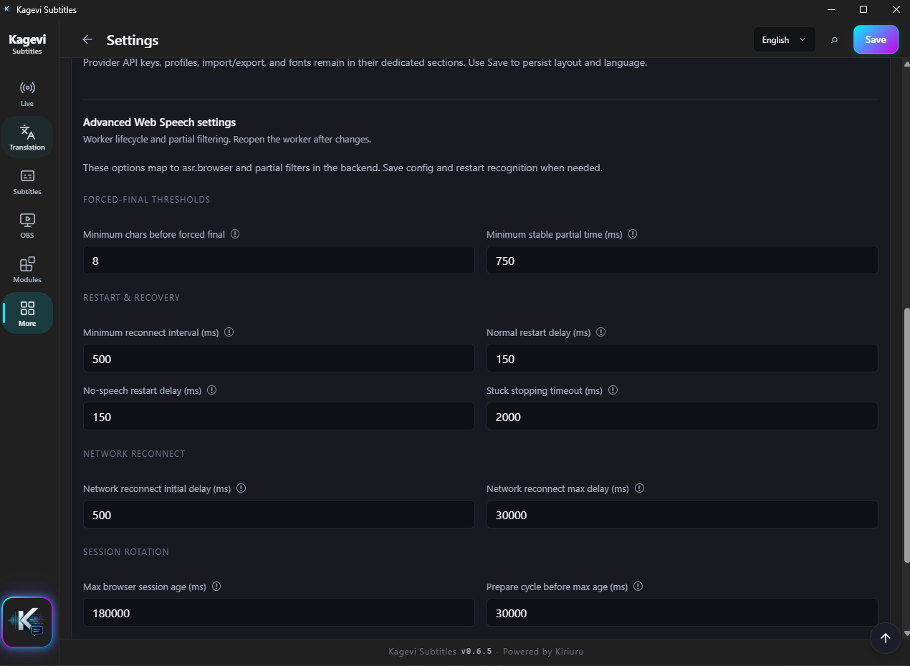
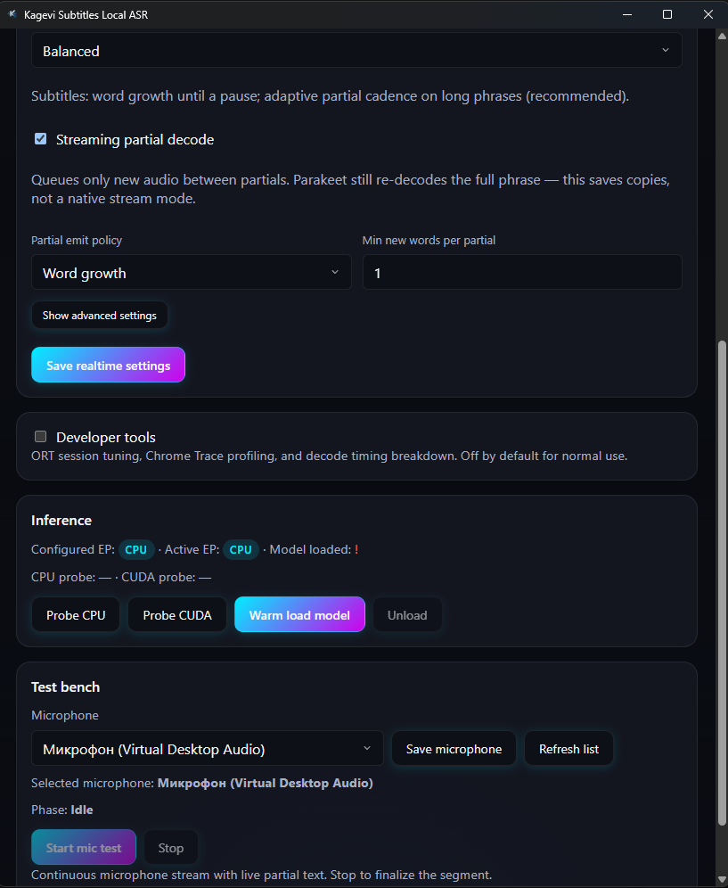
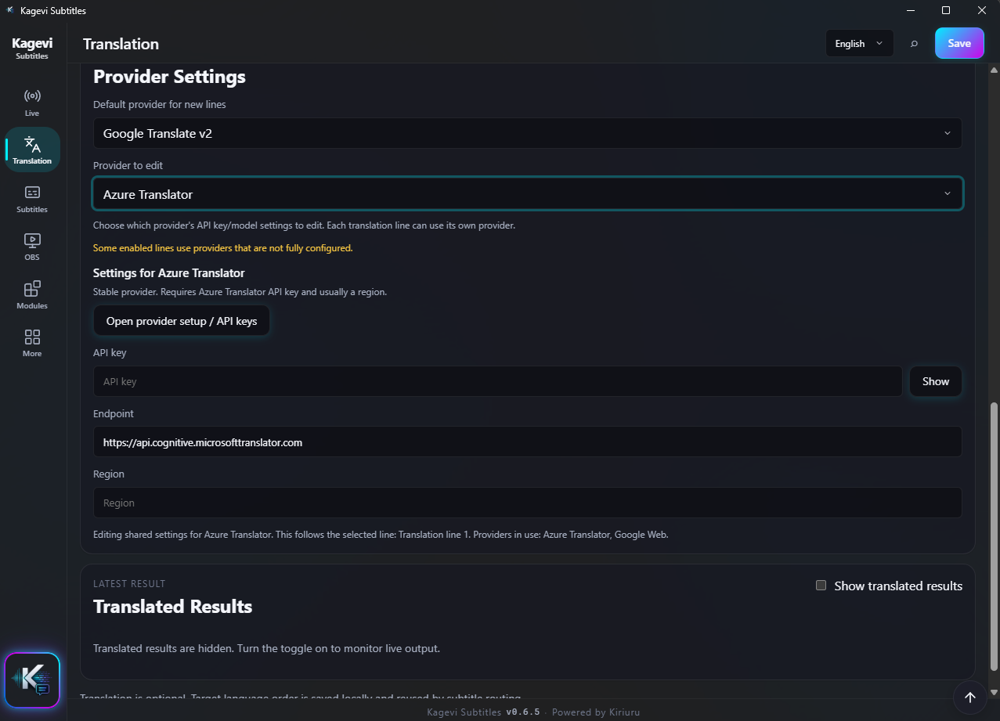
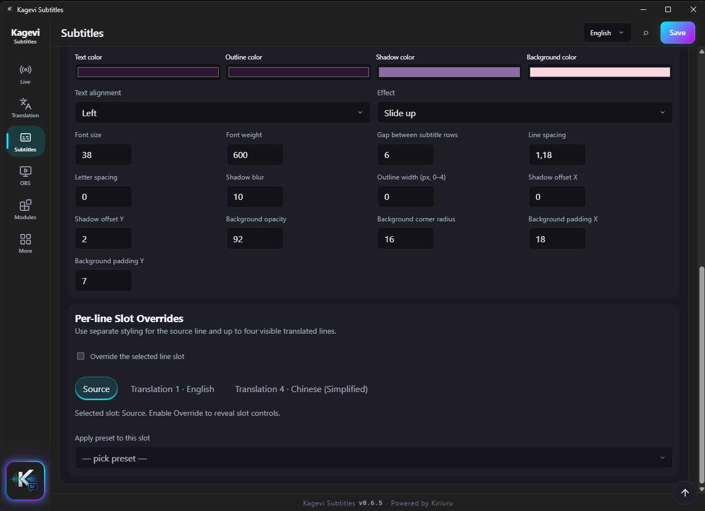
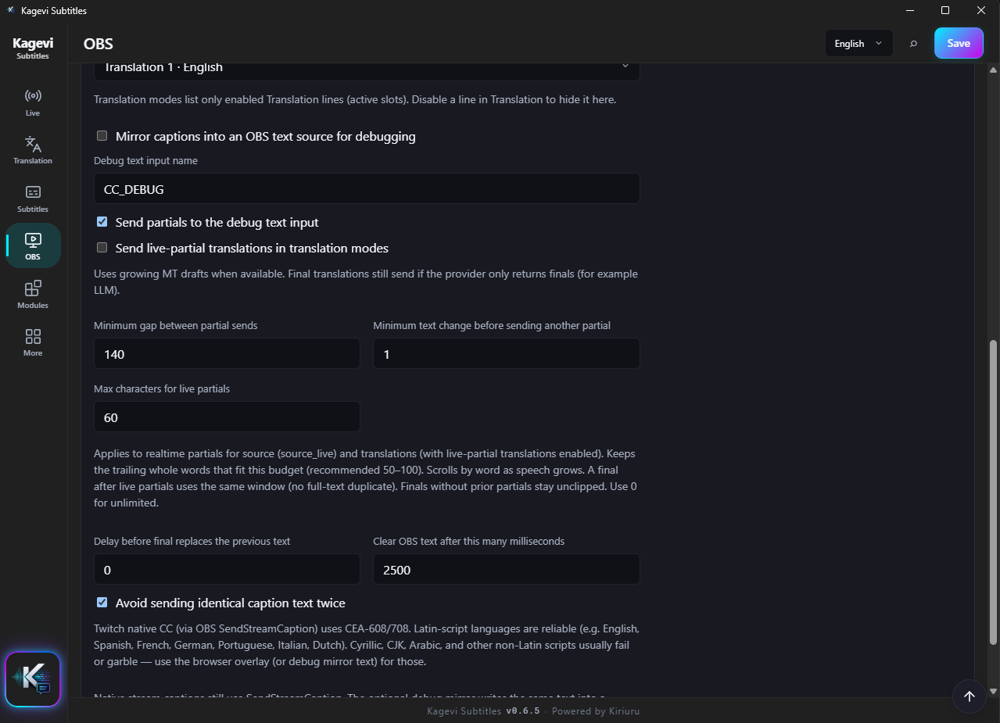
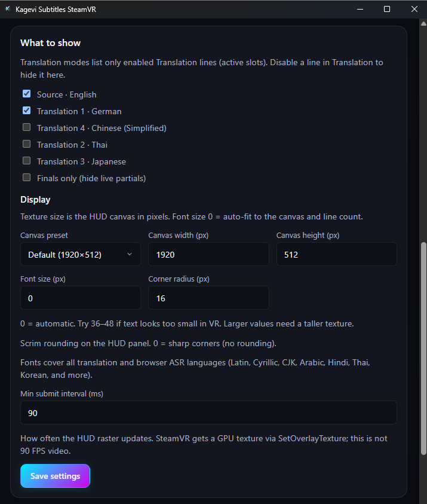
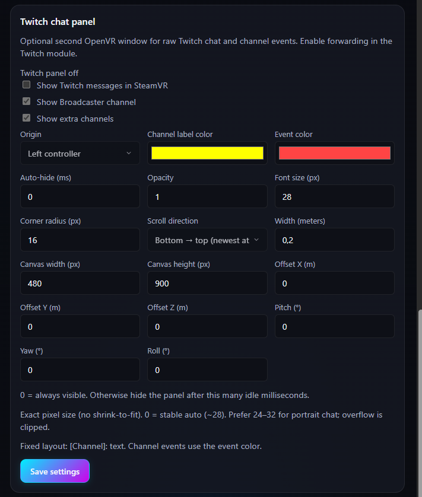

# Kagevi Subtitles Wiki

User guide for **Kagevi Subtitles `0.7.0`** — how to get live subtitles on stream, what each screen does, and how to fix common problems.

  <a href="../README.md">README</a> ·
  <a href="./WIKI.ru.md">Русский</a> ·
  <a href="./TECHNICAL_ARCHITECTURE.en.md">Architecture</a> ·
  <a href="./CHANGELOG.en.md">Changelog</a>

> [!TIP]
> On GitHub, open **Outline** (list icon in the file header) for a sidebar from headings. Use **Quick links** below for jumps.

## Quick links

  <a href="#quick-start"><code>Start</code></a> ·
  <a href="#choose-recognition"><code>Recognition</code></a> ·
  <a href="#troubleshooting"><code>Fix</code></a> ·
  <a href="#where-things-are"><code>UI map</code></a> ·
  <a href="#browser-speech-web-speech"><code>Web Speech</code></a> ·
  <a href="#local-asr"><code>Local ASR</code></a> ·
  <a href="#translation"><code>Translation</code></a> ·
  <a href="#subtitles"><code>Subtitles</code></a> ·
  <a href="#obs"><code>OBS</code></a> ·
  <a href="#tts-module"><code>TTS</code></a> ·
  <a href="#twitch-module"><code>Twitch</code></a> ·
  <a href="#vrchat-module"><code>VRChat</code></a> ·
  <a href="#steamvr-hud-module"><code>SteamVR HUD</code></a> ·
  <a href="#tools-and-data"><code>Tools</code></a> ·
  <a href="#settings"><code>Settings</code></a> ·
  <a href="#glossary"><code>Glossary</code></a>

## Table of contents

<strong>Expand / collapse contents</strong>

1. [About](#about)
2. [Quick start](#quick-start)
3. [Choose recognition](#choose-recognition)
4. [Troubleshooting](#troubleshooting)
5. [Where things are](#where-things-are)
6. [Browser Speech (Web Speech)](#browser-speech-web-speech)
7. [Local ASR](#local-asr)
8. [Translation](#translation)
9. [Subtitles](#subtitles)
10. [Subtitle style](#subtitle-style)
11. [UI theme](#ui-theme)
12. [OBS](#obs)
13. [Word replacement](#word-replacement)
14. [TTS module](#tts-module)
15. [Twitch module](#twitch-module)
16. [VRChat module](#vrchat-module)
17. [SteamVR HUD module](#steamvr-hud-module)
18. [Tools and data](#tools-and-data)
19. [Settings](#settings)
20. [Help](#help)
21. [Privacy and local-first](#privacy-and-local-first)
22. [Glossary](#glossary)

---

## About

Kagevi Subtitles turns your microphone speech into **live subtitles** for OBS — with optional translation, styling, TTS, and Twitch chat reading.

Everything runs on **your PC**. There is no account and no Kagevi cloud. The app listens on `http://127.0.0.1:8765` by default (this machine only).

| You want… | Use… |
| --- | --- |
| Fast setup, Google recognition in Chrome | **Web Speech** (default) |
| Offline recognition, no Chrome worker | **Local ASR** (Parakeet / ONNX) |
| Subtitles in OBS | Browser Source → `/overlay` |
| Optional cloud / free translation | **Translation** tab (up to 4 lines) |
| Read subtitles aloud | **TTS** module (needs Live **Start**) |
| Read Twitch chat aloud | **Twitch** module (independent of subtitle TTS) |
| Subtitles in VRChat social chatbox | **VRChat** module (OSC Chatbox) |
| Subtitles inside your PCVR headset | **SteamVR HUD** module (wearer only) |

Current version line: **`0.7.0`** (first Kagevi release was `0.5.0`). This line adds **VRChat Chatbox OSC**, **SteamVR HUD**, subtitle scroll speed, factory reset, full-snapshot profiles, and a Live status bar on every tab. Details: [Changelog](./CHANGELOG.en.md).

The app is free to use. Copyright © 2026 Kiriuru. All rights reserved. See the **[Kagevi Subtitles License](../LICENSE)** for terms of use.

> [!IMPORTANT]
> In OBS, use exactly: `http://127.0.0.1:8765/overlay`  
> After updating the app, **reload** that Browser Source if the overlay looks stuck or blank.

### System requirements

| Need | Why |
| --- | --- |
| Windows 10 or 11 (64-bit) | Supported platform |
| WebView2 Runtime | Powers the app windows (usually already on Windows 11; installer can add it on Windows 10) |
| Google Chrome | Only if you use **Web Speech**. Not required for Local ASR alone |
| Microphone | Granted in Chrome (Web Speech) or chosen in the Local ASR window |
| Internet | Optional for cloud translation; also needed the first time Local ASR downloads models / runtimes |

No Python or Node.js is required to run the installed app.

### Install and update

1. Run `Kagevi Subtitles_0.7.0_x64-setup.exe` (or the latest setup from the [releases page](https://github.com/kiriuru/Kagevi-Subtitles/releases)).
2. Open **Kagevi Subtitles.exe**.
3. Later updates: the dashboard can show an **update banner**. **Install update** downloads the signed NSIS installer (minisign), runs it, and relaunches the app. You can still close the app and install a new setup over the old one from GitHub. Settings in `user-data/` stay put.

Manual **Download** / release-page links remain available if you prefer not to install from inside the app.

### Useful local addresses

| Address | What it is |
| --- | --- |
| `http://127.0.0.1:8765/` | Main dashboard |
| `http://127.0.0.1:8765/overlay` | OBS Browser Source page |
| `http://127.0.0.1:8765/google-asr` | Chrome Web Speech worker |
| `http://127.0.0.1:8765/google-asr-compact` | Compact Chrome `--app=` worker (optional) |
| `http://127.0.0.1:8765/tts` | TTS module window (subtitle speech) |
| `http://127.0.0.1:8765/twitch` | Twitch module window (IRC + chat TTS) |
| `http://127.0.0.1:8765/local-asr` | Local ASR module window |
| `http://127.0.0.1:8765/vrchat` | VRChat Chatbox OSC module window |
| `http://127.0.0.1:8765/vr-overlay` | SteamVR HUD overlay module window |

<a href="#quick-links">↑ Quick links</a> · <a href="#table-of-contents">↑ Contents</a>

---

## Quick start

   
  <em><strong>Live</strong> — Start/Stop, recognition status, transcript, subtitle preview</em>

### First stream setup (about 5 minutes)

1. **Install and launch** Kagevi Subtitles.
2. In **OBS**, add a **Browser Source**:
   - URL: `http://127.0.0.1:8765/overlay`
   - Width/height: match your canvas (or full canvas and crop).
3. On the **Live** tab, pick recognition:
   - **Web Speech** (default) — Chrome will open when you Start.
   - **Local ASR** — only appears after setup is finished (see [Local ASR](#local-asr)).
4. Optional: open **Translation**, turn translation on, enable at least one line, pick a provider (three work with **no API key** — see below).
5. Optional: open **Subtitles** / **Style** to set preset, TTL, fonts, colors, **Subtitle scrolling**, and **Scroll speed**.
6. Press **Start**. A status bar (ASR / WebSocket / Worker / OBS CC + Start/Stop) stays on **every** tab — full on Live, compact elsewhere.
7. Speak — check the Live preview, then check OBS.
8. Optional **VRChat**: [VRChat module](#vrchat-module) — OSC on → **Enable output** → **Start** on Live.
9. Optional **PCVR**: [SteamVR HUD](#steamvr-hud-module) — **Start SteamVR** on the module hero card → **Enable subtitle overlay** and/or **Enable chat overlay** → **Start** on Live (captions). Quest standalone cannot show this overlay.

### Start and Stop (plain English)

| Button | What happens |
| --- | --- |
| **Start** | Begins recognition, translation (if enabled), and optional OBS captions. Uses your **current** on-screen settings, even if you have not pressed Save yet. |
| **Stop** | Stops recognition. For Web Speech, the Chrome worker is closed. Subtitle state resets. |

### Preview on Live

Before Start, the preview shows sample text so you can tune style. After Start, it shows what OBS should see. Saving settings alone will not wipe that preview when idle.

### Compact window

Use compact layout for a tall, phone-like window on a second monitor (**Settings** → Layout, or `Ctrl+K`). Live stays in focus; other hubs stay one tap away. The same status bar (full on Live, compact elsewhere) stays at the top.

   
  <em><strong>Compact layout</strong> — phone-style window for a second monitor</em>

<a href="#quick-links">↑ Quick links</a> · <a href="#table-of-contents">↑ Contents</a>

---

## Choose recognition

You only need **one** path at a time.

| | Web Speech (default) | Local ASR |
| --- | --- | --- |
| Engine | Google Chrome Web Speech | Parakeet on your PC (ONNX) |
| Chrome window | Yes — keep it open while streaming | No |
| Internet for recognition | Usually yes (Google) | No (after models are downloaded) |
| Best when… | You want the familiar Chrome path | You want offline / no worker window |
| Setup | Mic permission in Chrome | Modules → Local ASR wizard until **ready** |

> [!TIP]
> New users: start with **Web Speech**. Switch to Local ASR later if you want offline recognition.

<a href="#quick-links">↑ Quick links</a> · <a href="#table-of-contents">↑ Contents</a>

---

## Troubleshooting

> [!TIP]
> Check in this order: **Start pressed?** → **recognition working?** → **translation on?** → **OBS URL correct?**

### No subtitles anywhere

- [ ] Pressed **Start** on Live?
- [ ] **Web Speech:** Is the Chrome `/google-asr` window open? Mic allowed **in Chrome**? Prefer not minimizing it for long periods (it can sit behind other apps).
- [ ] **Local ASR:** Is Local ASR selected on Live? Did Modules → Local ASR show **ready**? Mic selected there?
- [ ] Open **More → Tools & Data** and check runtime / recognition status.

### I see source text, but no translation

- [ ] **Translation** tab → translation is enabled.
- [ ] At least one translation line is enabled.
- [ ] Provider needs a key? Add it under provider settings. Or switch to a **keyless** provider (Google Web, Free Web Translate, Bing Translator).
- [ ] Look at translation results / errors on the same tab — delays can also mean a newer phrase cancelled an older request (normal).

### OBS is empty

- [ ] Browser Source URL ends with `/overlay`, not `/` (dashboard).
- [ ] **Subtitles**: source and/or translations are set to visible.
- [ ] TTL is not extremely short (text can vanish before you notice).
- [ ] After an app update: right‑click the source → **Refresh**.
- [ ] Brief disconnects: overlay often keeps the last frame while reconnecting — that is expected.

### Text is cut off at the edge of the OBS source

Reload the Browser Source after updating. With **Subtitle scrolling** (Subtitles tab, on by default) the overlay keeps the designed font size; each line (source and translations) slowly scrolls inside its own slot. **Scroll speed** (default 48 px/s, range 12–120) is on the same tab. Uncheck scrolling to clip at the edges.

### Local ASR mode missing on Live

Finish **Modules → Local ASR** until the module reports ready (deps + model + warm load). CPU is enough; CUDA is optional.

### VRChat Chatbox empty / not updating

Needs **VRChat on this Windows PC** with OSC on. Quest standalone has no OSC for this app.

1. In VRChat: **Action Menu → OSC → Enable**
2. **Modules → VRChat → Open**
3. **Test connection** (OSCQuery / listen port **9001**) and **Send test** (Chatbox send port **9000**)
4. Press **Enable output**, then **Start** on Live — live phrases do not go out until Live is running
5. Close the module window if you want; output keeps running while enabled

If **Send test** appears in Chatbox but Live does not: Start is off, or **What to send** points at a disabled translation line. Mute/AFK pause needs OSCQuery on localhost; Chatbox send on 9000 can still work without inbound packets.

### Google Web / keyless translation returns HTTP 429

Keyless web providers get a short gap between HTTP calls by default. The shared parallel-jobs cap in **Settings** applies to every provider; Google Web / Free Web / Bing can add an extra per-name cap in the same section. Wait, enable fewer translation lines, switch to **Free Web Translate** or **Bing Translator**, or change the interval. Empty `provider_limits` in config is not rewritten on save — the runtime still applies the interval.

### SteamVR HUD not visible (PCVR)

Requires **Steam + SteamVR** on this PC. Quest standalone cannot show this overlay.

1. **Modules → SteamVR HUD → Open**
2. Press **Start SteamVR** on the **hero status card** at the top (not in the checklist section below)
3. Wait until the badge is **Enabled**, not **Waiting for SteamVR**
4. Configure attach point, wrist presets, and **What to show**
5. Press **Enable subtitle overlay** and/or **Enable chat overlay**, then **Start** on Live (captions)
6. Close the module window — the HUD keeps running while SteamVR and the core session are active
7. Optional: **Send test** in the SteamVR section — if the test frame appears, placement is fine and live captions need **Start**

If you quit SteamVR yourself (desktop or headset), start it again from the module. The HUD **never** auto-launches SteamVR.

Laptop / two GPUs: leave SteamVR on the GPU that drives the headset. The HUD follows SteamVR’s adapter.

### Squares instead of commas / letters in the SteamVR HUD

The HUD draws its own pixels (it is not a browser). Empty boxes used to appear for Japanese `、。`, Polish / Turkish / Vietnamese letters, and digits next to Thai. Current builds use full Noto Sans plus CJK / Arabic / Hindi / Thai faces, and fall back to Segoe UI on Windows.

- Update to the latest `0.7.0` (or newer) build.
- **Send test** with a line that includes those characters.
- OBS `/overlay` is unrelated — Chrome already falls back to system fonts there.

### Worker keeps dying (Web Speech)

- Unstable network to Google speech endpoints.
- **Stop → Start**, or relaunch the worker from Tools.
- Advanced: `VOICESUB_TRACE_BROWSER=1` writes `logs/browser-trace.jsonl` (for bug reports).

### Text stuck on screen after Stop / expiry

Update to the latest build and **refresh** the OBS Browser Source. The overlay must clear empty frames; an old build can leave a ghost line.

<a href="#quick-links">↑ Quick links</a> · <a href="#table-of-contents">↑ Contents</a>

---

## Where things are

Primary destinations (left rail / bottom nav):

| Place | What you do there |
| --- | --- |
| **Live** | Start/Stop, recognition mode, **status bar** (full KPI here), transcript, subtitle preview |
| **Translation** | Providers, up to 4 lines, cache, live/realtime options |
| **Subtitles** | Overlay layout, **Subtitle scrolling** + speed, visibility, order, how long completed lines stay |
| **OBS** | Copy overlay URL; optional Closed Captions |
| **Modules** | Compact square cards (icon / status / Open / **?**) for **TTS**, **Twitch**, **Local ASR**, **VRChat**, and **SteamVR HUD** |
| **More** | Theme, Word Replace, Tools & Data, Settings (including factory reset), Help |

**Command palette** (`Ctrl+K` or header search): jump to a panel, Start/Stop, Save, export diagnostics.

| Tab under More / hubs | Guide section |
| --- | --- |
| Style (under Subtitles) | [Subtitle style](#subtitle-style) |
| UI Theme | [UI theme](#ui-theme) |
| Word Replace | [Word replacement](#word-replacement) |
| Tools & Data | [Tools and data](#tools-and-data) |
| Settings | [Settings](#settings) |
| Help | [Help](#help) |

<table>
  <tr>
    <td align="center" width="33%">
       
      <a href="#translation">Translation</a>
    </td>
    <td align="center" width="33%">
       
      <a href="#subtitles">Subtitles</a>
    </td>
    <td align="center" width="33%">
       
      <a href="#subtitle-style">Style</a>
    </td>
  </tr>
  <tr>
    <td align="center">
       
      <a href="#ui-theme">UI Theme</a>
    </td>
    <td align="center">
       
      <a href="#obs">OBS</a>
    </td>
    <td align="center">
       
      <a href="#word-replacement">Word Replace</a>
    </td>
  </tr>
  <tr>
    <td align="center">
       
      <a href="#tts-module">TTS</a> · <a href="#twitch-module">Twitch</a> · <a href="#local-asr">Local ASR</a> · <a href="#vrchat-module">VRChat</a> · <a href="#steamvr-hud-module">SteamVR HUD</a>
    </td>
    <td align="center">
       
      <a href="#settings">Settings</a>
    </td>
    <td align="center">
       
      <a href="#help">More / Help</a>
    </td>
  </tr>
</table>

<a href="#quick-links">↑ Quick links</a> · <a href="#table-of-contents">↑ Contents</a>

---

## Browser Speech (Web Speech)

   
  <em><strong>Web Speech worker</strong> — Chrome window at <code>/google-asr</code> (keep open while listening)</em>

   
  <em><strong>Compact worker</strong> — optional Chrome <code>/google-asr-compact</code> <code>--app=</code> window</em>

### How it feels day to day

1. On Live, leave recognition on **Web Speech** (browser Google).
2. Press **Start** — a separate Chrome window opens to the worker page.
3. Allow the microphone **in that Chrome window**.
4. Leave the window open (it may sit behind OBS/game). Closing it stops recognition.

The microphone list in the main dashboard stays empty on purpose — the mic is chosen in Chrome, not in Kagevi settings.

### Worker window rules (important)

- **Full worker** (default): a **normal Chrome window** with an address bar (not a hidden tab).
- **Compact worker** (optional): Live-tab checkbox opens `/google-asr-compact` in a smaller Chrome `--app=` window (no omnibox). Same isolated profile and recognition path.
- It uses its own Chrome profile under `user-data/` so it does not mess with your daily browser.
- Windows is tuned so Chrome is less likely to “sleep” the tab while you stream.

### Recognition language

Set the speech language in **Settings** (Web Speech / recognition language). Match the language you actually speak. The worker window also shows live text — if it shows words but Live does not, recognition works and the problem is downstream (restart the session).

<strong>Advanced Web Speech (optional)</strong>

   
  <em><strong>Advanced Web Speech</strong> — forced finals, reconnect, session rotation</em>

**Settings → Advanced Web Speech settings** — forced finals, reconnect delays, session length, and related knobs. Each field has an **`!` help** tip.

After big changes: **Save → Stop → Start**, and reopen the worker if it was already open.

Idle “force final” timing is edited in the **worker window** itself (`force_finalization_timeout_ms`), not only in Advanced settings.

Some older config names (`pause_to_finalize_ms`, `hard_max_phrase_ms`, …) are ignored at runtime — leave them alone.

<strong>Stability notes</strong>

- Sessions rotate about every 3 minutes by default to keep Chrome recognition healthy.
- After a long finalized phrase (≥200 characters), the worker refreshes its internal buffer so the next lines stay clean.
- Screen wake lock can keep the machine from sleeping while recognition runs.

<a href="#quick-links">↑ Quick links</a> · <a href="#table-of-contents">↑ Contents</a>

---

## Local ASR

Offline speech recognition on your machine (Parakeet + ONNX). No Chrome worker while Live uses this mode.

  
  &nbsp;
   
  <em><strong>Modules</strong> / <strong>Local ASR</strong> — open the module and finish setup</em>

   
  <em><strong>Setup</strong> — download ORT / optional CUDA pieces and a Parakeet model</em>

   
  <em><strong>Local ASR</strong> — realtime options, inference, and mic test bench</em>

### Setup once

1. Open **Modules → Local ASR** (separate window).
2. Follow the checklist: check/download runtime → download a model → warm-load → pick a mic → run a short test until you see final text.
3. When the module is **ready**, close the window if you like — settings stay in `user-data/modules/local-asr/`.
4. On **Live**, choose **Local ASR**, then **Start**.

CPU is enough for Live. CUDA is optional (faster on supported NVIDIA GPUs after extra downloads). For CUDA pick **fp16** or **fp32** models — **int8** stays on CPU.

On a clean install, warm-load can run in the **same session** right after ORT/CUDA finish downloading (no app restart required for the usual first-setup path).

### After changing VAD / realtime options

**Stop → Start** on Live so the new mic/pipeline settings apply.

### What you get

Same subtitle, translation, style, and OBS path as Web Speech — only the speech engine changes.

<a href="#quick-links">↑ Quick links</a> · <a href="#table-of-contents">↑ Contents</a>

---

## Translation

   
  <em><strong>Translation</strong> — turn the pipeline on, pick providers, up to 4 lines</em>

   
  <em><strong>Provider settings</strong> — API keys, endpoints, and per-provider options</em>

### Simple setup

1. Enable **translation**.
2. Enable one or more lines (`translation_1` … `translation_4`).
3. Pick target language and provider per line.
4. Save (or just Start — Start also takes the current UI snapshot).

ASR still works with translation off (source-only subtitles).

### Lines

Each line is independent: on/off, language, provider, short label. More enabled lines = more work for providers. Order on screen is controlled under **Subtitles**.

### Providers without an API key

Good starting points if you do not want cloud accounts:

| Provider | Notes |
| --- | --- |
| **Google Web** | Free Translate Element path. If you see **HTTP 429**, wait, use fewer lines, or raise limits in Settings |
| **Free Web Translate** | Separate free Google path (own rate limits) |
| **Bing Translator** | Keyless Bing web session (`ttranslatev3`) |

There are **17** providers total (Google API, DeepL, Azure, LibreTranslate, OpenAI-compatible, China providers, and more). Keys stay only in your local `config.toml`. Older configs that still name `microsoft_edge` or `public_libretranslate_mirror` migrate to **Bing Translator** on load/save.

### Cache

Memory and optional disk cache (`user-data/translation-cache/`) avoid repeating the same request. If you change LLM prompts a lot, clear or expect old cached answers until the text changes.

### Optional realtime translation

Off by default. When enabled for classic MT providers, growing speech can show draft translations before the phrase finishes. LLM providers still wait for finals. Good for snappy overlays; use finals-only if you prefer stable text.

### How lines behave on screen

A finished subtitle **stays** until the **next** phrase finishes. Late translations can still arrive. If a newer phrase supersedes an old request, the old job is dropped — that is intentional, not a random failure.

<a href="#quick-links">↑ Quick links</a> · <a href="#table-of-contents">↑ Contents</a>

---

## Subtitles

   
  <em><strong>Subtitles</strong> — layout preset, what is visible, order, how long lines stay</em>

| Setting | In plain words |
| --- | --- |
| Overlay preset | How rows are stacked: **single**, **dual-line**, or **stacked**. Compact spacing is a separate toggle. OBS URL can override with `?preset=…&compact=1`. |
| Subtitle scrolling | On by default (`overlay.fit_to_box`). Full-size font; each line scrolls inside the Browser Source when it is too tall. `?fit=0` turns this off for one source. |
| Scroll speed | Default **48** px/s (range **12–120**). How fast overflowing lines crawl when Subtitle scrolling is on. |
| Visibility | Show source and translations. How many translation lines appear follows the **enabled** Translation lines (no separate max-lines control). |
| TTL / lifetime | How long a finished line stays after speech stops. |
| Line order | Order for preview, OBS overlay, and “first visible line” Closed Captions. |

> [!IMPORTANT]
> While you start a new sentence, the previous finished translation can stay until the new sentence **finalizes**. That keeps the screen readable during natural pauses.

<a href="#quick-links">↑ Quick links</a> · <a href="#table-of-contents">↑ Contents</a>

---

## Subtitle style

   
  <em><strong>Subtitle Style</strong> — fonts, colors, effects, per-line overrides</em>

   
  <em><strong>Per-line overrides</strong> — separate style for source and each translation slot</em>

- Pick a built-in preset or customize fonts, size, outline, shadow, background, alignment.
- Font picker shows each face in its own typeface; alphabet tags stay in native scripts (`Latin`, `Кириллица`, `日本語`, …) so CJK / Latin-only coverage is obvious.
- Effects include fade, slide, zoom, glow, and similar.
- Style **source** and each **enabled** `translation_1…4` separately if you want (tabs only for active lines).
- Live preview and OBS share the same look — Save (or Start) after edits.
- In OBS each line **scrolls inside the Browser Source** at full size (Subtitles: **Subtitle scrolling**).

<a href="#quick-links">↑ Quick links</a> · <a href="#table-of-contents">↑ Contents</a>

---

## UI theme

   
  <em><strong>UI Theme</strong> — dark/light and accent colors for the app chrome</em>

This only changes the **dashboard / module windows**. OBS subtitle look comes from **Subtitle style**, not this theme.

Pick a preset from the gallery — **click** applies it. The sample includes chips, an input, and primary/ghost buttons.

Theme, language, and UI font can sync live across windows without a full Save when the app pushes a UI sync.

<a href="#quick-links">↑ Quick links</a> · <a href="#table-of-contents">↑ Contents</a>

---

## OBS

   
  <em><strong>OBS</strong> — overlay URL and optional Closed Captions</em>

   
  <em><strong>Closed Captions extras</strong> — debug text source, partials, and send gaps</em>

### Overlay (what most streamers need)

1. Copy the URL from the **OBS** tab (default `http://127.0.0.1:8765/overlay`).
2. Paste into an OBS **Browser Source**.
3. Leave Kagevi running while you stream.

The overlay **keeps captions at full size** inside the Browser Source (for example 800×600). Captions sit on the **top** and grow **downward**. If a line (source or a translation) is taller than its share of the box, **that line scrolls** on its own. Toggle this on the **Subtitles** tab: *Subtitle scrolling*. Speed is **Scroll speed** on the same tab.

Optional URL tweaks: `?preset=stacked&compact=1` (and similar). `?fit=0` turns off auto-fit for that source only. Prefer changing presets in the app unless you need a one-off OBS override.

### Closed Captions (optional)

Sends captions into OBS via WebSocket (handy for platforms that surface CC, e.g. Twitch).

- Enable in the OBS tab; set host / port / password to match OBS WebSocket v5.
- Choose what to send: live source, finals only, a translation line (`translation_1`…`translation_4`), or the first visible line.
- Optional: send **live-partial translations** in `translation_*` modes (`send_translation_partials`; throttled like source). Finals still cover LLM / providers without partials.
- Native stream captions only work while OBS is actually streaming.
- Twitch native CC is reliable for **Latin** scripts; Cyrillic / CJK usually need the **browser overlay** instead.
- Debug mirror can push text into an OBS text source for testing.

<a href="#quick-links">↑ Quick links</a> · <a href="#table-of-contents">↑ Contents</a>

---

## Word replacement

   
  <em><strong>Word Replace</strong> — fix ASR mistakes before translation and display</em>

Use this to clean names, slang, or misheard words **before** they hit translation and the overlay.

- Custom find/replace pairs.
- Optional built-in lists / stem rules (en/ru/ja/ko/zh) and light obfuscation cleanup.
- Builtin / empty replacement mask keeps the **first and last** letter (`fuck`→`f**k`, `whore`→`w***e`); already-masked forms with `*` are left alone.
- Case; **whole-word** for custom pairs. Builtin Latin/Cyrillic always matches whole tokens (so `бля` does not break `кораблями`); Hangul uses spaces; multi-char CJK is substring; single Han characters and short katakana only match when isolated.

Twitch chat TTS has its **own** filter switches in the **Twitch** module window (same builtin mask rule); dashboard word-replace pairs do not automatically apply there.

<a href="#quick-links">↑ Quick links</a> · <a href="#table-of-contents">↑ Contents</a>

---

## TTS module

   
  <em><strong>TTS</strong> — speak subtitles aloud</em>

Open from **Modules → TTS** (`/tts`). Settings live in `user-data/modules/tts/`. You can close the window — playback continues while the module stays enabled.

Subtitle speech needs **Start** on Live (unlike Twitch IRC, which can run without Live).

### Subtitle speech

- Turn the speech channel on, pick voice / rate / volume.
- Volume goes up to **150%**.
- Playback modes:
  - **Native** — lowest latency, rate fixed at 1.0×
  - **Sonic** — change speaking rate while keeping pitch
- TTS engine: **Google HTTP proxy** (`browser_google`) or **Python sidecar** (`python_stdlib` via bundled `google_tts_fetch.exe`).
- Pick a dedicated output device for subtitle speech (independent from Twitch chat TTS).

Use the sample / Speak control in the module to test without going Live.

The Google TTS helper binary is bundled under the TTS module runtime — you do not install Python yourself.

<a href="#quick-links">↑ Quick links</a> · <a href="#table-of-contents">↑ Contents</a>

---

## Twitch module

   
  <em><strong>Twitch</strong> — IRC chat log and optional chat TTS (up to five channels)</em>

   
  <em><strong>Twitch connection</strong> — broadcaster OAuth, channels, and EventSub alerts</em>

   
  <em><strong>Twitch filters</strong> — emotes, language, speak template, nick replacements</em>

Open from **Modules → Twitch** (`/twitch`). Settings live in `user-data/modules/twitch/`. Enable-without-window: closing the webview does **not** disconnect IRC or stop chat TTS.

Chat TTS is **independent** of subtitle TTS — you can use one, both, or neither.

### Connect and channels

1. **Connect with Twitch** — like Streamer.bot: **Broadcaster** token is enough (`chat:read` + EventSub scopes). It auto-joins the streamer's own chat and marks that channel **Broadcaster**. A **bot** token (`chat:read`) is optional for a separate IRC login / extra channels. OAuth opens in the system browser. Redirect URI is still `http://localhost:{port}/tts`; the unauthenticated `/tts` page is the OAuth shell.
2. Extra channel logins (without `#`) are **optional** (total JOIN cap **5**, including the auto-joined streamer channel). Extra channels are **chat-only**.
3. Toggle **Speak chat** to read filtered messages aloud.
4. Toggle **Speak channel events** and edit templates for follow / sub / resub / gift / raid / cheer. Alerts are read **only on the streamer (Broadcaster) channel**. EventSub uses the broadcaster login; subs/raids/cheers also arrive from IRC as a fallback on that same channel.
5. If IRC drops, the module retries with backoff; bad auth stops instead of looping forever.
6. **?** next to bot nick explains the optional IRC login used for extra JOINs.

On app start, if the module is enabled and Broadcaster or bot credentials exist, IRC **auto-connects** (no Live **Start** required).

### Chat TTS engine and playback

- **TTS engine:** Google HTTP proxy (`browser_google`) or Python sidecar (`python_stdlib`) — separate from subtitle TTS settings.
- **Playback mode:** Native or Sonic (same semantics as the TTS module).
- **Output device**, volume, and rate for chat/event TTS are configured here (independent of subtitle speech; rate applies in Sonic mode).
- **Test phrase** and **Clear queue** help verify audio without waiting for chat.

Filters (emotes, links, symbols, language, profanity mask) apply live — usually no reconnect needed.

<a href="#quick-links">↑ Quick links</a> · <a href="#table-of-contents">↑ Contents</a>

---

## VRChat module

   
  <em><strong>VRChat</strong> — OSC Chatbox output for social captions in VR</em>

Optional **social** output: pipeline text goes to the VRChat **Chatbox** over OSC. Other players in the instance see it. This is **not** a headset HUD and **not** KAT — for wearer-only captions in SteamVR use the [SteamVR HUD](#steamvr-hud-module).

Open from **Modules → VRChat**. Theme, locale, and UI font follow the dashboard. Settings live in `user-data/modules/vrchat/config.toml` (created on first open). Profiles and **Reset to factory defaults** include this file.

### VRChat requirements

- **VRChat on this Windows PC** (PCVR or desktop). Quest standalone has no OSC for Kagevi.
- OSC **Enabled** in VRChat (**Action Menu → OSC**)
- Core app **Start** on Live for live captions (**Send test** / **Test connection** work without Live)
- Chatbox cap: **144 characters / 9 lines**, UTF-8 (Japanese, Russian, and other scripts VRChat already shows)

Stay on `127.0.0.1`. The listen socket is loopback-only, so Windows should not ask for local-network access under a random process name.

### VRChat setup

1. Launch VRChat and turn on **OSC**
2. Open **Modules → VRChat**
3. Confirm host `127.0.0.1`, send port **9000**, listen port **9001** (must match VRChat’s OSC send port)
4. Pick [what to send](#what-to-send-to-chatbox) and [Chatbox options](#chatbox-options)
5. **Test connection**, then **Send test** — you should see the test line in Chatbox
6. Press **Enable output**
7. Press **Start** on Live
8. Close the module window — Chatbox keeps updating while `enabled` and Live is running

Dashboard **Modules** card badges: **Off** / **Enabled** / **Muted** / **AFK** (+ the selected layer).

### OSC ports

| Direction | Default | Used for |
| --- | --- | --- |
| App → VRChat | `127.0.0.1:9000` | Chatbox text (`/chatbox/input`) |
| VRChat → app | `127.0.0.1:9001` | **Test connection** and optional mute / AFK pause |

**Test connection** looks for VRChat OSCQuery on localhost (`/?HOST_INFO`) and can also wait for UDP on the listen port. A result like “VRChat OSC is on (OSCQuery)” means OSC is up; Chatbox send on **9000** does **not** need inbound packets.

**Send test** writes to Chatbox immediately (bypasses Enable output and Live). Use it to check the send port before going Live.

There is no Chatbox notification beep in the UI. Packets always send the OSC SFX argument as off (VRChat often ignores that flag).

### What to send to Chatbox

Same idea as OBS Closed Captions. Translation lines in the list match **enabled** lines on the Translation tab (labels like `Source · ja`, `Translation 1 · en`). The window refreshes those lines about every 2 s while open.

| Content | Meaning |
| --- | --- |
| **Source** | Recognized text (language shown when recognition is not `auto`) |
| **Translation 1–4** | That translation slot — only if the line is enabled |
| **First visible line** | First line that is currently visible in the overlay payload |
| **Source + Translation 1** | Both, stacked (still clamped to 144 / 9 lines) |
| **Custom template** | Placeholders `{source}`, `{tr1}`, `{tr2}`, `{tr3}`, `{tr4}` |

If you pick a translation line and then disable it on the Translation tab, the dropdown keeps it marked inactive until you choose another mode.

### Chatbox options

| Option | Default | Meaning |
| --- | --- | --- |
| **Send on final segments only** | on | Skip live partials; wait for a finished phrase |
| **Skip unchanged text** | on | Do not resend the same string |
| **Pause sending while muted** | off | Stop while VRChat **MuteSelf** is true (needs OSCQuery) |
| **Pause sending while AFK** | off | Stop while VRChat **AFK** is true (needs OSCQuery) |
| **Max chars** | **144** | Clamp 1–144 |
| **Min interval (ms)** | **1000** | 200–10000. Faster phrases: only the **latest** is sent |
| **Clear Chatbox after (ms)** | **5000** | Empty Chatbox when the timer elapses. **0** = keep until the next phrase. Otherwise 500–60000. A newer send cancels the previous timer. After a timed clear, the same completed phrase is **not** sent again until the text changes |

Mute / AFK are polled from OSCQuery about twice a second (UDP change-only packets are not enough). Enable output, Save, and keep OSC on in VRChat.

### Enable without the window

Enable-without-window: configure → **Enable output** → close. Sends continue while Live is running. Reopening the window reloads `config.toml` and the dashboard theme. **Disable output** in the module (or factory reset) stops Chatbox updates.

Contracts (OSC, HTTP, config keys): [Technical Architecture §18b](./TECHNICAL_ARCHITECTURE.en.md#18b-vrchat-chatbox-osc-module).

<a href="#quick-links">↑ Quick links</a> · <a href="#table-of-contents">↑ Contents</a>

---

## SteamVR HUD module

   
  <em><strong>SteamVR HUD</strong> — module window, placement, and what to show</em>

   
  <em><strong>SteamVR HUD</strong> — canvas presets, fonts, and submit interval</em>

   
  <em><strong>SteamVR HUD</strong> — wearer-only overlay in PCVR (not captured in OBS)</em>

Optional **wearer-only** output: the same subtitle lines OBS uses, drawn on an OpenVR overlay quad inside SteamVR. Only **you** see it in the headset. Stream viewers still use OBS `/overlay`. People in VRChat still use the [VRChat Chatbox](#vrchat-module) module — that is a different, 144-character social path.

Open from **Modules → SteamVR HUD**. Settings live in `user-data/modules/vr-overlay/` (`config.toml`, plus `openvr-host.pid` / `openvr-host.log` for the overlay host). Theme, locale, and UI font follow the dashboard.

The HUD is **not** captured in OBS. It sits over SteamVR games for the wearer only.

### Requirements

- Windows PCVR with **Steam + SteamVR** installed
- **Not** Quest standalone (no SteamVR compositor there)
- Core app **Start** on Live for live captions (test frames work without Live)
- Headset tracking when origin is **Headset**; a tracked controller when origin is left/right

### Setup once

1. Open **Modules → SteamVR HUD**
2. Press **Start SteamVR** on the **hero card** at the top (not the checklist)
3. Wait for **SteamVR connected** / badge **Enabled** (or **Waiting for SteamVR** until the runtime is up)
4. Pick [placement](#placement), [what to show](#what-to-show), and a canvas preset
5. Press **Save settings**, then **Enable subtitle overlay** and/or **Enable chat overlay**
6. Optional: type a **Test message** → **Send test** and look in the headset
7. Press **Start** on Live (needed for captions; chat overlay does not require Live)
8. Close the module window — the HUD keeps running while either overlay is enabled, SteamVR, and the core session are active

**Check SteamVR** only probes whether the overlay API is available. It does not start SteamVR.

Dashboard **Modules** card badges: **Off** / **Waiting for SteamVR** / **Enabled** (+ origin) / **Paused**.

### Placement

| Origin | Where the panel sits |
| --- | --- |
| **Headset (HMD)** | Default: in front of the eyes, slightly below. Follows the HMD. |
| **Left / right controller** | Follows that controller. **Wrist preset**: Wrist, Near, Far, Palm, Above hand, Below hand. |
| **World (absolute)** | Fixed in the play space (does not follow the head). |

Pose (offset, rotation, width) is **remembered per origin** and per wrist preset. Switching HMD → wrist → HMD restores the last HMD setup instead of factory defaults.

- **Reset offset** returns the *current* origin to its calibrated base (not every origin).
- **Nudge** moves in 1 mm / 5 mm / 1 cm steps.
- OpenVR local space: **+X right, +Y up, −Z forward**. HMD default is about `{0, -0.28, -1.15}` meters.
- Do not yaw the panel 180° — the overlay has no backside, so it disappears.
- Width default is **0.55 m** on the HMD and **0.14 m** on a controller. Opacity and curvature are optional.

### What to show

Checkboxes, not a single dropdown — same labels as OBS / VRChat (`Source · ja`, `Translation 1 · en`, …). Only **enabled** translation lines appear. Source shows the recognition language when it is not `auto`.

| Option | Meaning |
| --- | --- |
| **Source** / **Translation 1–4** | Which pipeline lines to draw |
| **Finals only** | Hide live partials; wait for a finished phrase |
| **Min submit interval** | How often the HUD raster updates (default **90 ms**). This is not 90 FPS video — SteamVR gets a GPU texture when the text changes. |

Empty payload hides the panel (same idea as OBS clearing an empty overlay).

### Display (canvas)

The HUD is a fixed pixel canvas, then scaled in meters in VR.

| Canvas preset | Size |
| --- | --- |
| **Default** | 1920×512 |
| **Tall** | 1920×768 |
| **Large** | 2560×720 |
| **Compact** | 1280×384 |
| **Custom** | Even width/height, 256–2048 |

**Font size 0** = auto-fit to canvas height and line count. Try **36–48** if text looks small in VR; a taller preset helps more lines.

### Languages and text

The HUD rasters itself (fontdue + shaping). It is not a web page, so missing glyphs used to show as empty squares.

Current builds cover the translation / ASR languages:

- Japanese / Chinese punctuation (`、。「」` and fullwidth `，！？`)
- Korean Hangul
- Polish, Turkish, Vietnamese (extended Latin)
- Russian and other Cyrillic
- Arabic (joined letters, right-to-left; Latin names and `OBS` stay left-to-right inside the sentence)
- Hindi (Devanagari conjuncts) and Thai (stacked marks; ASCII digits stay Latin)

Line breaks follow words where there are spaces, and character clusters for CJK. Japanese closers (`。、」`) are not left hanging at the start of the next row.

### SteamVR start and stop

| Button | What it does |
| --- | --- |
| **Start SteamVR** | Launches SteamVR (`vrstartup`, fallback `steam.exe -applaunch 250820`). **User action only** — the module never auto-starts SteamVR. |
| **Stop SteamVR** | Tears down the overlay session first, then asks SteamVR to quit (monitor window, fallback console command). |

If you exit SteamVR from Steam or the headset, the HUD goes to **Waiting for SteamVR** and waits. Press **Start SteamVR** again when you want it back. A 5 s backoff sits between reconnect attempts so a shutdown is not hammered.

OpenVR runs in a helper process `kageviSub-vr-overlay-host.exe` so a stuck compositor cannot freeze Live, VRChat, or TTS. You can ignore it in Task Manager unless you are filing a bug; then attach `user-data/modules/vr-overlay/openvr-host.log`.

### After you close the window

Enable-without-window: configure → **Enable subtitle overlay** and/or **Enable chat overlay** → close. Submits continue while the core app is running. Profiles and **Reset to factory defaults** include this module’s `config.toml`. Reopening the window reloads the saved file and the dashboard theme.

### Three outputs compared

| Output | Who sees it | How |
| --- | --- | --- |
| OBS `/overlay` | Stream viewers | Browser Source |
| VRChat `/vrchat` | People in VRChat | OSC Chatbox (144 chars / 9 lines) |
| SteamVR `/vr-overlay` | **Headset wearer** | OpenVR overlay (full lines, wearer only) |

OpenVR / D3D11 / raster contracts: [Technical Architecture §18c](./TECHNICAL_ARCHITECTURE.en.md#18c-steamvr-openvr-hud-overlay-module).

<a href="#quick-links">↑ Quick links</a> · <a href="#table-of-contents">↑ Contents</a>

---

## Tools and data

   
  <em><strong>Tools & Data</strong> — profiles, status, diagnostics ZIP</em>

| Feature | Why you care |
| --- | --- |
| Runtime status | See if recognition / translation / OBS CC are alive |
| Profiles | Save and switch named setups (`user-data/profiles/*.json`) — includes TTS, Twitch, Local ASR, VRChat, and SteamVR HUD module configs. Loading a profile applies it immediately (theme and open module windows included). |
| Export diagnostics | ZIP with redacted config + logs — attach when asking for help |
| Logs folder | `logs/core.log`, `runtime-events.log`, `session-latest.jsonl` next to the app data |

<strong>Deep diagnostics (advanced)</strong>

Turn on full logging in Settings / config (`logging.full_enabled`) or set `VOICESUB_DEEP_DIAGNOSTICS=1`. Extra JSONL traces can be enabled with `VOICESUB_TRACE_*` variables. Detailed Tools metrics / Local ASR decode counters need `logging.runtime_metrics_enabled` (off by default). Only needed when hunting a tough bug.

<a href="#quick-links">↑ Quick links</a> · <a href="#table-of-contents">↑ Contents</a>

---

## Settings

   
  <em><strong>Settings</strong> — language, layout, Advanced Web Speech</em>

   
  <em><strong>Advanced Web Speech</strong> — same panel as under [Browser Speech](#browser-speech-web-speech)</em>

### UI language

English, Russian, Japanese, Korean, Chinese. Saved with your config. The Web Speech worker follows the locale when it launches.

### Layout

**Standard** desktop window vs **compact** second-monitor layout.

### Reset to factory defaults

**Settings → Reset to factory defaults** applies the `default` profile plus TTS / Twitch / Local ASR / VRChat / SteamVR HUD module configs, then saves immediately. Open module windows pick up theme and settings without a Save + reopen. Downloaded Local ASR models / ORT are **not** deleted.

### Keyless translation limits

Settings shows both layers in one dispatcher block: shared **Maximum parallel jobs** (all providers) plus extra fields for Google Web / Free Web / Bing (optional per-name cap + 750/750/500 ms interval). The interval reduces HTTP 429 at Start; empty concurrent does not add a cap beyond the global job limit.

### Fonts / other

Project subtitle fonts come from `bin/fonts/` (the SteamVR HUD uses the same files plus a Windows system fallback). Advanced Web Speech options are described in [Browser Speech](#browser-speech-web-speech).

<a href="#quick-links">↑ Quick links</a> · <a href="#table-of-contents">↑ Contents</a>

---

## Help

   
  <em><strong>More</strong> — Theme, Word Replace, Settings, Tools & Data, Help</em>

   
  <em><strong>Help</strong> — in-app guide and quick-start checklist</em>

In-app Help summarizes recognition, translation, subtitles, OBS, and tools. VRChat Chatbox: [VRChat module](#vrchat-module). SteamVR HUD: [SteamVR HUD module](#steamvr-hud-module). Deeper contracts (HTTP/WS/IPC, OpenVR): [Technical Architecture](./TECHNICAL_ARCHITECTURE.en.md).

<a href="#quick-links">↑ Quick links</a> · <a href="#table-of-contents">↑ Contents</a>

---

## Privacy and local-first

- By default the app listens only on **localhost** (`127.0.0.1`). Other devices on your LAN cannot reach it.
- LAN bind (`VOICESUB_ALLOW_LAN=1`) is for advanced setups — WebSockets then have **no login**, so use only on trusted networks.
- Translation API keys and Twitch tokens stay on your disk.
- Diagnostics ZIP **redacts** secrets before export.
- The Chrome worker uses an isolated profile (not your everyday Chrome sync).

<a href="#quick-links">↑ Quick links</a> · <a href="#table-of-contents">↑ Contents</a>

---

## Glossary

| Term | Meaning |
| --- | --- |
| **Live** | Main screen with Start/Stop and preview |
| **partial** | Text still being recognized (draft) |
| **final** | Phrase finished by the recognizer |
| **translation line / slot** | One of up to four translated rows (`translation_1`…`translation_4`) |
| **overlay** | The `/overlay` page you add in OBS |
| **Web Speech / browser worker** | Chrome window that listens with Google Web Speech |
| **Local ASR** | Offline Parakeet recognition module |
| **completed block** | Finished subtitle that stays until the next phrase finishes |
| **TTS module** | Separate window for speaking finalized subtitles (`/tts`) |
| **Twitch module** | IRC chat log + optional chat TTS (`/twitch`), independent of subtitle TTS |
| **VRChat module** | OSC output to VRChat Chatbox (social, 144 chars) |
| **SteamVR HUD** | OpenVR overlay for the headset wearer in PCVR (not OBS, not VRChat Chatbox) |
| **TTL** | How long a finished line remains on screen |

<a href="#quick-links">↑ Quick links</a> · <a href="#table-of-contents">↑ Contents</a>

---

  <a href="#quick-links">↑ Top</a> ·
  <a href="../README.md">README</a> ·
  <a href="./WIKI.ru.md">Русский</a> ·
  <a href="./TECHNICAL_ARCHITECTURE.en.md">Architecture</a>

