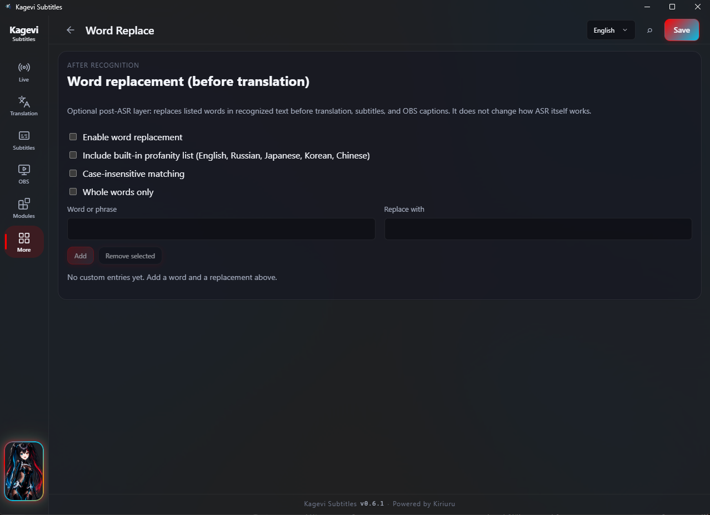
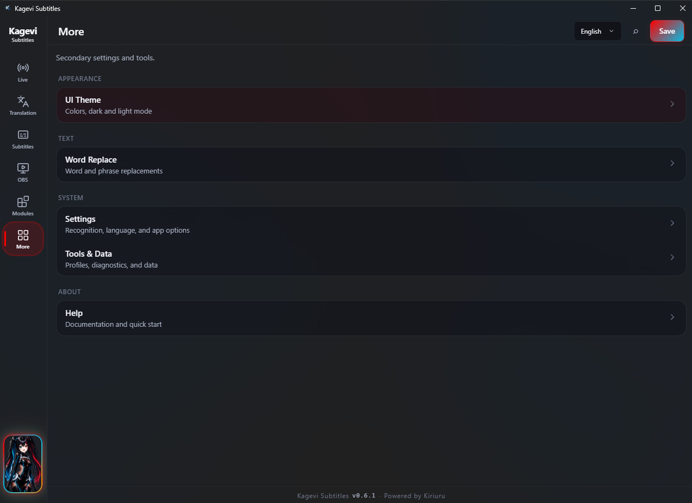

# Kagevi Subtitles Wiki

Руководство пользователя для **Kagevi Subtitles `0.6.5`** — как получить живые субтитры на стриме, что делает каждый экран и как чинить типичные проблемы.

  <a href="../README.ru.md">README</a> ·
  <a href="./WIKI.en.md">English</a> ·
  <a href="./TECHNICAL_ARCHITECTURE.md">Архитектура</a> ·
  <a href="./CHANGELOG.md">Список изменений</a>

> [!TIP]
> На GitHub откройте **Outline** (иконка списка в шапке файла) — боковое оглавление из заголовков. Ниже — **быстрые ссылки** для прыжков по странице.

## Быстрые ссылки

  <a href="#быстрый-старт"><code>Старт</code></a> ·
  <a href="#выбор-распознавания"><code>Распознавание</code></a> ·
  <a href="#диагностика"><code>Фикс</code></a> ·
  <a href="#где-что-лежит"><code>Карта UI</code></a> ·
  <a href="#browser-speech-web-speech"><code>Web Speech</code></a> ·
  <a href="#local-asr"><code>Local ASR</code></a> ·
  <a href="#перевод"><code>Перевод</code></a> ·
  <a href="#субтитры"><code>Субтитры</code></a> ·
  <a href="#obs"><code>OBS</code></a> ·
  <a href="#tts-модуль"><code>TTS</code></a> ·
  <a href="#инструменты-и-данные"><code>Инструменты</code></a> ·
  <a href="#настройки"><code>Настройки</code></a> ·
  <a href="#глоссарий"><code>Глоссарий</code></a>

## Содержание

<strong>Развернуть / свернуть оглавление</strong>

1. [О продукте](#о-продукте)
2. [Быстрый старт](#быстрый-старт)
3. [Выбор распознавания](#выбор-распознавания)
4. [Диагностика](#диагностика)
5. [Где что лежит](#где-что-лежит)
6. [Browser Speech (Web Speech)](#browser-speech-web-speech)
7. [Local ASR](#local-asr)
8. [Перевод](#перевод)
9. [Субтитры](#субтитры)
10. [Стиль субтитров](#стиль-субтитров)
11. [Тема UI](#тема-ui)
12. [OBS](#obs)
13. [Замена слов](#замена-слов)
14. [TTS-модуль](#tts-модуль)
15. [Инструменты и данные](#инструменты-и-данные)
16. [Настройки](#настройки)
17. [Справка](#справка)
18. [Приватность и local-first](#приватность-и-local-first)
19. [Глоссарий](#глоссарий)

---

## О продукте

Kagevi Subtitles превращает речь с микрофона в **живые субтитры** для OBS — с опциональным переводом, стилем, озвучкой и чтением Twitch-чата.

Всё работает **на вашем ПК**. Аккаунта Kagevi и облачного бэкенда нет. По умолчанию приложение слушает только `http://127.0.0.1:8765` (этот компьютер).

| Хотите… | Используйте… |
| --- | --- |
| Быстрый старт, распознавание Google в Chrome | **Web Speech** (по умолчанию) |
| Офлайн без окна Chrome | **Local ASR** (Parakeet / ONNX) |
| Субтитры в OBS | Browser Source → `/overlay` |
| Перевод (облако или без ключа) | вкладка **Перевод** (до 4 линий) |
| Озвучка субтитров или чата | модуль **TTS** |

Текущая линия: **`0.6.5`** (первый релиз Kagevi — `0.5.0`).

> [!IMPORTANT]
> В OBS нужен именно: `http://127.0.0.1:8765/overlay`  
> После обновления приложения **перезагрузите** Browser Source, если overlay пустой или «залип».

### Системные требования

| Нужно | Зачем |
| --- | --- |
| Windows 10 или 11 (x64) | Поддерживаемая платформа |
| WebView2 Runtime | Окна приложения (на Win11 обычно уже есть; на Win10 установщик может поставить) |
| Google Chrome | Только для **Web Speech**. Для одного Local ASR не нужен |
| Микрофон | Разрешение в Chrome (Web Speech) или выбор в окне Local ASR |
| Интернет | Опционально для облачного перевода; также для первой загрузки моделей / runtime Local ASR |

Для запуска установленного приложения Python и Node.js не нужны.

### Установка и обновление

1. Запустите `Kagevi Subtitles_0.6.5_x64-setup.exe` (или свежий setup со [страницы релизов](https://github.com/kiriuru/Kagevi-Subtitles/releases)).
2. Откройте **Kagevi Subtitles.exe**.
3. Позже: на dashboard может появиться **баннер обновления**. **Установить обновление** скачивает подписанный NSIS (minisign), ставит его и перезапускает приложение. По-прежнему можно закрыть приложение и поставить новый setup поверх со страницы GitHub. Настройки в `user-data/` сохраняются.

Ручная ссылка **Скачать** / страница релиза остаётся, если не хотите ставить из приложения.

### Полезные локальные адреса

| Адрес | Что это |
| --- | --- |
| `http://127.0.0.1:8765/` | Главный dashboard |
| `http://127.0.0.1:8765/overlay` | Страница для OBS Browser Source |
| `http://127.0.0.1:8765/google-asr` | Chrome Web Speech worker |
| `http://127.0.0.1:8765/tts` | Окно модуля TTS |
| `http://127.0.0.1:8765/local-asr` | Окно модуля Local ASR |

<a href="#быстрые-ссылки">↑ Быстрые ссылки</a> · <a href="#содержание">↑ Содержание</a>

---

## Быстрый старт

   
  <em><strong>Live</strong> — Start/Stop, статус распознавания, транскрипт, превью субтитров</em>

### Первый запуск под стрим (около 5 минут)

1. **Установите и запустите** Kagevi Subtitles.
2. В **OBS** добавьте **Browser Source**:
   - URL: `http://127.0.0.1:8765/overlay`
   - Размер — под ваш холст (или полный холст + crop).
3. На вкладке **Эфир / Live** выберите распознавание:
   - **Web Speech** (по умолчанию) — при Start откроется Chrome.
   - **Local ASR** — появится только после настройки модуля (см. [Local ASR](#local-asr)).
4. По желанию: **Перевод** — включите перевод, активируйте хотя бы одну линию, выберите провайдера (три работают **без API key** — ниже).
5. По желанию: **Субтитры** / **Стиль** — пресет, TTL, шрифты и цвета.
6. Нажмите **Start**.
7. Говорите — смотрите превью на Live, затем OBS.

### Start и Stop простым языком

| Кнопка | Что происходит |
| --- | --- |
| **Start** | Запускает распознавание, перевод (если включён) и опциональные Closed Captions. Берёт **текущие** настройки с экрана, даже если вы ещё не нажимали Save. |
| **Stop** | Останавливает распознавание. Для Web Speech закрывается окно Chrome. Состояние субтитров сбрасывается. |

### Превью на Live

До Start показывается пример текста — удобно настроить стиль. После Start — то, что должно уходить в OBS. Одно только сохранение настроек в idle не «стирает» превью.

### Компактное окно

Компактный layout — высокое «телефонное» окно на второй монитор (**Настройки** → Layout или `Ctrl+K`). Live остаётся в фокусе, остальное — в один тап.

<a href="#быстрые-ссылки">↑ Быстрые ссылки</a> · <a href="#содержание">↑ Содержание</a>

---

## Выбор распознавания

Одновременно нужен только **один** путь.

| | Web Speech (по умолчанию) | Local ASR |
| --- | --- | --- |
| Движок | Google Chrome Web Speech | Parakeet на вашем ПК (ONNX) |
| Окно Chrome | Да — держите открытым на стриме | Нет |
| Интернет для распознавания | Обычно да (Google) | Нет (после скачивания моделей) |
| Когда удобнее | Знакомый путь через Chrome | Офлайн / без worker-окна |
| Настройка | Разрешение mic в Chrome | Modules → Local ASR до статуса **ready** |

> [!TIP]
> Новичкам: начните с **Web Speech**. На Local ASR переключитесь позже, если нужен офлайн.

<a href="#быстрые-ссылки">↑ Быстрые ссылки</a> · <a href="#содержание">↑ Содержание</a>

---

## Диагностика

> [!TIP]
> Идите по порядку: **нажали Start?** → **распознавание живое?** → **перевод включён?** → **URL в OBS верный?**

### Нет субтитров нигде

- [ ] На Live нажат **Start**?
- [ ] **Web Speech:** окно Chrome `/google-asr` открыто? Микрофон разрешён **в Chrome**? Лучше не сворачивать его надолго (может лежать под OBS/игрой).
- [ ] **Local ASR:** на Live выбран Local ASR? В Modules → Local ASR статус **ready**? Mic выбран там?
- [ ] Откройте **Ещё → Инструменты и данные** и посмотрите статус runtime / распознавания.

### Исходный текст есть, перевода нет

- [ ] Вкладка **Перевод** → перевод включён.
- [ ] Включена хотя бы одна линия перевода.
- [ ] Провайдеру нужен ключ? Добавьте в настройках провайдера. Или возьмите **безключевой**: Google Web, Free Web Translate, Bing Translator.
- [ ] Смотрите блок результатов / ошибок на той же вкладке — задержка иногда значит, что новая фраза отменила старый запрос (это нормально).

### В OBS пусто

- [ ] URL Browser Source заканчивается на `/overlay`, а не на `/` (это dashboard).
- [ ] **Субтитры**: исходник и/или переводы видимы.
- [ ] TTL не слишком короткий (текст может исчезнуть раньше, чем вы заметите).
- [ ] После обновления приложения: ПКМ по источнику → **Refresh**.
- [ ] Короткие обрывы связи: overlay часто держит последний кадр, пока переподключается — ожидаемо.

### Текст обрезается по краю источника OBS

После обновления перезагрузите Browser Source. Галочка **«Вписывать субтитры в окно OBS»** (вкладка Субтитры, по умолчанию вкл.) оставляет крупный шрифт; каждая линия (исходник и переводы) медленно прокручивается в своём слоте. Снимите её, чтобы обрезать по краям.

### На Live нет режима Local ASR

Доведите **Modules → Local ASR** до ready (зависимости + модель + warm load). CPU достаточно; CUDA опционален.

### Worker постоянно падает (Web Speech)

- Нестабильная сеть до endpoints Google Speech.
- **Stop → Start** или перезапуск worker из инструментов.
- Для бага: `VOICESUB_TRACE_BROWSER=1` → `logs/browser-trace.jsonl`.

### Текст «залип» после Stop / истечения TTL

Обновите сборку и **обновите** Browser Source в OBS. Старый билд иногда не чистит пустой кадр.

<a href="#быстрые-ссылки">↑ Быстрые ссылки</a> · <a href="#содержание">↑ Содержание</a>

---

## Где что лежит

Основные разделы (левая / нижняя навигация):

| Место | Что делаете |
| --- | --- |
| **Эфир (Live)** | Start/Stop, режим распознавания, статус, транскрипт, превью |
| **Перевод** | Провайдеры, до 4 линий, кэш, опции realtime |
| **Субтитры** | Раскладка overlay, видимость, порядок, время жизни строк |
| **OBS** | Скопировать URL overlay; опциональные Closed Captions |
| **Модули** | Открыть окна **TTS** и **Local ASR** |
| **Ещё** | Тема, замена слов, инструменты, настройки, справка |

**Command palette** (`Ctrl+K` или поиск в шапке): прыжок к панели, Start/Stop, Save, экспорт diagnostics.

| Вкладка в Ещё / хабах | Раздел гайда |
| --- | --- |
| Стиль (в хабе Субтитры) | [Стиль субтитров](#стиль-субтитров) |
| Тема UI | [Тема UI](#тема-ui) |
| Замена слов | [Замена слов](#замена-слов) |
| Инструменты и данные | [Инструменты и данные](#инструменты-и-данные) |
| Настройки | [Настройки](#настройки) |
| Справка | [Справка](#справка) |

<table>
  <tr>
    <td align="center" width="33%">
       
      <a href="#перевод">Перевод</a>
    </td>
    <td align="center" width="33%">
       
      <a href="#субтитры">Субтитры</a>
    </td>
    <td align="center" width="33%">
       
      <a href="#стиль-субтитров">Стиль</a>
    </td>
  </tr>
  <tr>
    <td align="center">
       
      <a href="#тема-ui">Тема UI</a>
    </td>
    <td align="center">
       
      <a href="#obs">OBS</a>
    </td>
    <td align="center">
       
      <a href="#замена-слов">Замена слов</a>
    </td>
  </tr>
  <tr>
    <td align="center">
       
      <a href="#tts-модуль">Модули / TTS</a> · <a href="#local-asr">Local ASR</a>
    </td>
    <td align="center">
       
      <a href="#настройки">Настройки</a>
    </td>
    <td align="center">
       
      <a href="#справка">Ещё / Справка</a>
    </td>
  </tr>
</table>

<a href="#быстрые-ссылки">↑ Быстрые ссылки</a> · <a href="#содержание">↑ Содержание</a>

---

## Browser Speech (Web Speech)

   
  <em><strong>Web Speech worker</strong> — окно Chrome на <code>/google-asr</code> (держите открытым, пока слушаете)</em>

### Как это выглядит каждый день

1. На Live оставьте распознавание **Web Speech** (browser Google).
2. Нажмите **Start** — откроется отдельное окно Chrome со страницей worker.
3. Разрешите микрофон **в этом окне Chrome**.
4. Не закрывайте окно на стриме (может лежать под OBS/игрой). Закрытие = стоп распознавания.

Список микрофонов в главном dashboard пустой специально — mic выбирается в Chrome, не в настройках Kagevi.

### Правила окна worker (важно)

- **Полный worker** (по умолчанию): **обычное окно Chrome** с адресной строкой (не скрытая вкладка).
- **Компактный worker** (опционально): галочка на вкладке Эфир открывает `/google-asr-compact` в меньшем Chrome `--app=` (без omnibox). Тот же изолированный профиль и путь распознавания.
- Отдельный профиль Chrome в `user-data/`, чтобы не мешать вашему повседневному браузеру.
- На Windows Chrome реже «засыпает» вкладку во время стрима.

### Язык распознавания

Задайте язык речи в **Настройках** (Web Speech / язык распознавания). Совпадайте с тем, на каком говорите. В окне worker виден живой текст — если слова там есть, а на Live нет, проблема не в Chrome (перезапустите сессию).

<strong>Advanced Web Speech (по желанию)</strong>

**Настройки → Advanced Web Speech** — forced final, паузы перезапуска, длина сессии и соседние параметры. У каждого поля есть подсказка **`!`**.

После крупных правок: **Save → Stop → Start**, при необходимости заново откройте worker.

Idle-таймаут forced final правится в самом **окне worker** (`force_finalization_timeout_ms`), не только в Advanced.

Старые имена вроде `pause_to_finalize_ms` / `hard_max_phrase_ms` в рантайме не работают — не трогайте их вручную.

<strong>Стабильность</strong>

- Сессия Chrome по умолчанию ротируется примерно раз в 3 минуты.
- После длинной финальной фразы (≥200 символов) worker обновляет внутренний буфер — следующие фразы чище.
- Wake Lock может не давать ПК уснуть, пока идёт распознавание.

<a href="#быстрые-ссылки">↑ Быстрые ссылки</a> · <a href="#содержание">↑ Содержание</a>

---

## Local ASR

Офлайн-распознавание на вашем ПК (Parakeet + ONNX). Без окна Chrome, пока на Live выбран этот режим.

  
  &nbsp;
   
  <em><strong>Модули</strong> / <strong>Local ASR</strong> — откройте sidecar и доведите setup</em>

   
  <em><strong>Setup</strong> — скачать ORT / опционально CUDA и модель Parakeet</em>

### Один раз настроить

1. Откройте **Модули → Local ASR** (отдельное окно).
2. Пройдите чеклист: проверить/скачать runtime → скачать модель → warm-load → выбрать mic → короткий тест до появления final-текста.
3. Когда модуль **ready**, окно можно закрыть — настройки в `user-data/modules/local-asr/`.
4. На **Live** выберите **Local ASR** и нажмите **Start**.

Для Live хватает CPU. CUDA опционален (быстрее на подходящих NVIDIA после доп. загрузок). Для CUDA берите модели **fp16** или **fp32** — **int8** остаётся на CPU.

На чистой установке warm-load можно запускать **в той же сессии** сразу после скачивания ORT/CUDA (для обычного первого setup перезапуск приложения не нужен).

### После смены VAD / realtime

На Live сделайте **Stop → Start**, чтобы новые настройки микрофона/пайплайна применились.

### Что получаете

Тот же путь субтитров, перевода, стиля и OBS, что у Web Speech — меняется только движок речи.

<a href="#быстрые-ссылки">↑ Быстрые ссылки</a> · <a href="#содержание">↑ Содержание</a>

---

## Перевод

   
  <em><strong>Перевод</strong> — включить пайплайн, выбрать провайдеров, до 4 линий</em>

### Простая настройка

1. Включите **перевод**.
2. Включите одну или несколько линий (`translation_1` … `translation_4`).
3. Для каждой линии — язык и провайдер.
4. Save (или сразу Start — Start тоже берёт текущий снимок UI).

ASR работает и без перевода (только исходник).

### Линии

Каждая линия независима: вкл/выкл, язык, провайдер, короткая метка. Больше активных линий — больше нагрузки на провайдеров. Порядок на экране задаётся во вкладке **Субтитры**.

### Провайдеры без API key

Удобный старт без аккаунтов:

| Провайдер | Заметки |
| --- | --- |
| **Google Web** | Бесплатный browser-style путь Google |
| **Free Web Translate** | Отдельный бесплатный путь Google (свои лимиты) |
| **Bing Translator** | Keyless Bing web session (`ttranslatev3`) |

Всего **17** провайдеров (Google API, DeepL, Azure, LibreTranslate, OpenAI-compatible, китайские и др.). Ключи хранятся только в локальном `config.toml`. Старые конфиги с `microsoft_edge` или `public_libretranslate_mirror` при load/save мигрируют на **Bing Translator**.

### Кэш

Память и опциональный диск (`user-data/translation-cache/`) не дергают провайдера повторно на тот же текст. Если часто меняете промпты LLM — учитывайте старый кэш, пока текст не изменится.

### Опциональный realtime-перевод

По умолчанию выкл. Для классических MT можно показывать черновики перевода, пока фраза ещё растёт. LLM-провайдеры ждут finals. Удобно для «живой» картинки; если нужна только стабильная строка — оставьте выкл.

### Поведение на экране

Завершённый блок субтитров **остаётся**, пока не завершится **следующая** фраза. Поздние переводы могут долететь. Если новая фраза отменила старый запрос — это защита от устаревшего текста, а не случайный сбой.

<a href="#быстрые-ссылки">↑ Быстрые ссылки</a> · <a href="#содержание">↑ Содержание</a>

---

## Субтитры

   
  <em><strong>Субтитры</strong> — пресет раскладки, видимость, порядок, время жизни строк</em>

| Настройка | Простыми словами |
| --- | --- |
| Пресет overlay | Как складываются ряды: **single**, **dual-line** или **stacked**. Компактные отступы — отдельный переключатель. URL OBS может переопределить `?preset=…&compact=1`. |
| Вписывать субтитры в окно OBS | По умолчанию вкл. (`overlay.fit_to_box`). Крупный шрифт; каждая линия прокручивается внутри Browser Source, если не влезает. `?fit=0` отключает для одного источника. |
| Видимость | Показывать исходник и переводы. Сколько линий перевода на экране — по **включённым** линиям в Переводе (отдельного «максимума строк» нет). |
| TTL / время жизни | Как долго держать законченную строку после паузы. |
| Порядок линий | Для превью, OBS overlay и режима Closed Captions «первая видимая линия». |

> [!IMPORTANT]
> Пока начинается новая фраза, предыдущий готовый перевод может оставаться, пока новая фраза не **финализируется**. Так экран читается в естественных паузах.

<a href="#быстрые-ссылки">↑ Быстрые ссылки</a> · <a href="#содержание">↑ Содержание</a>

---

## Стиль субтитров

   
  <em><strong>Стиль субтитров</strong> — шрифты, цвета, эффекты, оверрайды по слотам</em>

- Встроенный пресет или свои шрифт, размер, обводка, тень, фон, выравнивание.
- В списке шрифтов каждая строка рисуется своим лицом; метки алфавитов в родных письменностях (`Latin`, `Кириллица`, `日本語`, …), чтобы было видно покрытие CJK / latin-only.
- Эффекты: fade, slide, zoom, glow и похожие.
- Можно отдельно стилизовать **source** и каждую **включённую** `translation_1…4` (вкладки только для активных линий).
- Превью и OBS выглядят одинаково — после правок Save (или Start).
- В OBS каждая линия **прокручивается внутри Browser Source** крупным шрифтом (Субтитры: «Вписывать субтитры в окно OBS»).

<a href="#быстрые-ссылки">↑ Быстрые ссылки</a> · <a href="#содержание">↑ Содержание</a>

---

## Тема UI

   
  <em><strong>Тема UI</strong> — тёмная/светлая тема и accent для оболочки приложения</em>

Меняет только **окна dashboard / модулей**. Вид субтитров в OBS задаётся **стилем субтитров**, не этой темой.

Тема, язык и UI-шрифт могут синхронизироваться между окнами без полного Save, когда приложение шлёт UI sync.

<a href="#быстрые-ссылки">↑ Быстрые ссылки</a> · <a href="#содержание">↑ Содержание</a>

---

## OBS

   
  <em><strong>OBS</strong> — URL overlay и опциональные Closed Captions</em>

### Overlay (то, что нужно большинству)

1. Скопируйте URL со вкладки **OBS** (по умолчанию `http://127.0.0.1:8765/overlay`).
2. Вставьте в OBS **Browser Source**.
3. Держите Kagevi запущенным на стриме.

Overlay **держит крупный шрифт** внутри Browser Source (например 800×600). Субтитры сидят **сверху** и растут **вниз**. Если линия (исходник или перевод) выше своей доли окна, **прокручивается только она**. Включается на вкладке **Субтитры**: *Вписывать субтитры в окно OBS*.

Опционально в URL: `?preset=stacked&compact=1`. `?fit=0` отключает автоподгонку только для этого источника. Обычно проще менять пресет в приложении, а не только в OBS.

### Closed Captions (опционально)

Отправка captions в OBS через WebSocket (удобно платформам с CC, например Twitch).

- Включите на вкладке OBS; host / port / password как в OBS WebSocket v5.
- Что слать: live source, только finals, линия перевода (`translation_1`…`translation_4`) или первая видимая линия.
- Опционально: **live-partial переводы** в режимах `translation_*` (`send_translation_partials`; throttle как у source). Finals остаются для LLM / провайдеров без partials.
- Нативные stream captions работают только пока OBS реально стримит.
- Twitch native CC надёжен для **латиницы**; кириллица / CJK обычно через **browser overlay**.
- Debug mirror может писать в текстовый источник OBS для проверки.

<a href="#быстрые-ссылки">↑ Быстрые ссылки</a> · <a href="#содержание">↑ Содержание</a>

---

## Замена слов

   
  <em><strong>Замена слов</strong> — правка ошибок ASR до перевода и показа</em>

Чистит имена, сленг и ослышки **до** перевода и overlay.

- Свои пары find/replace.
- Опциональные builtin-списки / стемы (en/ru) и лёгкая нормализация обходов.
- Регистр и whole-word (для CJK — substring).

У Twitch chat TTS в окне TTS свои фильтры; пары с dashboard туда сами не применяются.

<a href="#быстрые-ссылки">↑ Быстрые ссылки</a> · <a href="#содержание">↑ Содержание</a>

---

## TTS-модуль

   
  <em><strong>TTS</strong> — озвучка субтитров</em>

   
  <em><strong>Twitch TTS</strong> — чтение чата до пяти каналов</em>

Открывается из **Модули → TTS**. Настройки в `user-data/modules/tts/` (окно можно закрыть).

### Озвучка субтитров

- Включите speech-канал, выберите голос / скорость / громкость.
- Громкость до **150%**.
- Режимы playback:
  - **Native** — минимальная задержка, скорость 1.0×
  - **Sonic** — менять скорость речи с сохранением высоты тона
- Speech и Twitch можно вывести на **разные** устройства.

Проверка без Live — кнопка Speak / sample в модуле.

<strong>Twitch chat TTS</strong>

1. Подключитесь через Twitch OAuth (системный браузер).
2. Добавьте до **5** логинов каналов (без `#`).
3. Фильтры (emotes, ссылки, символы, язык) применяются сразу — обычно без reconnect.
4. При обрыве IRC модуль пытается переподключиться; ошибка auth останавливает цикл.
5. **?** у ника бота объясняет IRC-логин для `JOIN`.

Вспомогательный бинарник Google TTS уже лежит в runtime модуля — отдельно ставить Python не нужно.

<a href="#быстрые-ссылки">↑ Быстрые ссылки</a> · <a href="#содержание">↑ Содержание</a>

---

## Инструменты и данные

   
  <em><strong>Инструменты и данные</strong> — профили, статус, diagnostics ZIP</em>

| Функция | Зачем вам |
| --- | --- |
| Статус runtime | Живы ли распознавание / перевод / OBS CC |
| Профили | Сохранять и переключать настройки (`user-data/profiles/*.json`) |
| Экспорт diagnostics | ZIP с редактированным config + логами — прикладывайте к баг-репортам |
| Папка логов | `logs/core.log`, `runtime-events.log`, `session-latest.jsonl` рядом с данными приложения |

<strong>Глубокая диагностика (advanced)</strong>

Включите полное логирование в настройках / config (`logging.full_enabled`) или `VOICESUB_DEEP_DIAGNOSTICS=1`. Доп. JSONL — через `VOICESUB_TRACE_*`. Подробные метрики Tools / счётчики Local ASR — `logging.runtime_metrics_enabled` (по умолчанию выкл.). Нужно только для сложных багов.

<a href="#быстрые-ссылки">↑ Быстрые ссылки</a> · <a href="#содержание">↑ Содержание</a>

---

## Настройки

   
  <em><strong>Настройки</strong> — язык, layout, Advanced Web Speech</em>

### Язык интерфейса

EN / RU / JA / KO / ZH. Сохраняется в config. Worker Web Speech подхватывает locale при запуске.

### Layout

**Standard** — обычное окно; **compact** — под второй монитор.

### Шрифты / прочее

Шрифты субтитров — из `bin/fonts/`. Advanced Web Speech описан в [Browser Speech](#browser-speech-web-speech).

<a href="#быстрые-ссылки">↑ Быстрые ссылки</a> · <a href="#содержание">↑ Содержание</a>

---

## Справка

   
  <em><strong>Ещё</strong> — тема, замена слов, настройки, инструменты, справка</em>

Встроенная справка кратко покрывает распознавание, перевод, субтитры, OBS и инструменты. Контракты HTTP/WS/IPC — в [Технической архитектуре](./TECHNICAL_ARCHITECTURE.md).

<a href="#быстрые-ссылки">↑ Быстрые ссылки</a> · <a href="#содержание">↑ Содержание</a>

---

## Приватность и local-first

- По умолчанию приложение слушает только **localhost** (`127.0.0.1`). Другие устройства в LAN не достучатся.
- LAN bind (`VOICESUB_ALLOW_LAN=1`) — для advanced-сетапов: WebSocket тогда **без логина**, включайте только в доверенной сети.
- API-ключи перевода и токены Twitch остаются на диске.
- Diagnostics ZIP **редактирует** секреты перед экспортом.
- Chrome worker — изолированный профиль (не ваш обычный Chrome sync).

<a href="#быстрые-ссылки">↑ Быстрые ссылки</a> · <a href="#содержание">↑ Содержание</a>

---

## Глоссарий

| Термин | Смысл |
| --- | --- |
| **Live / Эфир** | Главный экран Start/Stop и превью |
| **partial** | Текст ещё распознаётся (черновик) |
| **final** | Фраза завершена распознавателем |
| **линия / слот перевода** | Одна из до четырёх строк (`translation_1`…`translation_4`) |
| **overlay** | Страница `/overlay` для OBS |
| **Web Speech / browser worker** | Окно Chrome с Google Web Speech |
| **Local ASR** | Офлайн-модуль Parakeet |
| **completed block** | Готовый субтитр, пока не завершится следующая фраза |
| **TTS-модуль** | Отдельное окно озвучки субтитров / Twitch-чата |
| **TTL** | Сколько держать готовую строку на экране |

<a href="#быстрые-ссылки">↑ Быстрые ссылки</a> · <a href="#содержание">↑ Содержание</a>

---

  <a href="#быстрые-ссылки">↑ Наверх</a> ·
  <a href="../README.ru.md">README</a> ·
  <a href="./WIKI.en.md">English</a> ·
  <a href="./TECHNICAL_ARCHITECTURE.md">Архитектура</a>

